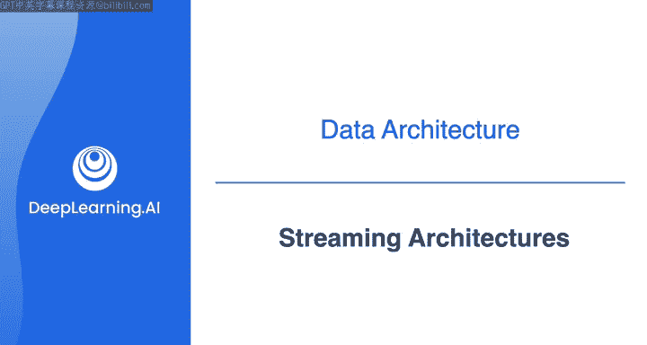
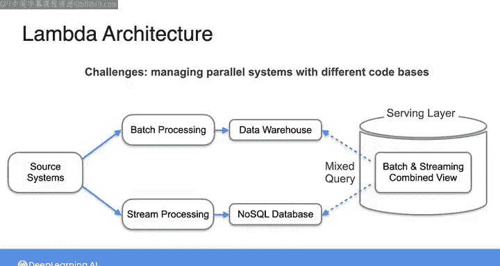
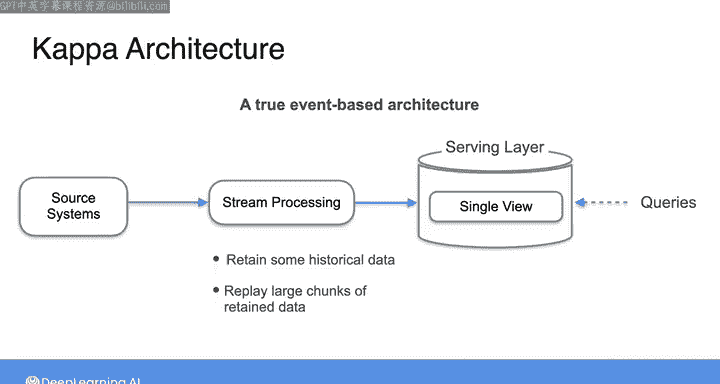
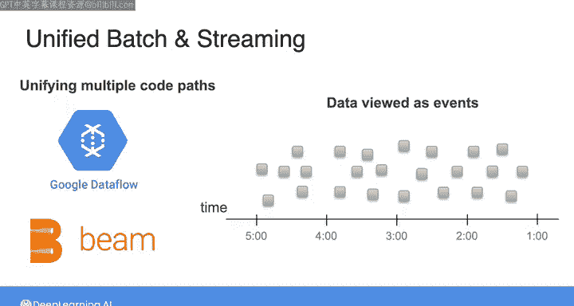
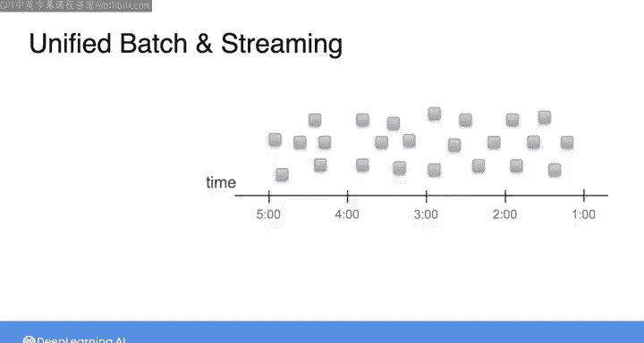
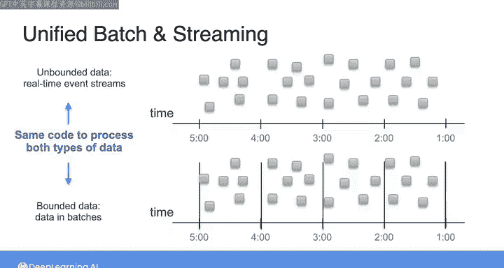
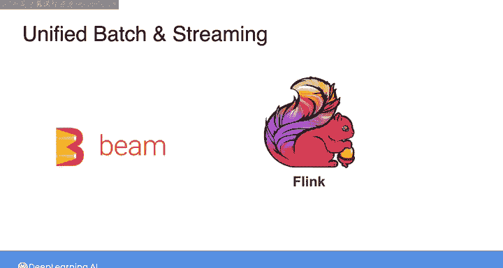

#  046：流处理架构 🚀

在本节课中，我们将要学习流处理架构的基本概念、发展历程以及现代数据工程中如何统一处理批数据和流数据。我们将从数据产生的本质出发，探讨流处理系统的构成，并介绍几种关键的架构模式。

---

正如上周所提到的，你可以将数据视为由一系列事件产生的。这些事件可能是网站点击、传感器测量或其他活动。

从这个意义上说，在数据源头，几乎所有数据都可以被描述为这种事件的连续流。也就是说，数据通常是以连续的方式产生和更新的。

我们上一节视频探讨了批处理数据管道。在批处理中，你需要等待数据积累，然后在预定义的时间间隔或数据达到特定大小阈值时，处理一批数据。因此，你只是以一系列数据块的形式处理数据流。

另一方面，在流处理数据管道中，你以连续、近实时的方式摄取数据并提供给下游系统。这里所说的“近实时”，意味着数据产生后（可能不到一秒）很快就能被下游系统使用。

最简单的流处理系统可以看作由**生产者**、**消费者**和**流处理代理**组成。

以下是其核心组件：
*   **生产者**是数据源。这可能是来自应用程序的点击流数据，或来自物联网设备的测量数据。
*   **消费者**可以是处理数据的服务或应用程序，也可以是数据湖或数据仓库。
*   **流处理代理**位于生产者和消费者之间，协调两者之间的数据流动。

消费者的下游可能是一些实时分析或机器学习用例。

在2010年代早中期，随着Kafka作为高可扩展事件流平台的出现，以及Apache Storm和SAMza等用于流处理和实时分析的其他框架的兴起，处理流数据的普及度激增。这些技术使公司能够对大量数据执行新型分析和建模，例如用户聚合、排名和产品推荐。

这种对流数据解决方案的新需求并不意味着批处理消失了。相反，它意味着数据工程师需要弄清楚如何将批处理和流数据统一到一个架构中。

**Lambda架构**是早期应对此问题的流行方案之一。在Lambda架构中，批处理、流处理和服务系统彼此独立运行。源系统同时将数据流式传输到两个目的地：一个用于流处理（处理后的数据可能存储在NoSQL数据库中），另一个用于批处理（可能使用数据仓库来转换和存储处理及聚合后的数据以进行分析）。该架构中的服务层通过聚合来自批处理层和流处理层的查询结果，提供统一的视图。

我在这里提到Lambda架构，只是希望你了解它。但这种架构带来了各种挑战和问题，例如管理具有不同代码库的并行系统等。在许多方面，技术和实践已经超越了Lambda架构，但Lambda架构仍然是后来这些流处理架构设计和工具的一个良好参考点。

---

上一节我们介绍了Lambda架构及其挑战，本节中我们来看看为解决这些缺点而提出的另一种架构。

作为对Lambda架构缺点的回应，Apache Kafka的原始作者之一J. Kreps提出了一种名为**Kappa架构**的替代方案。

Kappa架构的核心思想是使用**流处理平台**作为所有数据处理（摄取、存储和服务）的支柱。这促进了一种真正的基于事件的架构。这意味着，与其等待系统定期检查更新，不如在事件发生、数据产生时，自动将信息发送给需要更新的相关消费者，以便这些消费者能更及时地对信息做出反应。

以流处理平台为支柱，你可以通过读取实时事件流来应用实时处理。同时，你可以配置流处理器在从实时流读取时保留一定量的历史数据。这实际上允许你在需要时，通过重放保留数据中的大块数据，对同一数据流应用批处理。

虽然Lambda架构已不再流行，而Kappa架构也从未被广泛采用，但这两种架构都为克服统一批处理和流数据处理这一核心挑战提供了灵感和基础。管理批处理和流处理的核心问题之一就是统一多个代码路径。

---

前面我们了解了早期统一批流处理的尝试，现在来看看现代数据工程是如何解决这个问题的。

如今，工程师们通过几种方式寻求解决这个问题。谷歌开发了**数据流模型**以及实现该模型的**Apache Beam框架**。

数据流模型的核心思想是将所有数据视为事件。正在进行的实时事件流包含**无界数据**，而数据批处理则只是**有界的事件流**。边界提供了一个自然的窗口。因此，实时处理和批处理可以在同一个系统中使用几乎相同的代码进行。

Apache Flink和其他流处理工具如今被广泛使用。我们将在本课程中探讨这些及类似的工具。在当今的数据工程中，“**批处理是流处理的一种特例**”这一理念比以往任何时候都更加普遍。

---

在你的数据工程师工作中，可以预期会遇到管理批处理和流处理管道的挑战。面对这些挑战时，在选择系统组件时，你需要将良好数据架构的原则放在首位。

为灵活性和可扩展性而构建，并预见潜在的故障模式。无论你构建何种系统，都需要考虑的一件事是**合规性**。简而言之，合规性意味着确保你的数据系统符合法律、法规以及你自己组织的隐私协议和服务条款政策。

请与我一起进入下一个视频，讨论为合规性而设计的架构。