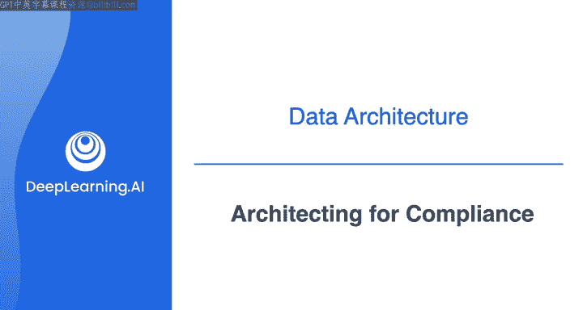
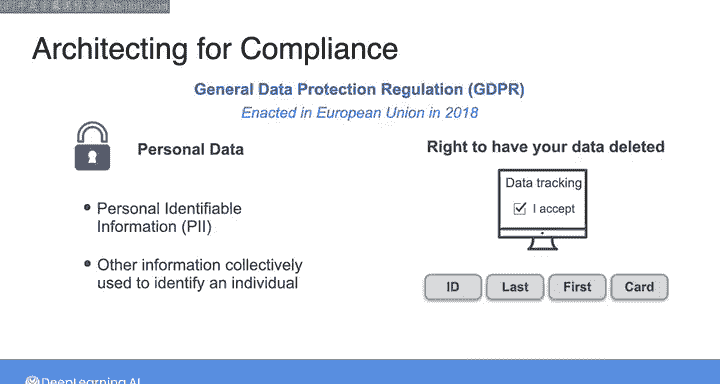
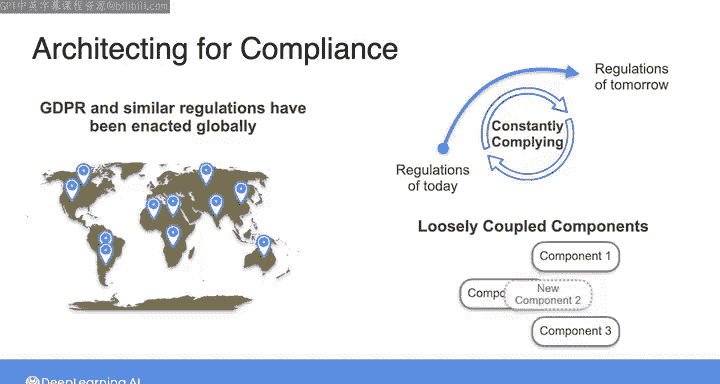
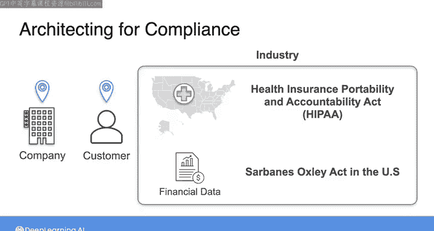

#  047：数据工程合规性架构 🏛️ | 课程 1-2-3, P47

在本节课中，我们将探讨数据工程中一个至关重要但常被忽视的方面：**合规性架构**。我们将了解为什么遵守法规对数据系统至关重要，以及数据工程师在其中扮演的角色。

---

在开始之前，需要明确指出，**法规遵从性**可能是这些课程中最枯燥的话题。没有人真的想讨论法律和法规，尤其是在我们可以讨论处理数据和使用酷炫技术的时候。然而，如果完全不讨论法规遵从性如何融入你作为数据工程师的角色，那将是一种失职。这主要是因为，你的数据系统最惨烈的失败方式之一，就是违反法规，导致你的组织被起诉并遭受巨额罚款。这种情况确实会发生。

那么，这里讨论的是哪些法规呢？一个重要的法规是 **《通用数据保护条例》**，简称 **GDPR**，于2018年在欧盟颁布。简而言之，GDPR旨在保护个人的隐私和个人数据。但GDPR下“个人数据”的定义相对宽泛，不仅包括**个人身份信息**，还包括其他可共同用于识别个人身份的信息。

为了符合GDPR，你需要确保从数据收集对象那里获得了适当的同意，并且如果个人希望将其数据从你的系统中删除，你能够及时删除数据。

现在，你可能会想，如果我的公司不在欧盟，或者我们不服务于欧盟的客户呢？从技术上讲，是的，你的公司和客户所在地至少会在一定程度上决定这些法规是否适用于你。然而，自GDPR颁布以来，全球数十个国家以及美国各州都采用了类似的法规。

作为数据工程师，你将负责构建不仅符合当今法规，也符合未来法规的系统。这些新法规可能在你当前运营的地区颁布，也可能在你公司未来扩展到的、已有法规的地区实施。保持系统更新以符合适用于你业务的法规，将是你的责任。

明智的做法是，构建符合现代数据保护法规（如GDPR）的系统，即使你当地的法规不那么严格；同时构建**灵活、松散耦合**的系统，以便你能适应法规的变化。

除了公司和客户所在地，你所在的行业也可能有自己的一套法规。例如，如果你在美国处理医疗保健数据，你需要遵守 **《健康保险携带和责任法案》**，即 **HIPAA法案**，该法案涉及敏感的**患者数据**。全球许多国家也针对医疗数据颁布了类似法律。

或者，如果你在组织中处理金融数据，你需要遵守美国的 **《萨班斯-奥克斯利法案》** 或其他地方的类似法律，这些法律规定了特定的财务报告和记录保存实践。

因此，这里的主要结论是，无论你身处世界何处，或从事哪个行业，都有适用于你作为数据工程师所构建系统的法律和法规。你能为组织创造价值的一种方式，就是避免因未能遵守必要法规而引发的诉讼和罚款。

在这些课程的其余部分，我们不会花太多时间讨论法规遵从性的细节，但至少希望让你意识到作为数据工程师角色的这一方面，以便你能将其与良好数据架构的其他原则一起牢记在心。

---

在下一课中，我们将探讨如何为你的架构选择合适的技术。我们下节课见。

**本节课总结**：我们一起学习了数据工程中合规性架构的重要性。核心在于，数据工程师必须构建符合 **GDPR**、**HIPAA** 等法规的系统，无论公司所在地或行业如何。关键在于设计**灵活、松散耦合**的架构，以适应不断变化的法规环境，从而避免法律风险并为组织创造价值。