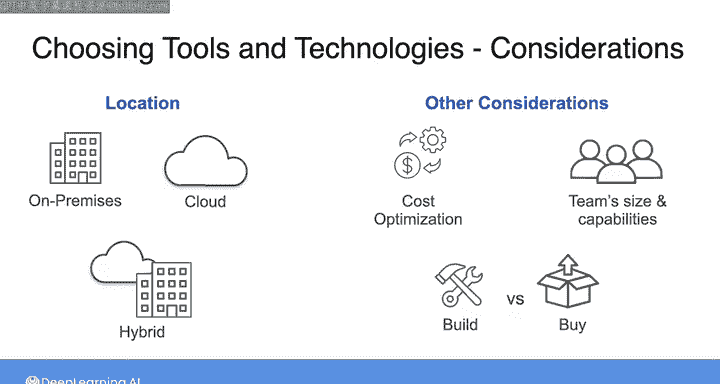

#  048：选择工具与技术 🛠️

在本节课中，我们将学习如何为数据架构选择合适的工具与技术。上一节我们介绍了良好数据架构的设计原则及其重要性，本节中我们来看看如何将这些原则转化为具体的技术选型决策。

数据工程领域从不缺乏可用的工具与技术。事实上，数据工程师常常面临“选择过多”的困境。无论是数据摄取、存储、转换还是服务提供，你都会面对开源、托管开源、专有软件、服务等多种选项。面对这些决策时，必须牢记最终目标：交付满足最终用户需求的高质量数据产品。

换句话说，数据架构定义了实现业务数据需求的**内容**、**原因**和**时机**，而选择的工具与技术则是实现该架构的**方法**。你可能会认为，选择能带来成功结果的工具是理所当然的。然而，这个过程中存在许多可能出错的地方，这正是本节课要讨论的内容，以确保你为成功做好准备。

我们将首先探讨**部署位置**，即在本地、云端或某种混合模式之间构建系统的权衡。接着，我们将研究**成本优化**，并思考是自行构建工具还是购买现成解决方案，这需要考虑团队规模、能力以及真正驱动业务价值的活动类型。我们还将讨论如何既满足当前需求，又着眼于组织未来的潜在需求。所有这些讨论都将基于上一课介绍的**良好数据架构原则**以及上周学习的**数据工程生命周期**的潜在主线进行。

以下是本节课将涵盖的主要方面：

*   **部署位置**：分析在本地、云端或混合环境中部署系统的优缺点。
*   **成本优化**：评估自建工具与购买现成解决方案的成本效益，考虑团队能力和核心价值活动。
*   **当前与未来需求**：探讨如何在满足现有需求的同时，为未来可能的变化做好准备。

在接下来的视频中，我们将开始深入探讨这些内容。

---

本节课中，我们一起学习了为数据架构选择工具与技术的关键考量。我们明确了工具选择是实现架构目标的手段，并概述了在部署位置、成本优化以及平衡当前与未来需求时需要权衡的主要因素。下一节我们将具体分析不同部署位置的利弊。