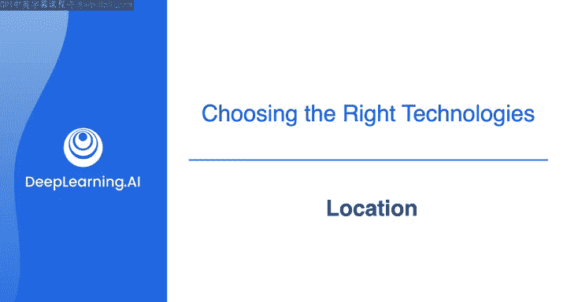
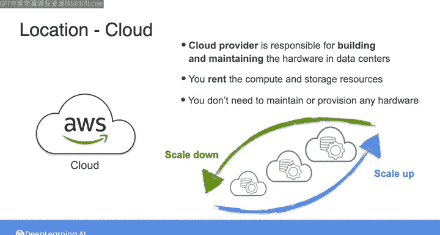
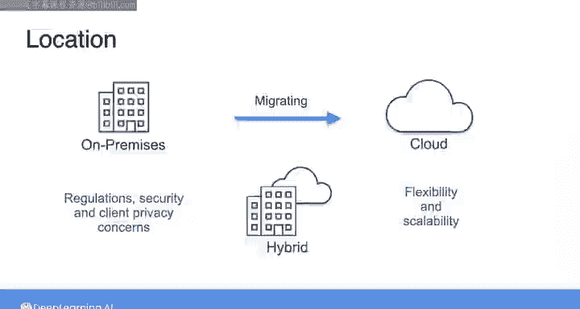

#  049：本地部署与云数据系统 🏢☁️

在本节课中，我们将要学习数据系统部署的两种主要方式：本地部署系统和云数据系统。我们将了解它们各自的特点、优势以及现代行业的选择趋势。

---

## 本地部署系统时代

不久以前，大约就在二十年前，构建本地部署的数据系统是满足任何数据存储或处理需求的唯一选择。

这仅仅是因为现代云数据平台当时尚未出现。一个本地部署系统是指公司拥有并维护整个数据栈的硬件和软件。

这意味着公司需要负责运营，包括配置、维护、更新以及运行在其上的硬件和软件的扩展。

## 云数据系统的兴起

如今，许多公司在云上构建其整个数据系统。对于云数据系统，云服务提供商（例如 AWS）负责构建和维护硬件与数据中心以满足客户需求。

如果你在云上构建数据系统，你本质上是在租用系统所需的计算和存储资源。云计算和存储的好处在于，你可以轻松扩展以满足需求，或在不需要时缩减规模以节省成本。你无需维护或配置任何硬件，并且可以相对容易地改变系统中想要使用的工具或技术类型。

## 当前部署模式的选择

现在，许多公司选择完全在云上构建数据系统，而其他公司仍然维护本地部署系统，或采用某种混合系统，即部分组件在本地，部分在云端。

行业的势头无疑正朝着更多公司选择云而非本地数据系统，或从本地迁移到云的方向发展。这是因为云在灵活性和可扩展性方面提供了所有显而易见的优势。

然而，有些公司由于业务性质、法规、安全或客户隐私考虑，选择或必须将其部分或全部数据系统保留在本地。

## 对数据工程师的意义

作为一名当今的数据工程师，你可能会在一家拥有部分本地系统的公司工作，或者一家正在从本地迁移到云的公司工作。在这些课程中，我们将专注于在云上构建数据系统。

这是因为对于当今绝大多数商业用例而言，在云上构建数据系统是最佳选择。行业正朝着更多云、更少本地部署的方向发展。作为一名有抱负的数据工程师，我相信你最好将时间花在学习如何在云上构建数据系统。

---

本节课中我们一起学习了数据系统从本地部署到云端的演变历程，理解了两种模式的核心区别与各自的适用场景。下一节，我们将探讨软件与数据工程领域的另一个趋势：从单体架构向模块化系统的转变。