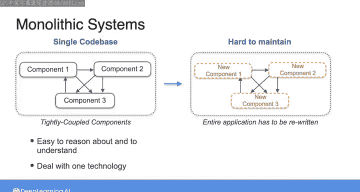
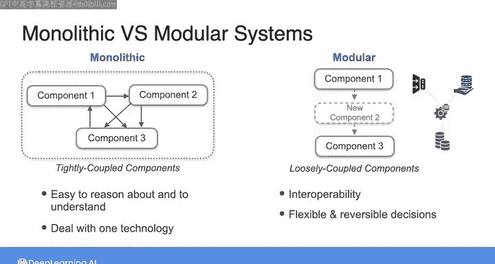

#  050：单体架构 vs 模块化架构 🏗️

在本节课中，我们将探讨数据工程中的一个核心概念：单体架构与模块化架构的区别。理解这两种架构模式的特点、优势与劣势，对于设计和构建灵活、可维护的数据系统至关重要。

---

## 概述

当我们讨论那些包含硬性依赖、灵活性有限的系统，与那些松散耦合、灵活性高的系统时，数据工程中另一个需要简要提及的概念是**单体架构**与**模块化架构**的理念。

---

## 单体架构 🧱

上一节我们提到了系统设计的两种思路，本节中我们首先来看看**单体架构**。

单体系统是一种**自包含的系统**，由紧密耦合的组件构成。在软件开发中，单体架构作为技术主流已存在数十年，大型团队协作交付一个单一的工作代码库。该软件产品的所有组件代码会被构建并部署为一个单一的应用程序。

单体系统的一个优势是**简单性**。所有功能都集中在一个地方，这意味着单体系统易于理解。你无需处理数十或数百种技术，通常只需面对一种技术和一种主要的编程语言。因此，如果你追求架构和流程的简单性与可推理性，单体架构是一个绝佳的选择。

然而，随着单体系统的增长，其维护也变得非常困难。由于单体系统由紧密耦合的组件组成，如果你需要更新一个组件，可能不得不更新其他组件，甚至常常需要重写整个应用程序。

例如，我曾为一家公司工作，他们有一个单体ETL管道，运行一次至少需要48小时。如果这个管道的任何地方出现问题，整个管道流程都必须重新启动。与此同时，下游焦急的业务用户等待着报告，这些报告默认已经延迟了两天，并且常常到得更晚。负责该管道的团队迫切希望替换它，但这将导致整个系统停机数周。因此，他们只能勉强维持，接受次优的性能，因为更新系统的任务过于艰巨且成本高昂。

以下是单体架构的核心特点总结：

*   **紧密耦合**：组件间依赖性强。
*   **统一部署**：所有功能作为一个整体构建和发布。
*   **初期简单**：技术栈单一，易于理解和推理。
*   **难以维护**：随着系统增长，更新和扩展成本高昂。

---

## 模块化架构 🧩

了解了单体架构的局限性后，我们来看看另一种设计思路：**模块化架构**。

相比之下，模块化系统由**松散耦合的组件**构成。它不是依赖一个结合了应用程序所有功能的大单体，而是依赖于将应用程序分解为**自包含的关注领域**。在软件开发中，真正的模块化系统随着**微服务**的兴起而出现。

在微服务架构中，与将对应多个服务的组件组合成一个单一的可部署实体不同，**每个服务都作为一个独立单元进行部署**。现代数据工程和数据处理技术已经转向模块化模型，为互操作性提供了强有力的支持。这意味着当今可用的大多数数据处理工具都可以轻松地与支持数据工程生命周期其他阶段的工具集成。

例如，以标准格式（如 **Parquet**）存储在对象存储中的数据，可以与任何支持 **Parquet** 格式的处理工具配对使用。随着技术发展而能够更换工具的能力是无价的。它通过支持灵活且可逆的决策以及持续改进，帮助你构建良好的数据架构。

以下是模块化架构的核心特点总结：

*   **松散耦合**：组件间独立性高。
*   **独立部署**：服务或组件可以独立更新和发布。
*   **互操作性强**：易于与其他系统或工具集成。
*   **灵活可扩展**：便于替换组件和持续改进架构。

---

## 后续课程展望

在接下来的课程中，我们将详细讨论为实现你的架构所需做出的各种选择细节。例如成本优化、选择开源还是商业解决方案等所有其他方面。我将继续从**云优先**和**模块化**的视角来阐述这些观点，因为我认为这是数据工程发展的方向。

---

## 总结

本节课中，我们一起学习了数据工程的两种核心架构模式：
1.  **单体架构**：将所有功能紧密集成，初期简单但难以维护和扩展。
2.  **模块化架构**：将系统分解为松散耦合的独立组件，强调灵活性、互操作性和易于演进。

理解这两种模式的权衡，是设计能够适应变化、支撑业务发展的健壮数据系统的关键第一步。请继续观看下一个视频，我们将深入探讨**成本优化**的相关策略。