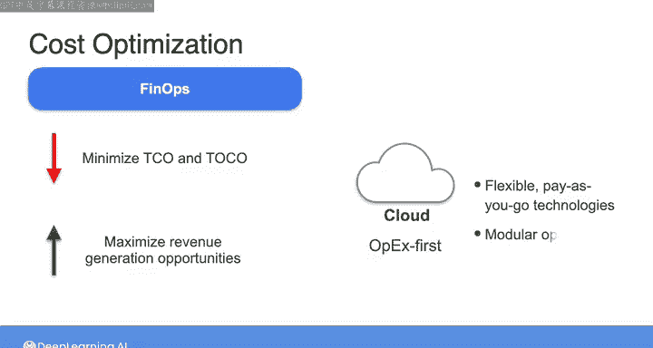

#  051：成本优化与商业价值 💰

在本节课中，我们将学习数据工程生命周期中的成本考量。我们将探讨如何评估和优化数据系统的总成本，理解不同成本类型，并学习如何通过技术选择最大化商业价值。

---

在数据工程生命周期的每个阶段，你都需要从多种工具和技术中选择合适的方案来完成工作。

每一个选择都伴随着成本。这里所说的成本不仅指软件或服务的订阅价格标签。

还存在与实施相关的成本，即支付团队搭建和维护系统所需的时间成本。

此外还有机会成本，这意味着选择一种工具的同时，至少在短期内放弃了选择其他工具的机会。

因此，你的工具和技术选择将显著影响预算。作为数据工程师，你的职责是确保组织在数据系统上的投资能获得正向回报。

在本视频中，我们将通过三个主要视角来审视成本。首先聚焦于**总拥有成本**。之后快速了解**总机会成本**。最后将重新探讨我们上周简要提及的**FinOps**概念。

---

## 总拥有成本

总拥有成本是指一个解决方案、项目或计划在其整个生命周期内的总估算成本。

TCO这个术语并非数据工程专用，而是一个通用的商业术语，用于描述对某个项目的总投资，包括你所使用的产品和服务的直接与间接成本。

这包括硬件和软件的购置、管理维护和维修的成本，以及任何必要的培训费用。

对于数据系统而言，直接成本是指那些易于识别、可直接归因于数据产品开发的有形成本。

例如，你的直接成本包括参与该计划的团队薪资、所使用的所有AWS服务费用，以及任何软件订阅的许可费用。

你的间接成本，几乎可称为开销，是指那些不直接归因于数据产品开发的费用。

例如，这可能是由于网络停机、持续的IT支持或某些团队成员生产力损失所产生的成本。

在估算TCO时包含间接成本非常重要，因为这些成本可能相当可观。

---

### 硬件与软件成本分类

在硬件和软件成本方面，这些支出通常分为两大类。

第一类是**资本性支出**。Capex是为购买长期固定资产而支付的费用。在云平台出现之前，这类支出对于数据系统很常见。公司会预先支付一笔资金购买硬件和软件，然后将其安装在数据中心。这些通常高达数十万到数百万美元或更多的预先投资，会被视为Capex资产，并随时间慢慢折旧。

如今，随着向云的转变，许多公司构建数据系统时基本上实现了零Capex。

另一类主要成本是**运营性支出**。Opex是与日常运营相关的费用，因此是随时间分摊的。在数据系统中，Opex通常以按使用付费的形式出现，表现为定期订阅费或使用特定云服务的成本。

在对比本地构建与基于云的数据系统时，本地构建通常意味着巨大的Capex成本，而基于云的系统则几乎可以完全是Opex。在云平台出现之前，对于大型数据项目而言，以Opex为先的方法并不是一个真正的选项。随着云的出现，这种情况已经改变，因为数据平台服务允许你采用基于消费的模型进行支付。

数据项目的长期硬件投资 inevitably 会过时。因此，我建议你采取以云为中心的、Opex优先的方法，为你的数据管道选择灵活的按需付费技术。

---

## 总机会成本

与TCO相对，我称之为**总机会成本**。

这是指你选择特定工具或技术时所承担的、因失去其他机会而产生的成本。它更难量化，但其本质是，你做出的任何选择 inherently 排除了其他可能性。

如果你选择了包含特定技术组合的数据技术栈A来构建数据管道，那么你就选择了数据栈A的好处，而 effectively 排除了数据栈B、C等选项。

因此，在这种情况下，总机会成本就是被束缚在数据栈A上，而无法再从其他数据栈中获益所产生的成本。

如果数据栈A被证明是最佳选择，那么恭喜你，总机会成本 essentially 为零。

然而在现实中，数据工程工具和技术正在飞速发展。因此，即使你今天做出了最佳选择，未来仍然需要演进你的数据系统。

所以，如果数据栈A中某些曾是昨日最佳选择的组件如今已经过时，那么切换到不同组件或完全不同的技术栈就会产生相关成本。

---

### 构建灵活的系统

为了确保总拥有成本最小化，你需要构建灵活且松散耦合的系统，这些系统能够随着数据需求的变化以及工具和技术格局的演变而易于更新。

实现这一点的一种方法是预先识别数据管道中哪些组件最有可能发生变化。换句话说，将**持久性技术**与**过渡性技术**区分开来。

持久性技术是那些经受住时间考验的技术。在云存储中，这类技术包括对象存储和网络。另一个例子是SQL查询语言，它已经存在数十年，并且短期内不会消失。

过渡性技术，或者至少那些最可能具有过渡性质的，是那些处于前沿、崭新且处于数据技术栈中快速演进的领域的技术，例如流处理、编排和AI。

---

## FinOps与成本优化

在成本优化的背景下思考技术选择时，**FinOps**作为一个概念与TCO和TOCO密切相关。

FinOps旨在最小化与你的数据系统相关的成本，同时最大化你创造收入的机会。

那么如何做到这一点呢？简而言之，你可以选择基于云的服务，这些服务允许你采用Opex优先的方法，使用灵活的按需付费技术，以及提供模块化选项，使你能够迭代、改进和增长。

---

## 总结

本节课我们一起学习了数据工程中的成本考量。我们探讨了总拥有成本及其直接与间接成本的构成，区分了资本性支出和运营性支出。我们还引入了总机会成本的概念，理解了技术选择带来的隐性代价。最后，我们了解了FinOps的理念，即通过选择灵活的云服务和模块化架构，在最小化TCO和TOCO的同时，最大化商业价值。关键在于构建能够适应变化的系统，区分持久性与过渡性技术。

---

接下来，我们将更深入地探讨在优化成本的同时选择正确工具和技术的主题。

请在下一个视频中与我一起，看看自建数据系统组件与购买现成解决方案之间的权衡。