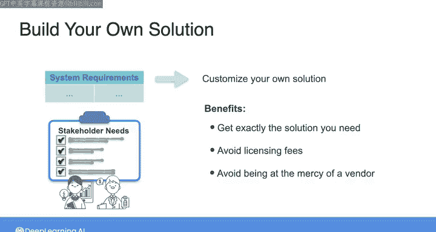
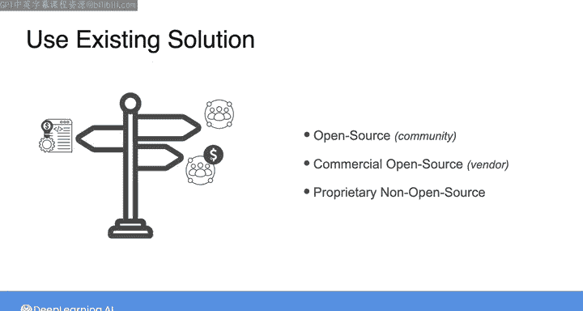
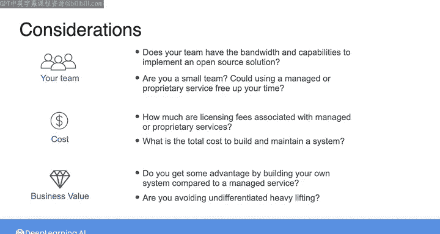

#  052：自建 vs 购买 🛠️ vs 🛒

在本节课中，我们将探讨在构建数据架构时，如何权衡“自建”与“购买/使用现有服务”这两种策略。我们将分析各自的适用场景、成本考量以及如何为你的团队和组织做出最佳选择。

到目前为止，我们一直在讨论为你的架构选择工具和技术。我强调过，对于绝大多数公司而言，在云端使用灵活的按需付费服务通常是上佳之选。对于对象存储这类常见服务，使用亚马逊S3这样的云服务是比尝试自建定制化对象存储方案好得多的选择。

然而，根据你系统的需求，可能有些工具或技术需要你自行构建和定制。例如，许多团队选择在开源框架之上进行构建，以获得恰好符合他们需求的解决方案。在其他情况下，团队可能会选择自建解决方案或定制开源框架，以避免许可费用，或仅仅是为了避免受制于某个供应商。

## 数据工程生命周期中的选择范围

上一节我们提到了自建方案的适用场景，本节中我们来看看在数据工程生命周期的各个阶段，你实际上都面临着一系列工具和技术选择。

事实上，对于数据工程生命周期的几乎所有阶段，在选择工具和技术时你都会有一系列选项。当然，对于任何你需要的工具，你都可以从头开始构建。在某些情况下，如果你尝试做一件前人未做过的事情，这可能是你唯一的选择。

但对于大多数情况，除非你确信没有现成的解决方案能满足你的需求，否则不建议这样做。在已有现成解决方案的情况下，从头开始构建技术无异于“重新发明轮子”，我通常将这类活动称为“无差异的重体力劳动”。

这意味着这是艰苦的工作，并且最终可能不会为你的组织增加价值。

## 现有解决方案的类型

在考虑是否自建之前，了解有哪些现有解决方案可供选择至关重要。

当涉及到现有解决方案时，它们包括完全开源的选项，以及来自供应商的商业开源选项（本质上是某些开源工具的托管版本），此外可能还有专有的非开源软件和服务可供选择。

## 选择时的关键考量参数

以下是选择这些选项时需要考虑的一些关键参数。

首先，如果你选择完全开源的解决方案，你的团队是否有足够的精力和能力来实施和维护该系统？许多开源工具都有强大的社区支持，你可以在需要时获得帮助。但如果你是一个小团队，甚至只有一个人，那么托管开源或专有服务可能更适合你的需求。因为这可以让你腾出精力来构建和管理整个数据系统，而不会陷入部署和维护单个组件的泥潭。

其次，即使你的团队确实拥有从头构建和实施开源解决方案的专业知识和精力，这真的值得吗？表面上看，自己构建或使用开源解决方案似乎能节省成本，因为你避免了许可费用。但正如我们在之前的视频中讨论过的，总拥有成本远不止许可费用。它还包括构建和维护系统所需的团队成本。

除了成本，另一个需要考虑的重要点是，构建和维护一个定制或开源解决方案是否真的能为你的组织提供价值。换句话说，与使用托管服务相比，自建系统或使用开源方案是否能带来某些优势？还是说这仅仅是“无差异的重体力劳动”，即不提供任何额外价值的艰苦工作？

## 给团队的建设性建议

对于大多数团队，特别是正在构建数据管道并纠结于是自建、使用开源还是购买的小团队，以下是我的建议。

我的建议是，首先查看开源或商业开源解决方案。如果无法满足需求，再考虑购买专有解决方案。无论哪种情况，都有大量优秀的模块化服务可供选择。这将使你的团队能够专注于为组织提供最大价值的独特机会。

本节课中，我们一起学习了在数据工程中“自建”与“购买”决策的权衡。我们分析了自建方案的特定场景、评估了总拥有成本的概念，并强调了选择应基于团队能力与是否能带来独特价值。下一节课，我们将一起探讨工具和技术的“无服务器”与“有服务器”选项之间的区别。