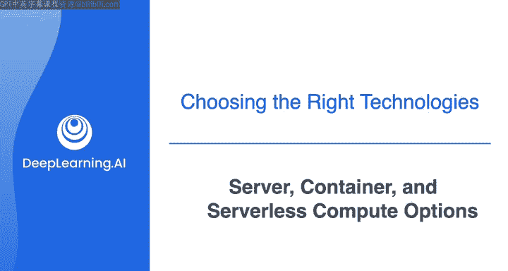
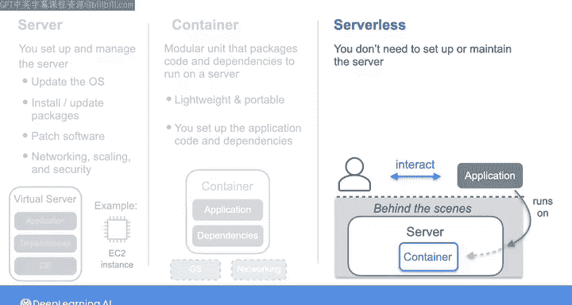
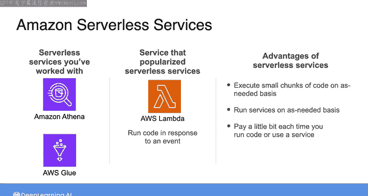
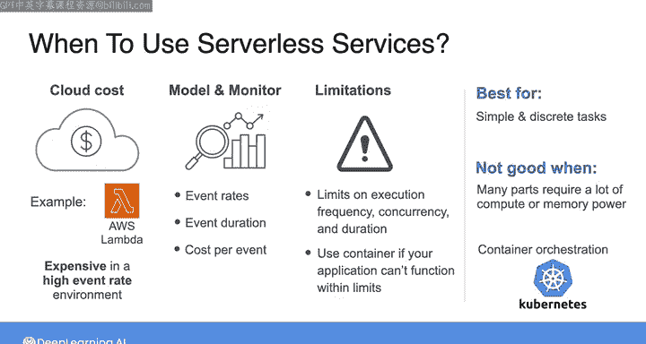

#  053：服务器、容器与无服务器计算选项 🖥️📦⚡

在本节课中，我们将学习三种主要的云计算选项：服务器、容器和无服务器计算。我们将探讨它们各自的特点、适用场景以及权衡取舍，帮助你为数据工程项目选择合适的技术方案。

***

任何软件应用程序都需要服务器。服务器本质上是一台或多台计算机，通过提供**CPU**、**内存（RAM）**、**磁盘存储**，有时还包括**GPU**和**网络**资源，来支撑你的应用程序运行。服务器通过网络（通常是互联网）提供计算资源。

在云服务领域，根据你考虑的具体服务，有时你需要自行设置和管理运行应用程序所需的计算资源。而在其他情况下，你可以在以下三种计算选项中进行选择：**服务器**、**容器**或**无服务器**。本视频将详细介绍这三种选项之间的差异和权衡。

***

## 服务器选项 🖥️

如果你选择服务的**服务器**版本，你将负责设置和管理服务器（例如一个亚马逊EC2实例），包括更新操作系统、安装或更新软件包、配置网络、扩展规模以及保障安全。

***

## 容器选项 📦

与服务器不同，**容器**是一个更模块化的单元，它将你的代码和所有依赖项打包成一个可以在服务器上运行的包。

传统的虚拟机封装了整个操作系统，而容器则更为轻量级，它只打包和隔离用户空间，例如文件系统和一些进程。

对于容器化解决方案，你仍然需要负责设置应用程序代码和依赖项等核心元素，但底层的操作系统、网络等其余部分将由平台提供。

***

## 无服务器选项 ⚡

除了服务器和容器选项，在云数据工具领域，**无服务器**这个术语正变得越来越常见，用于描述特定的服务。如果你熟悉计算机的工作原理，“无服务器”这个词听起来可能有点奇怪——没有服务器怎么运行软件呢？

实际上，“无服务器”并不意味着没有服务器，它只是意味着**设置和维护服务器不是你对该特定服务的责任**。你可以与应用程序交互，而无需管理背后的服务器，也无需担心软件包的安装和依赖关系。因此，服务器对你来说基本上是隐藏的。

通常，无服务器技术运行在容器之上，因此这些服务可以自动扩展，内置了可用性和容错能力，并提供按使用量付费的计费模式。但在无服务器服务中，它们所运行的容器也被抽象掉了。

通过这种方式，无服务器技术可以让你花更少的时间担心计算基础设施，而将更多时间专注于开发数据产品。在前几周的实验中，你已经使用了一些无服务器服务，例如**Amazon Athena**和**AWS Glue**。

无服务器趋势随着2014年**AWS Lambda**的推出而全面兴起。这项服务允许你在响应事件时运行代码。它承诺可以在需要时执行小块代码，而无需管理服务器。自此，无服务器选项在流行度和多样性上呈爆炸式增长，现已远远超出了按需运行代码片段的范畴。

其流行的主要原因在于**成本**和**便利性**。你无需支付整台服务器的费用，只需在代码每次运行或使用特定服务时支付少量费用。

***

## 如何选择？🤔

那么，何时使用无服务器服务是合理的呢？和许多其他云服务一样，这取决于具体情况。作为一名数据工程师，你需要了解云定价的细节，以便能够预测无服务器部署的成本，并判断它是否比服务器选项更具成本效益。

例如，查看AWS Lambda的定价，你会发现，在事件发生率很高的环境中使用该服务，成本可能会高得惊人。与数据管道的其他领域一样，对你所使用的服务（无论是否无服务器）进行建模和监控至关重要。你可能需要直接监控，以确定实际的事件发生率、持续时间和每个事件的成本，从而在真实环境中建模无服务器服务与替代方案的总成本。

此外，云无服务器平台对执行频率、并发性和持续时间都有限制。如果你的应用程序无法在这些限制内良好运行，那么就该考虑采用面向容器的方法了。

你可以这样思考：**无服务器最适合简单、离散的任务和工作负载**。如果你的系统有许多移动部件，或者需要大量的计算或内存资源，那么无服务器可能就不太适合。在这种情况下，请考虑使用容器以及像**Kubernetes**这样的容器工作流编排框架。

对于云中的大多数现代数据工程应用，你都可以使用无服务器或容器化工具完成任务。因此，我建议首先考虑使用无服务器，如果可能的话，再考虑容器和编排。

***

## 总结 📝

本节课我们一起学习了三种核心云计算模型：服务器、容器和无服务器。服务器需要你管理底层基础设施；容器将应用及其依赖打包，提供了更好的可移植性；而无服务器则进一步抽象了基础设施管理，让你可以专注于代码逻辑，通常按实际使用量付费。选择哪种方案取决于你的具体需求、成本考量以及对控制层级的要求。理解这些选项的差异是构建高效、经济的数据架构的关键一步。

***

当你熟悉了这些无服务器选项后，请加入下一个视频，我们将通过探讨数据工程生命周期的潜在影响因素，来总结本课程，并了解这些因素如何在你为数据架构选择工具和技术时发挥作用。