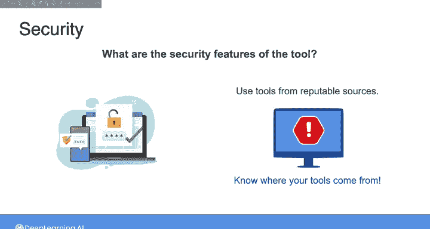
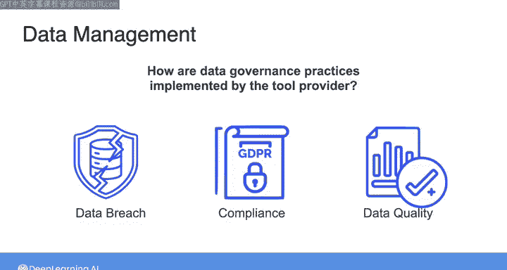
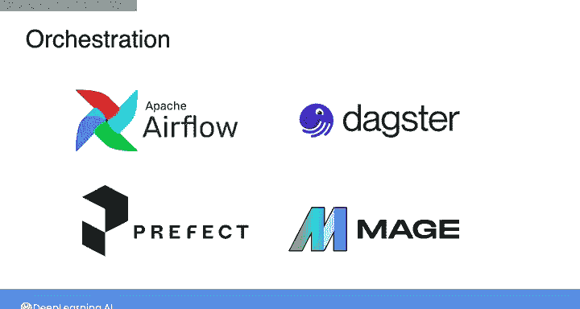
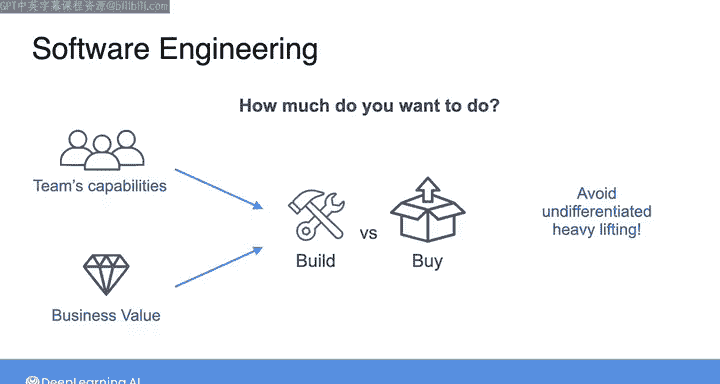

#  054：底层技术如何影响你的决策 🔧

在本节课中，我们将探讨数据工程生命周期的六大底层暗流如何影响你在构建数据架构时对工具和技术的选择决策。

上一周，我们逐一分析了安全、数据管理、数据运维、数据架构、编排和软件工程这六大暗流与数据工程生命周期的关系。本节中，我们将更深入地审视，在选择数据架构的具体组件时，这些暗流是如何发挥作用的。

## 安全 🔐

在安全方面，不同的工具具备不同的安全特性。理解这些特性并确保部署正确的身份验证技术及其他最佳实践至关重要。需要特别警惕的一点是，只使用由信誉良好的组织或可信的开源社区开发的软件和工具。历史上曾出现过某些组织或国家推送包含可疑组件（本质上是间谍软件）的数据工具，从而危及你的数据管道。此处不再赘述，但核心要点是：确保你清楚工具的来源。如果是开源工具，请查看其代码并确保你理解其实现方式。

## 数据管理 📊

对于数据管理，某些数据治理实践的实现方式并不总是清晰的。一个好的做法是向提供该工具的公司或社区询问他们如何处理治理问题。以下是几个关键问题示例：
*   你的数据将如何受到保护，以防范来自外部和内部的破坏？
*   该工具如何遵守GDPR及其他数据隐私法规？
*   该工具如何提供数据质量验证？

## 数据运维 ⚙️

在选择数据运维工具时，主要在于理解它们在自动化和监控方面提供哪些功能。如果你正在考虑托管服务选项，务必理解提供商的服务水平协议，该协议描述了他们在可靠性和可用性方面的保证。

## 数据架构 🏗️

正如我们在本周材料中反复讨论的，对于数据架构，你需要关注任何给定工具如何提供模块化以及与其他工具的互操作性。良好的模块化和互操作性能够带来灵活性和松耦合。

## 编排 🧩

在编排领域，当前数据工程领域主要由 **Apache Airflow** 主导，你可以将其作为开源工具或托管工具来实施。此外，像 **Prefect**、**Dagster** 和 **Mage** 等其他方案也越来越受欢迎。在选择编排工具时，请注意这个领域正在快速发展，对你自身数据架构目标的深刻理解将有助于你确定哪种编排工具最适合你的需求。

## 软件工程 💻

对于软件工程，核心问题是你希望投入多少。我的意思是，根据你对团队带宽、专业知识的评估，以及哪些开发活动真正能为你的组织带来价值，你需要决定：是构建自己的工具，还是选择开源方案，或是采用商业开源或专有解决方案？主要要避免的是“无差异的重体力活”，即那些不为你创造价值的艰苦工作。建议首先查看开源和商业开源工具，如果它们无法满足你的需求，再考虑专有工具。

以上就是对数据工程生命周期各底层暗流如何在你选择数据架构实施工具和技术时发挥作用的一个简要概述。

## 总结 📝

本节课中，我们一起学习了数据工程六大底层暗流——安全、数据管理、数据运维、数据架构、编排和软件工程——如何具体地影响技术选型决策。我们再次覆盖了广阔的领域，虽然有些抽象地讨论了数据工程。我知道到目前为止我们似乎聚焦了很多理论，你可能已经迫不及待想要实践这些学到的概念了。这很好，因为很快就会有大量的动手实践。在下一课中，请与我一同了解AWS架构框架，并评估你在AWS上为自己的数据架构所做的架构选择。