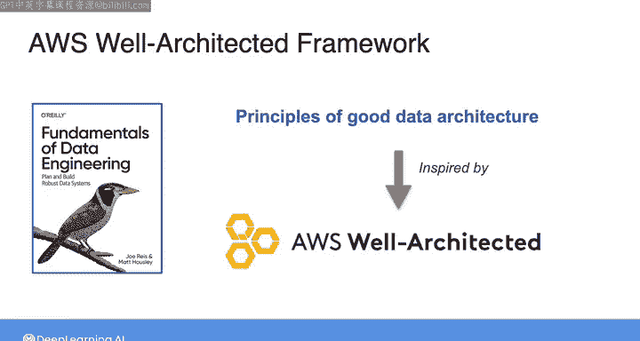

#  055：AWS架构完善框架简介 🏗️

## 概述

在本节课中，我们将要学习AWS架构完善框架。这个框架包含一系列原则和最佳实践，能帮助你在AWS上构建可扩展且稳健的架构。我们将了解这个框架如何补充本课程已讨论的原则，并为你后续的实践提供指导。

---

到目前为止，在本课程中，你一直在学习数据架构的基础知识，以及为自身数据架构设计和选择工具时需要考虑的诸多因素。

本节中，我们来看看AWS架构完善框架。这个框架由一系列原则和最佳实践组成，旨在帮助你在AWS上构建可扩展且稳健的架构。

AWS架构完善框架补充了我们在本课程中已经讨论过的那套原则和实践。事实上，在撰写《数据工程基础》一书并阐述我们认为对设计良好数据架构至关重要的关键原则时，我和合著者Matt Hausey从AWS架构完善框架以及其他来源中获得了灵感。

如果你快速搜索一下AWS架构完善框架，你会发现各种优秀的资源，包括专注于特定用例的白皮书，以及AWS提供的一个帮助你应用此框架的工具。实际上，这个框架本身就可以成为一门完整课程的主题。

为了本课程的目的，在下一个视频中，Morgan将向你介绍这个框架的六个关键支柱。

以下是关于这个框架的更多信息：

Morgan将介绍这个框架的六个关键支柱，并向你展示可以去哪里学习更多关于该框架的知识并进行更多实践。

在那之后，我将在接下来的视频中与你见面，进行本周实验练习的讲解。

我们将让你有机会在AWS云上应用良好数据架构的原则。

---

## 总结

本节课中，我们一起学习了AWS架构完善框架的基本概念。我们了解到该框架是一套用于在AWS上构建稳健、可扩展架构的原则和最佳实践，它是对本课程已学内容的有效补充。通过引入这个框架，我们为后续在云平台上实际应用数据架构原则做好了准备。