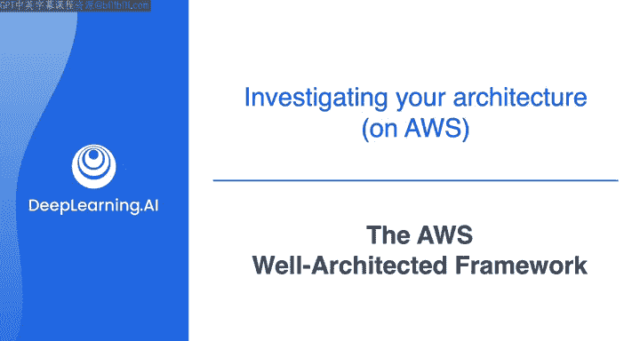
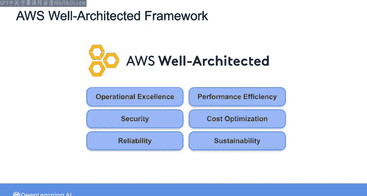
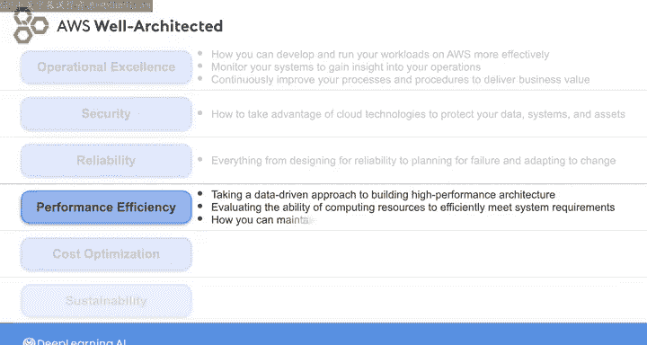
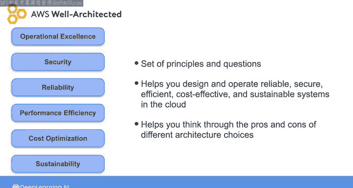
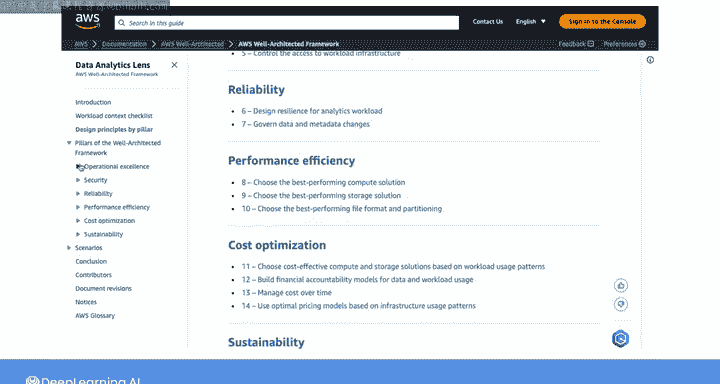

#  056：AWS架构完善框架 🏗️

在本节课中，我们将学习AWS架构完善框架。该框架提供了一套最佳实践和核心策略，帮助我们在AWS上设计、评估和改进云系统架构。我们将了解其六大支柱，并学习如何应用这些原则来构建可靠、安全、高效且可持续的数据工程解决方案。

---

## 背景介绍

在AWS上构建系统，尤其是在刚开始时，可能会令人不知所措。AWS提供了众多选项和不同的解决方案构建方式。如何确保我们的设计是正确的？这正是AWS架构完善框架的目的：评估和改进解决方案，确保在AWS上的构建工作正确无误。

AWS不仅提供云系统构建服务，还与全球数千家客户紧密合作，帮助他们构建最佳的云解决方案以支持业务运营。AWS解决方案架构师、领域专家和其他人员拥有数十年的客户合作经验，涉及广泛的业务需求和用例，这使他们积累了丰富的正确实践方法。

基于这些集体经验，AWS构建了架构完善框架。该框架包含一套在云中设计系统的最佳实践和核心策略。

---

## 六大支柱概述

AWS架构完善框架包含六大关键支柱：卓越运营、安全性、可靠性、性能效率、成本优化和可持续性。以下将简要描述每个支柱。如果你有兴趣深入了解，可以在本周课程末尾的资源部分找到相关链接。

### 卓越运营

卓越运营支柱关注如何在AWS上更有效地开发和运行工作负载，监控系统以洞察运营状况，并持续改进流程和程序，以交付业务价值。

### 安全性

安全性支柱关注如何利用云技术保护数据、系统和资产。这与Joe在数据工程生命周期中介绍的安全基础理念一致。我们需要采用适当的工具来保护系统，并在团队中培养安全文化。

### 可靠性

可靠系统是指能够正确、一致地执行其预期功能，并能从故障中快速恢复的系统。因此，该支柱涵盖了从可靠性设计、故障规划到适应变化等各个方面。

### 性能效率

性能效率支柱侧重于采用数据驱动的方法构建高性能架构。在评估系统性能效率时，我们将评估一组计算资源有效满足系统需求的能力，以及如何在需求变化和技术演进时保持这种效率。

### 成本优化

成本优化支柱非常直接，与Joe本周早些时候提到的拥抱FinOps的观点密切相关。简而言之，成本优化意味着以尽可能低的价格点构建系统，以交付最大的业务价值。AWS提供了一系列服务，包括AWS成本资源管理器（Cost Explorer）和成本优化中心（Cost Optimization Hub），你可以在其中进行比较并获取关于如何优化系统成本的建议。

### 可持续性

在构建数据系统时，性能、可扩展性、安全性和成本可能是首要考虑因素，但考虑在云上运行的工作负载对环境的影响也很重要。可持续性支柱侧重于减少能源消耗并提高系统所有组件的效率。

---

## 框架的应用方式

重要的是要记住，架构完善框架的这六大支柱不会提供可以直接复制并应用到解决方案中的具体设计。相反，你可以将它们视为一套原则和问题，帮助你围绕现有解决方案进行富有成效的讨论，并帮助你在云中设计和运营可靠、安全、高效、经济且可持续的系统。

这几乎就像拥有自己的AWS解决方案架构师，可以帮助你思考不同架构选择的利弊。

如前所述，你可以跟随本周课程末尾资源部分的链接，了解更多关于每个支柱的信息，并探索架构完善工具（Well-Architected Tool）。该工具允许你评估自己的架构，发现潜在风险和改进机会。

---

## 特定领域应用：透镜（Lenses）

架构完善框架还有特定领域的应用，称为“透镜”（Lenses），你可以进行探索。透镜本质上是AWS架构完善框架的扩展，专注于特定领域、行业或技术栈，并提供针对这些背景的指导。

每个透镜都有自己的一套问题、最佳实践、说明和改进计划。特别推荐你查看**数据分析透镜**（Data Analytics Lens），它专注于数据特定的考量。数据分析透镜将引导你评估数据架构的可扩展性、安全性、性能和成本。它可以帮助你评估当前的数据架构，识别改进领域，并实施符合行业最佳实践的策略。

---

## 实践环节

接下来，轮到你尝试将本周讨论的原则应用到自己在AWS上的数据架构中了。

在接下来的几个视频中，Joe将引导你完成本周的实验练习。我们下周再见。

---

## 课程总结

在本节课中，我们一起学习了AWS架构完善框架。我们了解了该框架的背景和目的，详细探讨了其六大支柱：卓越运营、安全性、可靠性、性能效率、成本优化和可持续性。我们还学习了如何将该框架作为一套原则和问题来指导架构设计，并介绍了其特定领域应用“透镜”，特别是数据分析透镜。最后，我们预告了接下来的实践环节，鼓励你将所学应用到实际架构评估中。