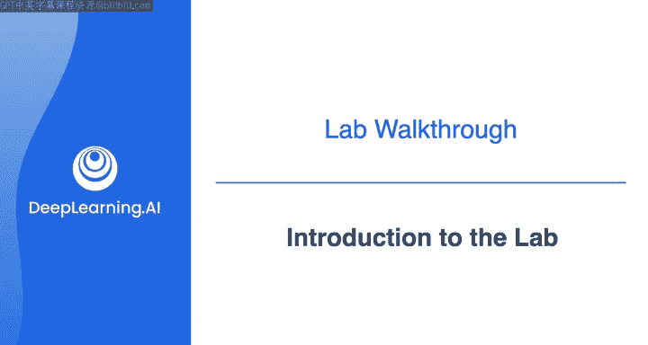
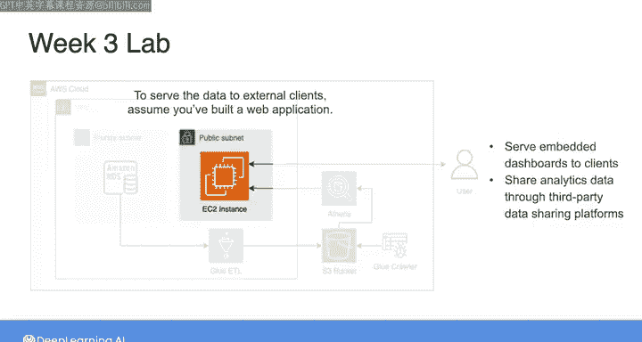
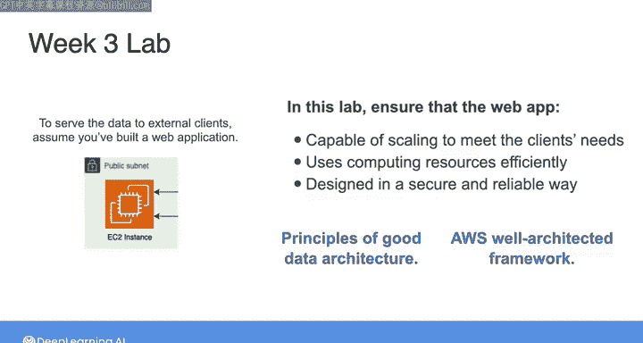
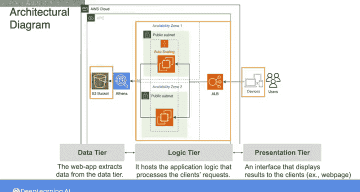
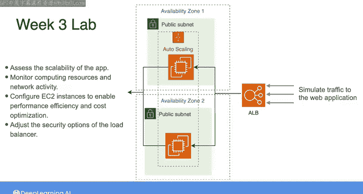
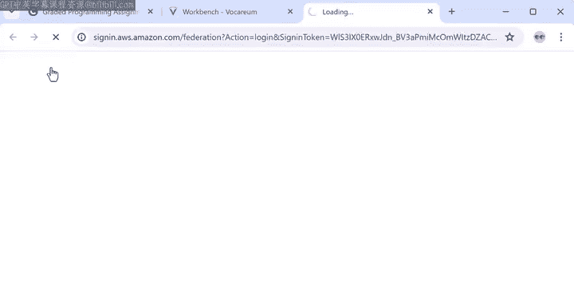

#  057：实验介绍 🧪

在本节课中，我们将学习如何为一个已构建的数据管道扩展功能，使其能够向外部客户提供数据服务。我们将通过一个基于AWS架构的Web应用程序实验，来探索如何确保应用的可扩展性、资源效率以及安全可靠性。

---

在上周的实验中，你构建了一个数据管道，用于摄取、转换数据并提供给公司的数据分析师使用。

现在，你的公司希望向客户提供一些嵌入式仪表板，并通过第三方数据共享平台分享分析数据。

因此，你的任务是将这些转换后的数据分享给更广泛的公众，以服务于外部客户。

我们假设你已经构建了一个运行在这些EC2实例上的Web应用程序。在本实验中，你将使用这个Web应用程序，确保它能够扩展以满足客户需求，高效利用计算资源，并以安全可靠的方式设计。

你还将使用Amazon CloudWatch监控此应用程序的性能，同时应用良好的数据架构原则，并遵循AWS完善架构框架。

在开始实验之前，让我们先仔细看看这些EC2实例，以理解Web应用程序的底层架构。

以下是Web应用程序的架构图。

这个Web应用程序基于三层架构设计，包括数据层、逻辑层和表示层。这种类型的三层架构是部署Web应用程序解决方案的常见方式。

左侧的S3存储桶代表数据层，你的Web应用程序从这里提取数据。

中间的EC2实例和负载均衡器代表逻辑层，它承载处理客户端请求的应用程序逻辑。逻辑层从数据层查询数据，并将结果返回给右侧的表示层。

表示层由一个界面组成，该界面向通过其设备与Web应用程序交互的客户端显示结果。在这个例子中，你可以将显示客户分析仪表板的网页视为表示层。

让我们放大中间的逻辑层。

这里有两个主要组件：Amazon EC2自动扩展组和应用程序负载均衡器（ALB）。

自动扩展组由一组运行相同应用程序逻辑的EC2实例组成。它们用于增加应用程序的计算能力。

因此，不是由单个EC2实例处理所有客户端请求，而是将这些请求分布到多个EC2实例上。

自动扩展意味着EC2实例的数量可以根据Web应用程序的客户端请求数量增加或减少。该组配置为从两个实例开始，每个实例启动于不同的可用区，以增强应用程序的可用性和可靠性。

自动扩展组需要与一个应用程序负载均衡器关联，该负载均衡器有助于将传入流量分布到EC2实例上，并作为客户端的单一联系点。在本实验中，你将主要与运行应用程序逻辑的计算资源进行交互。

你将模拟流向Web应用程序的流量以评估其可扩展性。

然后使用Amazon CloudWatch监控应用程序上的计算资源和网络活动。

你将配置EC2实例以实现性能效率和成本优化，并调整负载均衡器的安全选项以控制流向应用程序的入站流量。要开始实验，你需要在Coursera上打开实验项目，并看到包含本实验所有说明的页面。

与上周在Cloud9或Jupyter Lab中进行的实验不同，你将使用AWS管理控制台来监控和更新Web应用程序的设置。

现在，要访问控制台，让我们启动实验，然后等待此图标变为绿色。

一旦它变为绿色，你可以点击它并进入控制台。

这里说明的前几部分涵盖了我在此视频中介绍的说明。在下一个视频中，我将引导你完成实验的第3和第4部分，在那里你将探索和监控应用程序的计算资源。我们下一个视频见。

---

本节课中，我们一起学习了实验的背景与目标，并详细了解了待评估Web应用程序的三层架构，特别是其逻辑层中自动扩展组和负载均衡器的关键作用。我们明确了实验将围绕评估可扩展性、监控资源以及优化配置与安全展开。