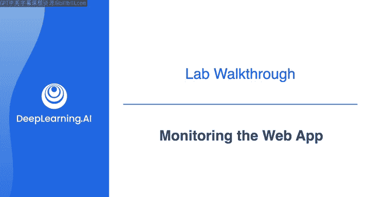
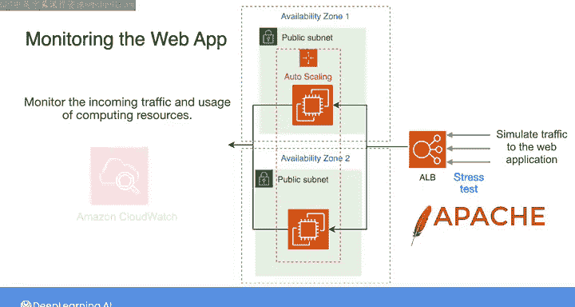
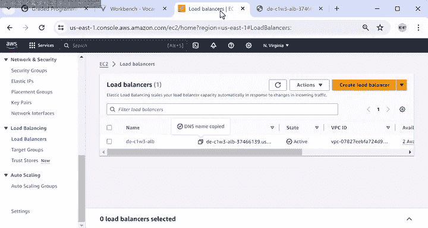
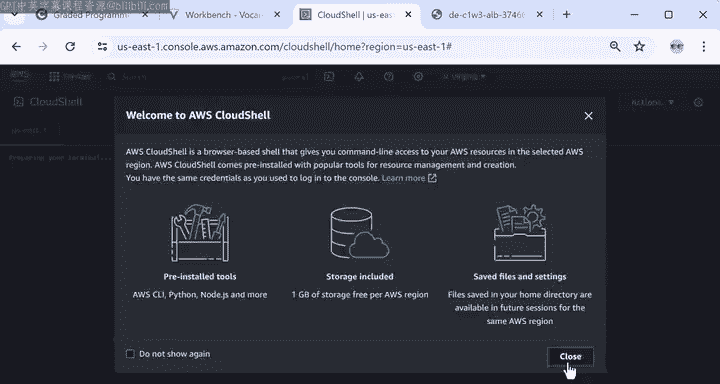
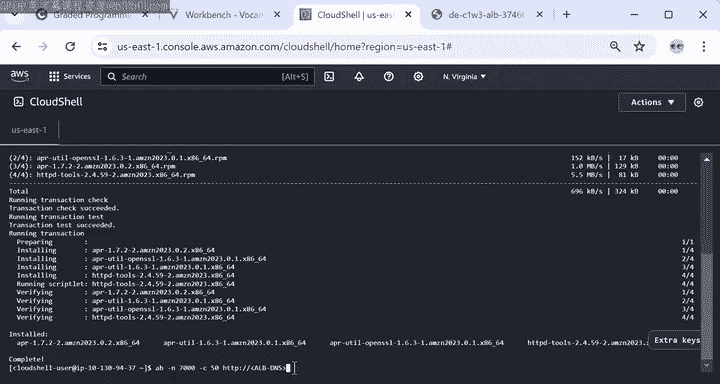
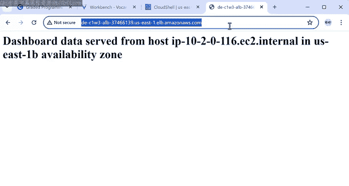
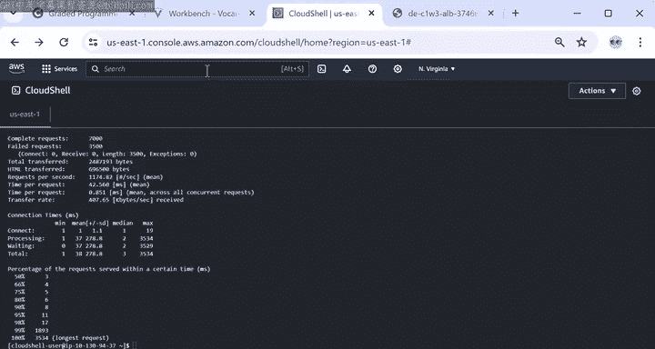
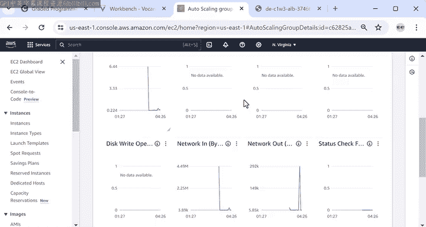

#  058：监控Web应用 🖥️📊



在本节课中，我们将学习如何监控一个Web应用程序的性能。我们将重点关注自动扩展组中的EC2实例以及通过应用程序负载均衡器进行的网络活动。课程将指导你如何获取应用地址、模拟流量，并使用Amazon CloudWatch监控关键指标。

---

## 实验预览与目标

上一节我们介绍了数据工程中监控的重要性。本节中，我们来看看一个具体的实验任务。该任务对应实验指南的第3和第4部分，核心是监控自动扩展组的EC2实例和应用程序负载均衡器的网络活动。实验环境已预先配置好自动扩展组和负载均衡器，你无需自行创建。

## 获取Web应用地址

首先，你需要找到Web应用程序的访问地址。由于负载均衡器是客户端访问应用的主要入口，因此地址需从负载均衡器获取。

以下是操作步骤：

1.  在AWS控制台的搜索栏中输入 **EC2** 并进入该服务。
2.  在左侧面板中，找到 **“负载均衡”** 部分。
3.  点击 **“负载均衡器”**，查看你的应用负载均衡器。
4.  在负载均衡器详情中，复制 **“DNS名称”** 下的地址。
5.  将此地址粘贴到浏览器的新标签页中打开。

打开的页面是客户端与应用交互的界面。为简化演示，该页面仅显示一条包含托管应用逻辑的EC2实例详细信息的消息。请保持此标签页打开，后续实验将用到此信息。

## 模拟流量与监控指标

当客户端使用你的Web应用时，负载均衡器会接收HTTP请求（例如打开网页的请求）并将其转发给EC2实例进行处理。为了确保应用能够支撑预期流量，监控流入流量和计算资源使用情况至关重要。

可观测性与监控是DataOps中的重要实践，也属于AWS架构完善框架中的运营卓越支柱。在本实验的第4部分，我们将使用 **Amazon CloudWatch** 来跟踪Web应用的性能指标。



首先，你需要使用一个名为 **Apache Benchmark** 的开源工具来模拟网站流量。此工具可用于执行压力测试，即向你的Web应用发送大量请求。

以下是模拟流量并监控的步骤：





1.  使用AWS控制台中的 **AWS CloudShell**（一个可直接从控制台访问的命令行服务）。
2.  从实验指南中复制安装命令并在终端中运行，以安装Apache Benchmark工具。
3.  使用以下命令生成压力测试，发送多个HTTP请求：

    ```bash
    ab -n 7000 -c 50 <你的网页地址>
    ```

    在此命令中：
    *   `-n` 选项指定HTTP请求的总数。
    *   `-c` 选项指定并发请求的数量。
    *   该命令将总共发送 **7000** 个请求，并以每次 **50** 个请求的并发方式发送。
    *   请将命令末尾的 `<你的网页地址>` 替换为你之前复制的实际网页地址。

请求开始发送后，你便可以监控自动扩展组中EC2实例的CPU使用率和网络活动。



## 在CloudWatch中查看监控结果



返回AWS控制台的EC2服务页面，按以下步骤查看监控图表：

1.  在左侧面板中，找到并展开 **“自动扩展组”** 部分。
2.  打开提供的自动扩展组，进入 **“监控”** 标签页。
3.  选择 **EC2** 指标。重点关注以下三个图表：
    *   **第一个图表** 显示了处理7000个请求时的CPU利用率。你可以看到处理流入流量所需的计算资源有所增加。
    *   **另外两个图表** 分别监控入站和出站网络活动（以字节为单位），也呈现出类似的变化模式。



几分钟后，一旦所有7000个请求处理完毕，刷新监控界面，你应该能看到CPU利用率和网络活动均有所下降。

---

## 课程总结

本节课中，我们一起完成了实验的第3和第4部分。我们学习了如何获取Web应用程序的地址，使用Apache Benchmark工具模拟传入流量，并通过Amazon CloudWatch监控了EC2实例的CPU使用率和网络活动。这些实践是确保应用性能与可靠性的基础。



请继续观看下一节视频，我们将一起探讨你的Web应用在安全性、可用性、可扩展性以及成本方面的表现。