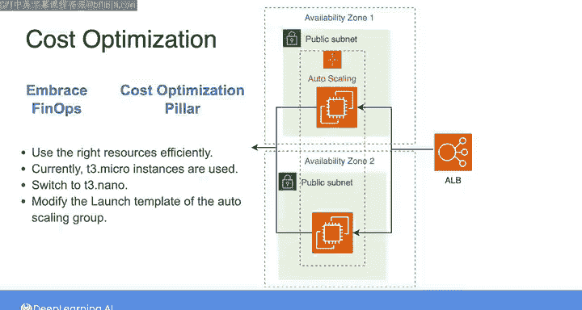
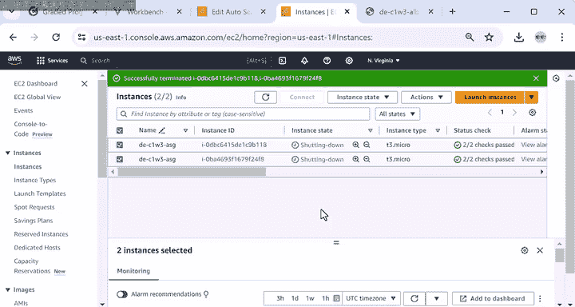
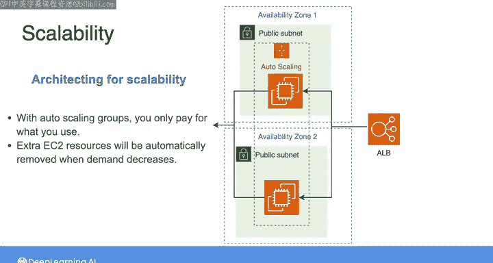
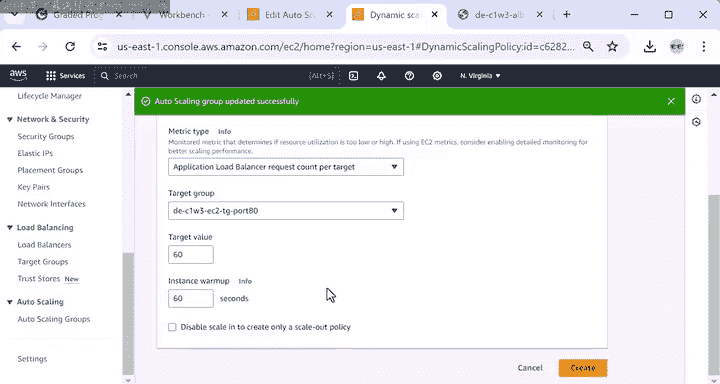
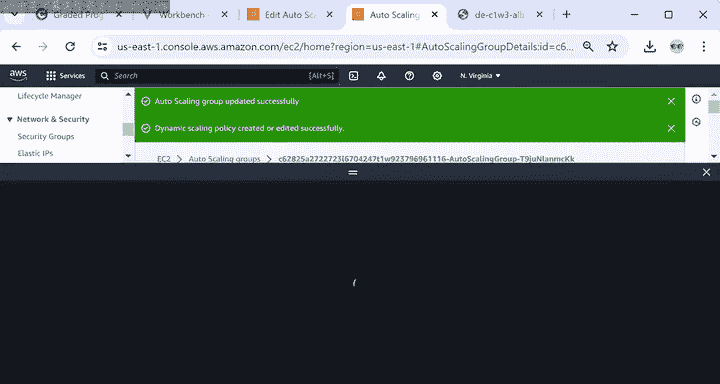
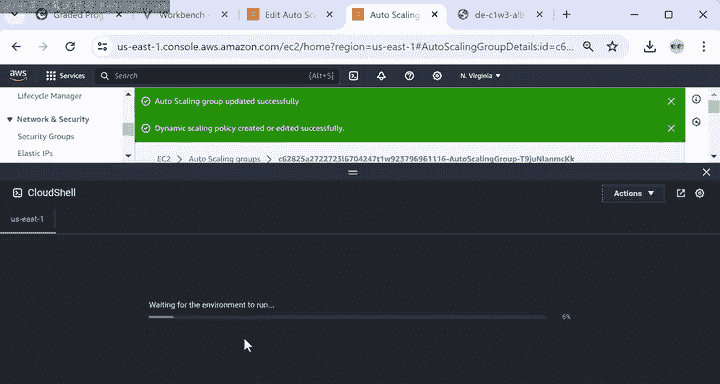
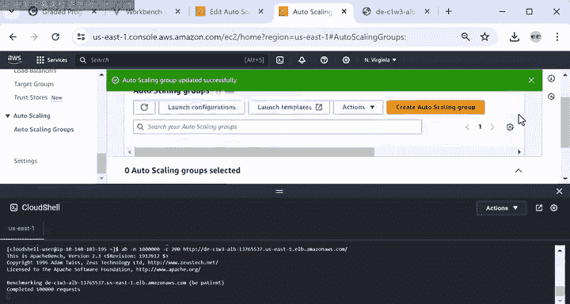
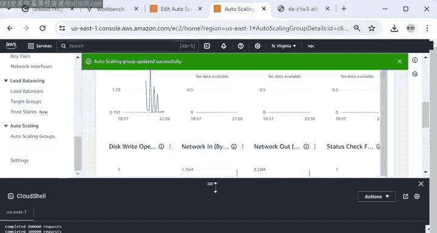
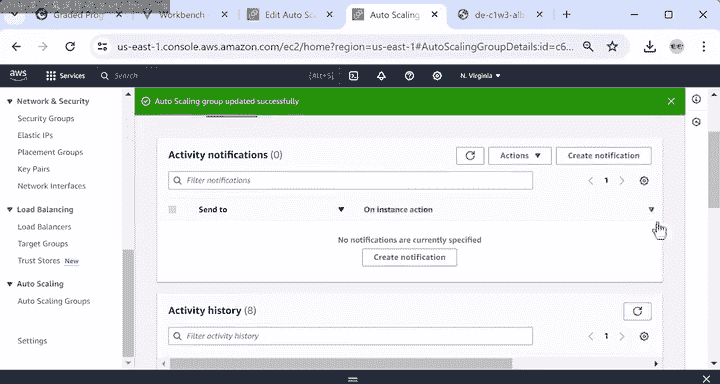
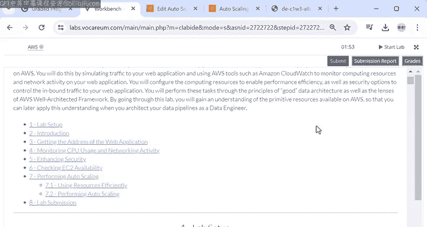

#  059：应用良好数据架构原则 🔧

在本教程中，我们将学习如何将良好的数据架构原则应用于一个Web应用程序。我们将重点关注**安全性**、**可靠性**、**成本优化**和**可扩展性**，通过实际操作来调整AWS云环境中的配置。

---

## 概述 📋

上一节我们模拟了Web应用的流量并监控了CPU使用率和网络活动。本节中，我们将根据实验指南第5至7部分的任务，预览如何应用良好数据架构原则，以确保应用的安全性、可用性、可扩展性，并优化成本。

---

## 安全性配置 🔒

根据“安全优先”架构原则和AWS Well-Architected框架的安全支柱，构建任何应用或数据系统时都应优先考虑安全。

为了控制对本实验Web应用的访问，您可以配置负载均衡器，使其仅接收特定类型的请求，同时阻止其他请求。当客户端向Web服务器发送请求时，需要地址和端口号。端口号是应用程序用来区分流量类型的虚拟标识符，每个端口可以与特定进程关联，以方便程序员。默认情况下，特定端口号被分配给常见请求。例如，端口80被分配给HTTP请求。然而，如果负载均衡器的安全规则配置不当，外部客户端仍可能访问其他端口。

对于本实验使用的Web应用，实验指南指出，由于配置错误，一些私有数据可能通过负载均衡器的端口90泄露。为了验证这一点，我将转到显示网页的标签页，复制地址，并将其粘贴到另一个标签页中，但这次我会附加`:90`来指定端口90。

此处的消息显示，有一些私有数据通过此端口显示，并且外部方可以轻松访问。要解决此问题，您需要调整负载均衡器的安全规则，即安全组。

让我们从控制台打开EC2，在左侧面板中导航到“网络与安全”部分，然后单击“安全组”。您可以看到两个安全组。第一个与自动扩展组的EC2实例关联，第二个与负载均衡器关联。如前所述，负载均衡器是客户端的主要联系点，应配置为接收来自外部互联网的流量，这将是您在实验部分调整的内容。但在调整之前，让我们验证EC2实例的安全组是否配置为仅接收来自负载均衡器的流量。

如果您单击EC2安全组的ID并向下滚动检查入站规则，您会发现此规则将负载均衡器安全组的ID列为源。这意味着EC2实例只能按预期从负载均衡器接收流量。

现在，让我们返回并调整负载均衡器安全组的配置。打开负载均衡器的安全组后，您会发现此规则将一堆零指定为源，这意味着它接受来自所有IP地址的请求，并且也接受端口范围内的所有可能端口号。这意味着任何源都可以使用任何端口访问负载均衡器，这是一个非常开放的规则。换句话说，使用这样的配置，您的Web应用对公共互联网的任何IP地址和任何端口号都是开放的，而这并不是您想要的。

让我们通过将HTTP请求限制为仅端口80来修复此问题。我将单击“编辑入站规则”，然后单击“添加规则”。在端口范围下，我将指定端口80。对于源，我将通过指定此块来选择所有IP地址。然后，我将删除第一条规则，然后单击“保存规则”。

现在您可以看到更新后的规则，端口范围为80。让我们验证端口90是否不再可从公共互联网访问。我将打开一个标签页，输入应用程序地址并附加`:90`。您可能仍会看到旧结果，因为Web浏览器可以缓存结果。但如果您不断刷新网页，您会注意到无法再访问包含私有数据的页面。如果您等待足够长的时间，您将收到此错误消息，提示“无法访问此网站”。这就是您如何调整Web应用的安全控制。

---

## 可靠性探索 🛡️

接下来，让我们转到实验指南的第6部分，探索应用的可靠性方面。

架构图告诉我们，自动扩展组配置为从两个EC2实例开始，每个实例启动于不同的可用区。为了验证这一点，我将转到显示应用程序网页的标签页。显示的消息显示了处理HTTP请求的EC2实例的内部IP地址及其可用区。我刷新此页面，现在您看到第二个EC2实例的IP和可用区。这意味着每次请求都由不同的EC2实例处理。

设计跨越多个可用区的应用与基于云的解决方案的可靠性支柱以及我们本周讨论的“为故障做计划”原则相关。这样，如果某个可用区出现问题，请求仍可以由托管在另一个区域的EC2处理。

---

## 成本优化与可扩展性 ⚙️

最后，让我们探索应用的两个方面：成本优化和可扩展性，这在实验指南的第7部分中涵盖。为了拥抱FinOps，您需要确保高效使用正确的资源。

请记住，上周我们了解到有不同类型的EC2实例，每种具有不同的处理能力和内存容量。当然，EC2实例功能越强大，您需要为每小时使用支付的费用就越多。目前我们使用的是t3.micro实例，但如果它们对您的应用来说功能过于强大且成本较高，您可以切换到t3.nano实例以降低成本。为此，您需要转到自动扩展组并修改启动模板，该模板保存了启动EC2实例的配置信息。

在AWS控制台中，我将搜索EC2，然后滚动查找左侧面板中的自动扩展组。我将单击组名并找到启动模板部分。此部分包含当前EC2实例的配置信息，因此您可以看到当前实例类型是t3.micro。让我们编辑模板。

在这里，我将单击“创建启动模板版本”以创建现有启动模板的新版本。除了实例类型外，我想保持一切不变，因此我将向下滚动到实例类型部分并搜索t3.nano。您会注意到nano和micro实例之间的区别在于它们的内存容量，当然还有定价。我将选择t3.nano，然后单击“创建模板版本”。

模板成功创建后，让我们返回自动扩展组，然后再次单击组名。在启动模板部分，我将单击“编辑”。然后在版本下拉菜单中，我将选择最新选项。别忘了单击底部的“更新”。这样，我就更新了该组未来将创建的所有EC2实例的启动模板配置，但我们也希望终止当前仍在运行的t3.micro EC2实例。

为此，我将导航到左侧面板的实例部分，选择当前运行的所有EC2实例，然后右键单击其中任何一个，并单击“终止实例”。EC2实例的状态现在显示为“正在关闭”。几分钟后，一旦您刷新UI，EC2实例的状态应显示为“已终止”。

您还会注意到已创建一个或两个新的t3.nano实例。这是因为自动扩展组的期望容量为两个实例，意味着它将始终启动两个实例。因此，如果您现在只看到一个实例在运行，过一会儿刷新UI后，您将看到两个t3.nano实例在运行。

对于实验指南第7部分的最后一项任务，我们将应用“为可扩展性而架构”的原则，通过使用自动扩展组的自动扩展属性来扩展和缩减资源。使用自动扩展组，您只需为使用的资源付费。因此，当需求减少时，AWS自动扩展将自动移除任何多余的EC2资源，帮助您避免超支。

目前自动扩展功能未启用。要启用自动扩展，您需要创建一个扩展策略，在其中指定触发自动扩展过程的指标和阈值。

因此，在EC2实例的左侧面板中，让我们导航到自动扩展组部分，然后单击组名并转到“自动扩展”选项卡。在这里，我将单击“创建动态扩展策略”，并按照实验指南中的名称命名策略。对于指标类型，我将选择“应用程序负载均衡器请求计数/目标”，对于目标组，我将选择端口80组。然后，我将选择60作为目标值，意味着当有超过60个HTTP请求时，自动扩展组可能会扩展以添加更多实例来处理增加的负载；当请求少于60个时，自动扩展组将通过减少实例数量来缩减。最后，我将将实例预热时间设置为60秒。此预热时间指的是新启动的实例在被视为可用于自动扩展评估指标之前，允许完全初始化的时间段。别忘了单击底部的“创建”。

现在，让我们使用Apache Bench进行更密集的压力测试，发送100万个请求，而不是7000个。我将单击此处底部的CloudShell图标，以便使用命令行发出请求并检查请求状态，同时监控应用程序的性能指标。

我将输入此命令，并将最后一个参数替换为应用程序的地址。测试需要几分钟才能运行。与此同时，让我们转到自动扩展组服务，然后单击“监控”，再单击“EC2”。在这里，您可以看到CPU使用率和网络指标中的一些活动。

几分钟后，您可以切换到“活动”选项卡，看到启动了额外的实例来处理增加的流量。

---

## 总结 🎯

本节课中，我们一起学习了如何将良好的数据架构原则应用于一个实际的Web应用。我们通过配置安全组规则增强了**安全性**，通过跨可用区部署验证了**可靠性**，并通过调整实例类型和启用自动扩展策略实现了**成本优化**和**可扩展性**。这些实践操作展示了在云环境中构建健壮、高效且安全的数据系统的基本方法。