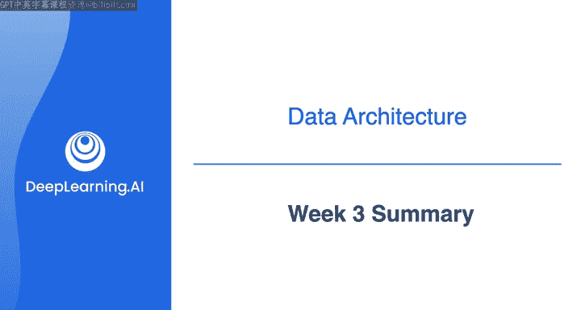
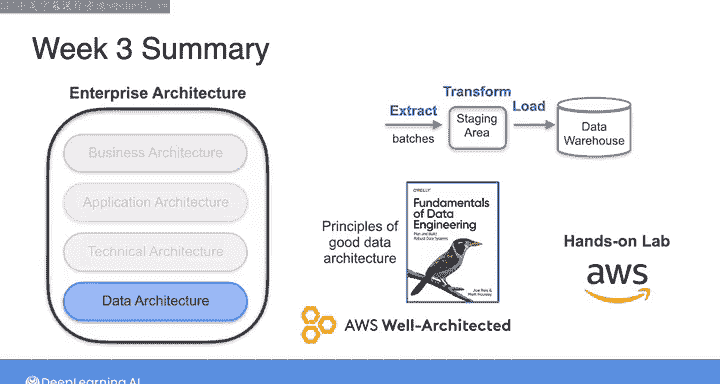

#  060：数据工程（导论，源系统、数据摄取和管道，数据存储和查询｜1-2-3课）｜第3周总结 🎯

在本节课中，我们将对数据工程课程的第三周内容进行总结。本周我们深入探讨了数据架构，以及如何构建良好的数据架构。

## 概述

第三周的学习重点是数据架构。我们首先了解了数据架构在企业整体架构中的位置，然后分析了一些具体的架构示例，探讨了如何将利益相关者的需求转化为数据系统的技术选择。我们详细回顾了良好数据架构的原则，并有机会探索了AWS完善架构框架。最后，在实验环节，你的任务是在AWS云上为数据架构评估成本、性能、可扩展性和安全性等方面的权衡。

## 课程内容回顾

上一节概述了本周的学习目标，本节中我们来详细回顾各个核心环节。

### 数据架构与企业架构

我们首先审视了数据架构在更广泛的企业架构背景下的位置。数据架构并非孤立存在，它需要与企业业务目标、应用架构和技术基础设施保持一致。

### 从需求到技术选择

之后，我们研究了一些具体的架构示例。关键在于学习如何开始思考将利益相关者的需求转化为数据系统的技术选择。这个过程涉及对业务目标、数据特性、处理需求和约束条件的综合分析。

### 良好数据架构的原则

我们详细回顾了良好数据架构的核心原则。这些原则是构建高效、可靠、可维护数据系统的基础。

以下是构建良好数据架构需遵循的一些关键原则：

*   **可扩展性**：系统应能随数据量和用户量的增长而平滑扩展。
*   **可靠性**：系统需要具备高可用性和容错能力。
*   **安全性**：必须保护数据免受未授权访问和泄露。
*   **成本效益**：在满足性能要求的同时，优化资源使用以控制成本。
*   **性能**：确保数据处理的延迟和吞吐量满足业务需求。
*   **简单性与可维护性**：设计应易于理解、修改和运维。

### AWS完善架构框架

你还获得了探索AWS完善架构框架的机会。这是一套补充性原则，可以帮助你在AWS上设计健壮且高效的数据系统。该框架围绕六个支柱构建：卓越运营、安全性、可靠性、性能效率、成本优化和可持续性。

### 实践：评估架构权衡

在本周的实验环节，你的任务是在AWS云上评估数据架构的权衡。这要求你在多个维度之间做出决策。

以下是实验环节需要评估的关键权衡维度：

*   **成本 vs. 性能**：选择更高性能的实例或服务通常意味着更高的成本。
*   **可扩展性 vs. 复杂性**：实现自动扩展会增加架构的复杂性。
*   **安全性 vs. 便利性**：更严格的安全控制可能会影响开发的便捷性或用户体验。

## 总结

本节课中，我们一起学习了数据架构的核心概念。我们探讨了数据架构在企业中的角色，学习了如何从需求推导出技术选型，重温了良好架构的设计原则，并借助AWS框架和动手实验，实践了在真实云环境中进行架构权衡决策的方法。这些知识为你设计和评估数据系统奠定了坚实基础。

我们下周的课程材料中再见。届时，我们将整合你在本课程中学到的所有概念，构建另一个AWS云上的数据架构。

*AWS云上的数据架构*