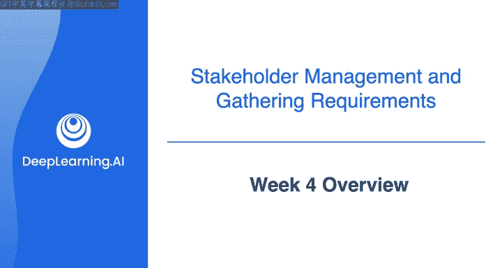
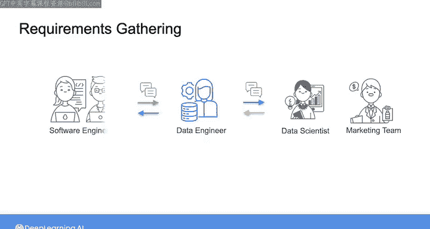
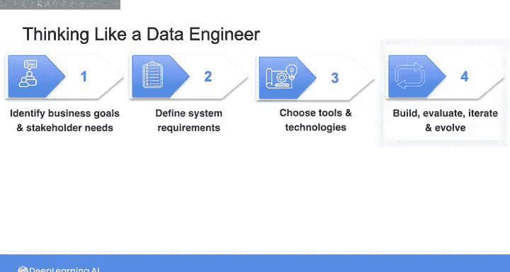
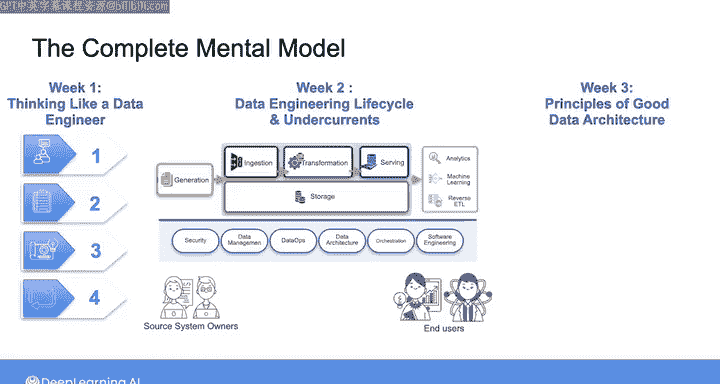
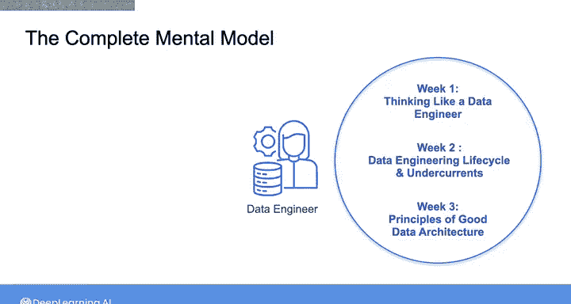
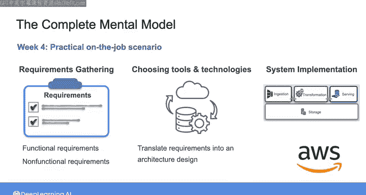

#  061：数据工程导论课程 - 第4周概览 🗺️

在本节课中，我们将回顾前三周的学习内容，并了解第四周的学习目标。我们将把之前学到的知识整合起来，通过一个实际的工作场景，学习如何从需求收集到系统实现的完整流程。

---

## 回顾前三周内容

在第一周课程中，我们简要了解了与数据工程师工作相关的需求收集。

我们探讨了你与公司数据科学家之间可能进行的对话，内容涉及他们正在进行的分析和机器学习项目的需求。你看到这样的对话如何迅速揭示出你需要与其他利益相关者（例如营销团队和软件工程师）沟通的必要性。

我们还介绍了一个数据工程师的思维框架。该框架包含以下步骤：
1.  识别业务目标和利益相关者需求。
2.  根据这些需求定义系统要求。
3.  选择满足要求的工具和技术。
4.  最终构建并部署你的系统。

这个简洁的框架包含了许多内容。即使我补充了每个步骤中的具体细节，例如第一步中询问利益相关者将采取什么行动，第二步中将利益相关者需求转化为系统要求，第三步中进行原型设计和测试，以及最后一步中演进你的系统，你仍然会发现有许多内容未被提及或详细说明。

本课程的第二周和第三周旨在填补这些细节，帮助你形成一个更完整的数据工程思维框架，理解数据工程领域，并了解在实践中作为一名数据工程师的角色和感受。

在第二周，我们学习了数据工程生命周期的各个阶段和底层支撑。我们不仅关注构成数据系统的组件，还关注所涉及的人员，包括源系统所有者和下游最终用户。

在第三周，我们深入探讨了良好数据架构的原则。你了解到，从一开始就应该考虑诸如为故障做计划、选择通用组件或系统设计元素等事项。

至此，你已经掌握了构成数据工程师工作关键思维模型的所有组成部分。

---

## 第四周学习目标

本周，我们将在一个实际的全职工作场景中，把所有学到的知识整合起来。

我们将从需求收集开始，然后选择工具和技术，最后实现你的系统。

接下来，我将从本课程第一周需求收集对话结束的地方开始，继续完成定义和记录功能性与非功能性需求的过程，并讨论可用于构建满足这些需求的系统的工具和技术。

在本周的学习过程中，我们将不时停下来，讨论一些概念和最佳实践。这些内容旨在帮助你在未来作为数据工程师遇到各种新场景时能够牢记于心。

在本周结束时，你将把需求转化为架构设计，并在AWS云上构建你的系统。

请与我一起进入下一个视频，开始学习。

---

## 总结

本节课中，我们一起回顾了数据工程思维框架、生命周期阶段和架构原则。从下一节开始，我们将把这些理论知识应用于一个完整的实践项目，体验从需求分析到云端部署的数据工程全流程。