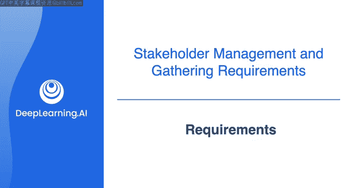
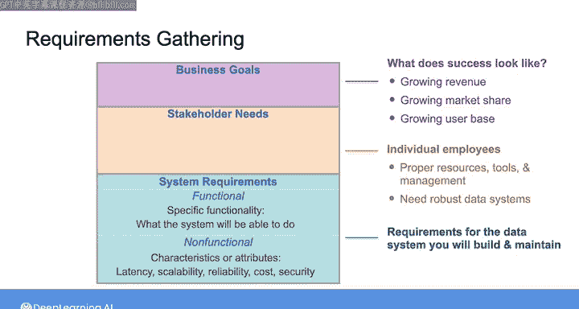

#  062：需求层次结构 📊

在本节课中，我们将学习数据工程师如何通过“需求层次结构”来理解业务目标、利益相关者需求以及系统要求。我们将探讨如何从高层业务目标出发，逐步分解到具体的功能性和非功能性需求，从而构建出能够有效支持业务的数据系统。

---

正如上一节视频所述，本周的重点是整合“像数据工程师一样思考”框架的各个方面。该框架始于通过需求收集过程来识别业务目标和利益相关者需求。

此时，请开始将需求视为一种**需求层次结构**。

在这个层次结构的顶端，是**业务的目标和目的**。这些描述了整个业务成功的样貌，例如围绕增长收入、市场份额、用户基数或其他代表业务最佳结果的目标。

层次结构中的下一层是**利益相关者需求**。在本课程中，“利益相关者”主要指企业中的个体员工。他们各自在实现高层业务目标中扮演角色。为了成功完成工作，利益相关者有其需求，他们需要适当的资源、工具和管理等。在本课程中，你可以假设他们还需要**稳健的数据系统**。

在利益相关者需求之下，是**系统要求**。原则上，这可以是任何系统，但这里我们特指你将构建和维护的**数据系统**。这是一组你的数据系统必须满足的要求，以便很好地服务于利益相关者需求。

接下来，系统要求可进一步分为**功能性需求**和**非功能性需求**。

功能性需求是指那些可以用特定功能来表达的系统要求，即系统为了满足利益相关者需求而**能够做什么**。

例如，一个监控银行交易欺诈行为的数据系统的功能性需求可能是：**`系统能够立即报告潜在的欺诈交易。`**

另一方面，非功能性需求可以被视为系统的**特性或属性**，这些特性使其能够正常运行。这些特性可能涉及延迟、可扩展性、可靠性、成本或安全性等方面。

例如，一个从电商平台摄取数据的流处理管道，在可扩展性方面的非功能性需求可能是：**`系统必须能够扩展到同时处理来自10,000名购物用户的数据。`**

以上就是与你作为数据工程师工作相关的业务**需求层次结构**。这里的主要启示是，正如我们一直讨论的，你构建数据系统的工作直接关系到组织内其他人的工作以及业务的整体目标。这就是为什么理解利益相关者需求和业务目标对你的工作如此重要。

这让我们回到**需求收集**。

在本课程的第一周，我们首先与数据科学家进行了对话以理解他们的需求。你可以将那次练习视为从这个层次结构的中间某处开始的需求收集。

然而，理想情况下，你希望从顶层开始。这意味着需要与领导层讨论公司的目标。

如果你在一家小公司工作，甚至可能有机会与CEO对话。我强烈推荐这样做。如果你在更大的组织，你只需要沿着指挥链尽可能向上，以了解业务目标。

在本课程第一周，你看到了我与Seul的对话，她曾在许多大型组织担任首席数据官。并非所有组织都有CDO，但大多数会有一位首席技术官或CTO，他是公司里的技术高管。CTO负责领导工程部门利用技术改进产品和服务，目标是促进业务增长。

在下一个视频中，我将向你介绍我的朋友Matt Hsley，他在与包括CTO在内的C级高管对接方面拥有丰富经验，他也是《数据工程基础》一书的合著者。他将分享一些关于如何开始数据工程生涯，以及如何与业务领导者合作提出业务问题解决方案的建议。

然后，我们将看看是否能邀请他加入我们本周的需求收集游戏，在游戏中他将扮演你刚被聘为数据工程师的公司的CTO角色。

请加入下一个视频，与Matt见面。

---

本节课中，我们一起学习了数据工程中的**需求层次结构**。我们了解到，构建有效的数据系统始于理解顶层的**业务目标**，然后分解为具体的**利益相关者需求**，并最终转化为数据系统必须满足的**功能性需求**和**非功能性需求**。掌握这种从宏观到微观的思考方式，是确保你的数据工程工作与业务价值紧密对齐的关键。下一节课，我们将学习如何与高层管理者沟通，以更好地收集和理解这些需求。