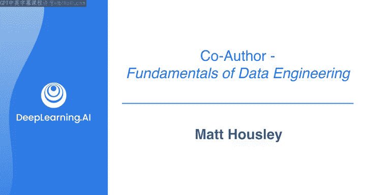
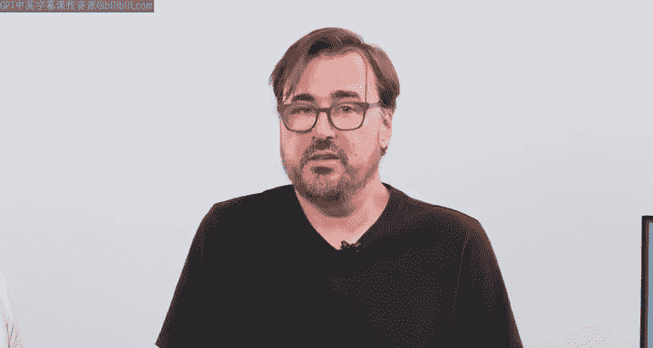
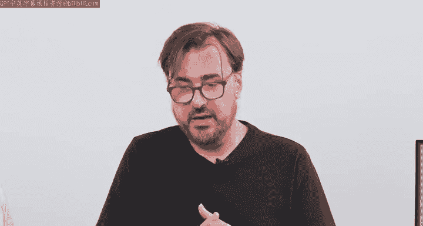
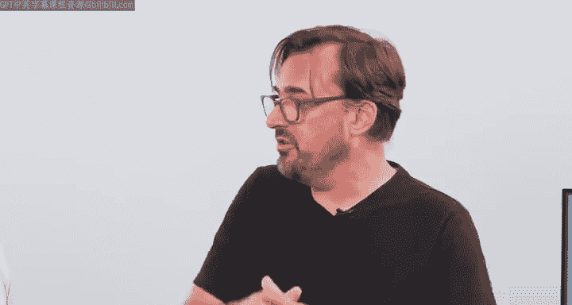
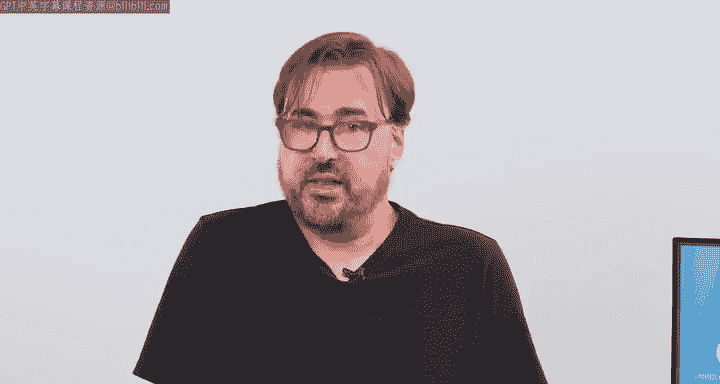

#  063：与Matt Housley的对话 🎙️

在本节课中，我们将学习数据工程领域的核心动机、学习方法以及如何将理论知识与实践相结合。课程内容基于《数据工程基础》一书作者Matt Housley的分享，旨在为初学者提供一个清晰的学习路径。

## 课程概述

本节课程将探讨数据工程领域的教育现状、学习资源的价值以及进入该领域的实用建议。我们将了解《数据工程基础》一书的创作背景，并讨论如何通过结合书籍理论与课程实践来构建扎实的数据工程知识体系。

## 书籍创作的动机与目标

上一节我们介绍了课程的整体背景，本节中我们来看看《数据工程基础》这本书的创作初衷。

作者Matt Housley指出，撰写此书的动机源于发现数据工程教育和书籍市场存在一个明显的缺口。现有的材料大多侧重于具体的工具和技术，缺乏对数据工程领域本身的系统性定义，也未能提供一个指导从业者如何像数据工程师一样思考和工作的心智框架。

因此，本书的写作视角并非成为某个特定技术（X、Y、Z）或云服务商（A、B、C）的教程，而是旨在提供对数据工程领域**第一性原理**的审视。其核心受众是具有技术背景但希望转入数据工程领域的人士。同时，本书也适用于其他次要受众，例如需要与数据工程师紧密合作、将数据产品嵌入应用程序的技术产品经理。

## 书籍与课程的互补关系

在了解了书籍的定位后，我们来看看它与本课程如何相辅相成。

书籍与课程的目标受众高度相似，都面向希望转入数据工程或希望更好理解相关概念的人。书籍提供了**数据工程生命周期**和**底层支撑要素**的理论框架，而本课程则允许你通过动手实践来应用这个框架。课程使用AWS等流行云工具和技术，让你通过实验获得实践经验，从而将书中的概念与实际操作技能真正结合起来。

## 进入数据工程领域的建议

从理论框架过渡到职业发展，本节我们探讨如何迈入数据工程领域。

以下是给希望进入数据工程领域人士的一些建议：

首先，学习核心的数据概念非常有益。即使你拥有软件开发背景，也可能缺乏对分析数据如何使用足够的经验。因此，从使用像Microsoft Excel这样的工具开始探索数据是有帮助的，这能让你了解**表格数据**的形态以及数据的用途。

需要强调的是，获得第一份数据工程工作并不仅仅是学习某一套特定的技术栈。在早期阶段，广泛接触多种工具以培养通用能力是更佳选择。当你开始进入具体岗位后，才会专注于所在公司内部使用的特定技术栈。

像《数据工程基础》这样的书籍能提供思考框架，帮助你像数据工程师一样思考。拥有这个框架后，你就能将各种工具归入正确的类别，并有效地履行数据工程师的职能。

## 模拟对话：数据工程师与CTO

理论建议之外，真实的职场沟通也至关重要。接下来，我们将通过一个模拟对话，展示数据工程师如何与首席技术官进行交流。

这个模拟场景基于作者在Ternary Data咨询公司的工作经验。他们曾与众多不同规模和领域的公司合作，从中了解到高层管理者，特别是CTO，在工程和数据方面所关心的问题。对话将揭示数据工程师在实际工作中需要关注的核心业务与技术考量。

## 课程总结

本节课中，我们一起学习了数据工程领域的入门知识。我们探讨了《数据工程基础》一书的创作背景及其提供的核心心智框架，理解了书籍理论与动手实践课程之间的互补关系。同时，我们也获得了进入数据工程领域的实用建议，包括从核心概念入手、广泛接触工具以及构建系统性思维框架的重要性。最后，通过模拟对话的引入，我们为理解数据工程师在实际工作中的沟通场景做好了准备。