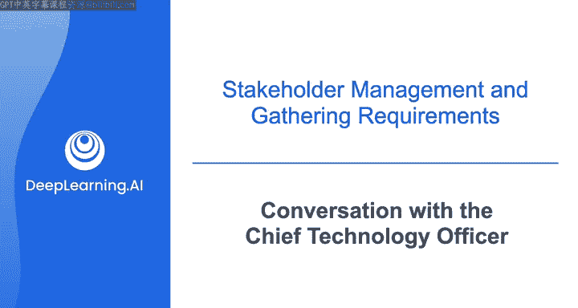
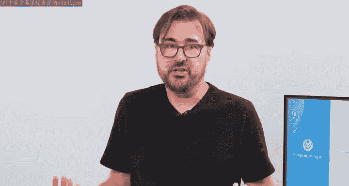
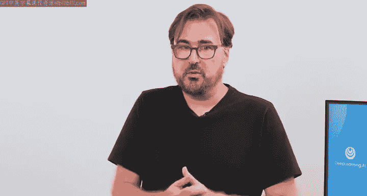
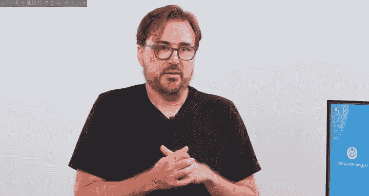

#  064：与CTO的对话 🎤

在本节课中，我们将通过模拟一位新入职数据工程师与公司首席技术官（CTO）的对话，来了解数据工程师在实际业务环境中的角色、面临的挑战以及如何将技术工作与公司战略目标对齐。我们将重点关注业务目标、技术债务、数据工具选择以及人工智能计划。

---

## 概述

本节课模拟了一位新入职的数据工程师“Joe”与公司CTO“Matt”的对话。Matt阐述了公司的业务目标、当前面临的技术挑战，并解释了数据工程师在这些计划中的关键作用。对话涵盖了市场扩张、技术现代化、数据工具选型以及机器学习项目支持等多个方面。

## 业务背景与挑战

上一节我们介绍了课程的基本场景。本节中，我们来看看CTO Matt如何描述公司的现状与核心挑战。

Matt首先介绍了公司的基本情况：作为一家电子商务平台，公司在有限的几条产品线上取得了相对成功，这得益于出色的营销和先发优势。

然而，公司目前面临两大核心挑战：
1.  **市场竞争加剧**：随着市场发展，许多小型品牌涌现并蚕食市场份额。
2.  **技术债务风险**：公司平台继承了一些陈旧的遗留代码，这些代码可能导致代价高昂的系统中断，损害客户品牌。

## 核心战略举措

基于上述挑战，公司制定了明确的战略举措。以下是Matt阐述的几项关键计划：

*   **扩大市场份额**：通过推出新产品来实现。
*   **拓展国际市场**：将业务推向更多国家和地区。
*   **进行软件重构**：这是支持以上业务扩张的技术基础。重构的目标是：
    *   清除遗留系统中存在风险的旧代码。
    *   使整个系统具备更高的可扩展性。

## 数据工程师的角色与影响

了解了公司的战略方向后，我们来看看这些举措将如何具体影响数据工程师的工作。

Matt询问这些变化对数据工程师Joe的影响。Joe回应说影响会很大，并期待帮助实现系统现代化。Matt对此表示赞同，并指出了他作为CTO经常担忧的一个问题：**软件与数据之间的隔阂**。

他解释道，开发人员经常在“真空”中编写代码，而数据工程师只能被动消费其输出的数据，这导致了一个大问题：遗留代码生成的数据模式非常难以用于分析。

因此，Matt对Joe的核心期望是：**在软件团队重构代码时担任顾问角色**，确保代码输出的数据适合分析，并尽量减少后续处理。虽然无法完全消除ETL（提取、转换、加载）过程，但如果能以正确的模式生成数据，流入分析系统的数据将干净得多。

## 技术栈与工具

明确了角色之后，数据工程师需要了解将要使用的技术工具。以下是Matt介绍的计划采用的技术：

作为重构计划的一部分，公司希望从**批处理**方式更多地转向**流处理**方式。

目前正在评估的AWS技术包括：
*   **Kinesis**：亚马逊原生的流处理服务。
*   **Kafka**：随着规模扩大，可能为某些管道采用。

Joe表示虽然缺乏实际经验，但学习过相关课程，并渴望将关于Kinesis和Kafka的实验室知识应用到实际场景中。Matt鼓励Joe在此期间搭建概念验证演示，试验这些技术的可扩展性，并扎实掌握相关技能，因为未来管理和扩展公司的流处理能力将是他的关键职责之一。

## 人工智能与机器学习计划

最后，我们探讨公司在前沿技术领域的规划。Joe询问公司是否在机器学习或人工智能方面有目标。

Matt指出，技术计划的另一个主要目标是**提高客户留存率**。核心软件重构将通过提供响应更快的网站和更少的停机时间来支持这一目标。

此外，公司正在开发一个**推荐引擎**。数据工程团队的工作将是开发数据管道来为该推荐引擎提供数据。这涉及：
*   分析产品分类中的数据。
*   分析客户在网站上的行为数据（如点击流、订单行为）。
*   与数据科学家合作，设计支持该流程的数据管道。

## 总结

本节课中，我们一起学习了数据工程师如何通过与技术高管的沟通来理解业务全局。我们了解到，数据工程师的工作远不止于构建管道，更需要：
1.  **对齐业务目标**：理解市场扩张、产品创新等战略如何转化为技术需求。
2.  **弥合软件与数据的隔阂**：在系统开发早期介入，确保数据产出便于分析。
3.  **掌握现代数据技术**：如从批处理转向流处理，并熟练使用Kinesis或Kafka等工具。
4.  **支持数据驱动应用**：为推荐引擎等机器学习项目构建可靠的数据基础设施。

通过这次对话，我们看到了一个成功的数据工程师需要具备技术技能、业务理解力和跨团队协作能力。