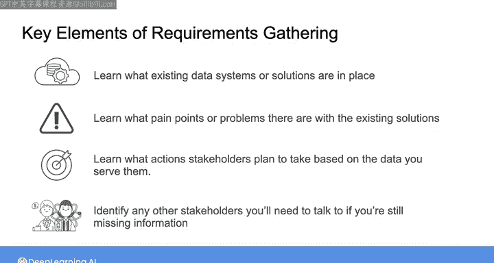

#  065：与市场营销部门的对话 📊

在本节课中，我们将学习如何与业务部门（以市场营销团队为例）进行有效沟通，以收集数据项目的具体需求。我们将通过一个模拟对话，分析如何识别现有系统的问题、理解业务目标，并明确数据工程需要交付的价值。

上一节我们介绍了需求收集的宏观框架，本节中我们来看看如何在实际对话中应用这些原则。

---

## 概述：对话的目标与框架

在与产品营销经理Colleen的对话前，数据工程师Joe已经了解到营销团队有两个核心需求：一个是关于产品销售指标仪表板，另一个是关于产品推荐系统。本次对话的目的是获取这两个项目的更多细节和期望。

任何需求收集过程都包含四个关键要素，本次对话将围绕它们展开：



以下是需求收集的四个关键要素：
1.  了解当前向利益相关者交付数据的任何现有系统或解决方案。
2.  理解这个现有系统或数据存在的任何问题。
3.  理解利益相关者计划用你提供的数据采取什么行动。
4.  确定需要与之交谈的其他利益相关者，或需要进行的对话，以收集任何缺失的信息。

请确保在观看对话展开时注意这些要素。

---

## 对话解析：从现状到期望

### 1. 仪表板系统的现状与问题

Joe首先询问了当前系统的状态。Colleen指出，仪表板在显示指标和趋势方面已经符合要求，但核心问题是**数据延迟**。

> “目前的情况是，新销售的数据被记录下来，到我们能在仪表板上实际看到它，通常会有几天的滞后。”

现有仪表板的功能包括：
*   按类别和地区查看产品销售额。
*   显示每日数据的时间趋势图。
*   可以下钻到特定区域，查看单个产品或更细时间粒度（如每小时）的详情。

**核心问题公式化**：
`数据延迟 = 数据记录时间 - 数据在仪表板可视时间 ≈ 2天`

### 2. 业务行动与实时数据需求

Colleen进一步说明了为何需要实时数据。除了监控长期趋势，团队希望**在特定产品趋势出现时实时看到**，以便抓住势头，推出更有针对性的促销活动。

> “我们现在偶尔会看到某些产品出现非常有趣的区域需求高峰，我们希望在这件事实际发生时就知道，而不是在需求已经消退后。”

需求高峰的特征是：需求在几小时内急剧上升，然后回落，有时持续一两天，有时仅几小时。

**期望的解决方案**：
`理想数据延迟 ≤ 1小时`

如果仪表板能反映过去一小时（而非两天）的销售数据，营销团队就能做好计划，在观察到销售额连续两三个小时稳步上升时立即采取行动。

### 3. 推荐系统的现状与期望

对于推荐系统，目前有一个非常基础的版本在运行。

> “我们让数据科学家确定前一周销售额中最受欢迎的产品，然后平台团队在结账时将这些产品作为推荐展示给所有人。这更像是‘本周热门产品’，而不是任何个性化的推荐。”

当前系统可以表示为：
```python
# 伪代码：当前推荐逻辑
weekly_popular_products = get_top_selling_products(last_7_days)
recommend_to_all_users(weekly_popular_products)
```

Colleen期望的是一个**个性化推荐系统**，能考虑客户的购买历史以及他们购物车中的商品，做出定制化推荐，类似于主流电商平台的做法。

**期望的解决方案逻辑**：
```python
# 伪代码：期望的推荐逻辑
def generate_personalized_recommendation(user, cart_items):
    user_history = get_user_purchase_history(user)
    recommendations = recommendation_algorithm(user_history, cart_items)
    return recommendations
```

---

## 总结与过渡

本节课中，我们一起学习了如何通过与业务部门的对话来细化数据需求。我们了解到，对于仪表板项目，核心需求是将数据延迟从**天级降低到小时级**，以支持实时营销决策。对于推荐系统，目标是从**全局的“本周热门”升级为个性化的推荐**。

通过关注现有系统、现存问题、业务行动和后续联系人这四个要素，数据工程师能够将模糊的业务愿望转化为明确、可执行的技术要求。


在下一节视频中，我们将深入剖析这段对话，**拆解并提炼出具体的系统需求**，为后续的数据管道与存储设计打下基础。