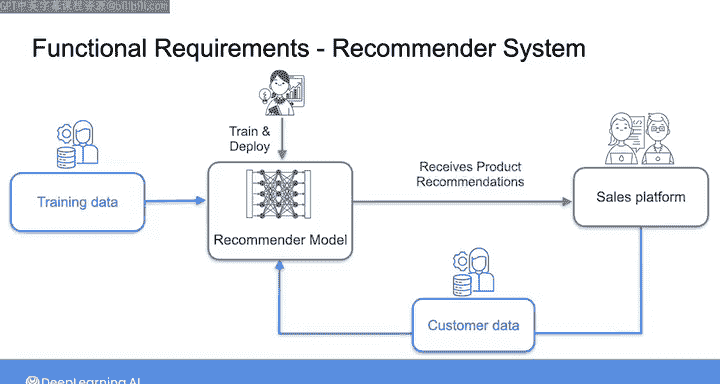

#  066：分析与市场营销部门的对话 📝

在本节课中，我们将学习如何将上一节与市场营销部门的对话内容进行整理，并开始将收集到的需求文档化。我们将使用一个层级结构来清晰地展示从底层系统需求到高层业务目标之间的联系。

---

在上一节中，我们与市场营销部门进行了一次对话，了解了他们的需求。这次对话在某种程度上也确认了您从数据科学家那里已经了解到的一些信息，并提供了关于最终用户具体需求的更多细节。

本节中，我们将回顾所学内容，并开始着手将收集到的需求整理成文档。

## 需求文档化方法 🗂️

我喜欢使用我们在之前课程中看过的层级结构来记录需求。这种方法可以轻松地可视化从底层的系统需求一直到高层业务目标之间的联系。

因此，在最顶层，我可以首先写下我所理解的业务目标。

## 记录业务目标 🎯

在本案例中，我们了解到的业务目标是：公司旨在通过专注于客户保留和忠诚度，以及扩展到新市场和新产品，来延续其增长轨迹。在这些努力中，他们渴望在决策过程中做到数据驱动。

在业务目标之下，我们现在可以添加利益相关者的需求。

## 记录利益相关者需求 👥

目前，我将把数据科学家和产品营销经理一起视为我们迄今为止交谈过的利益相关者。在这一点上，我们知道他们主要需要两样东西：一些分析仪表板和一个推荐系统。

以下是他们的具体需求：

### 分析仪表板需求

数据科学家和产品营销经理都表示，他们需要在仪表板中呈现实时或当前的数据。通过更深入地挖掘并询问他们计划用这些数据采取什么行动，我们了解到营销团队希望了解特定产品何时出现需求激增，以便他们能够对额外的促销活动做出反应。

鉴于这些需求激增的持续时间预计从几小时到一两天不等，每小时更新一次仪表板似乎就足够了。营销部门确认这完全可以满足他们的需求。

因此，我们得到了一个利益相关者需求。您可能会为数据系统捕获相关的功能需求，如下所示：
`数据系统需要提供和处理不超过一小时前的数据。`

### 推荐系统需求

当前的解决方案似乎只是在用户结账时在页面上显示一些热门产品。而营销团队希望拥有的是一个能够根据用户的浏览或购买历史以及他们在结账时购物车中的商品，提供定制化产品推荐的系统。

因此，我们得到了另一个利益相关者需求。为了满足这个需求，您的数据系统的功能需求可以这样描述：
`系统首先需要为推荐模型的开发提供适当的训练数据，然后能够接收、转换用户数据并将其提供给训练好的推荐模型，最后将模型输出（可能以产品ID的形式）返回给销售平台。`

## 需求转换的要点 ⚠️

我想在此暂停一下，强调一个事实：将利益相关者的需求转化为系统的功能需求可能有点棘手。

正如您在分析仪表板的例子中所看到的，营销团队实际需要的是仪表板本身。因此，很容易会写下一些关于仪表板功能或要显示指标的细节。但实际上，构建仪表板将是数据科学家的责任。数据科学家需要访问不超过一小时的数据。因此，就您的数据系统而言，只要您能够及时提供数据科学家所需的数据，那么您的系统就满足了这一功能需求。

对于推荐系统，营销团队需要进行定制化的产品推荐。为了实现这一点，将涉及多个人员和团队：数据科学家需要训练和部署推荐模型，平台团队需要能够接收来自模型的推荐以在平台上显示。就您的数据系统而言，您需要向数据科学家提供训练数据以开发模型，然后需要能够将客户数据从平台传递到模型，再将模型输出发送回平台。

## 当前文档化成果 📄

至此，我们已经为每个数据系统记录了一个功能需求。在实践中，任何给定的系统都可能有许多功能需求，以及比我们这里列出的更详细的细节。但为了简单起见，我们现在暂时只保留这两个功能需求。

这就是您如何开始记录功能需求的方法。很快，我们还将讨论如何记录非功能需求。但在那之前，我们将进行更多的利益相关者对话。

---

在本节课中，我们一起学习了如何将利益相关者的对话内容转化为结构化的需求文档。我们使用层级方法，从业务目标开始，逐步细化到具体的系统功能需求，并重点讨论了在转换过程中需要注意的关键点。下一节，我们将与维护销售平台（即您将从中摄取数据的源系统）的软件工程师进行对话。