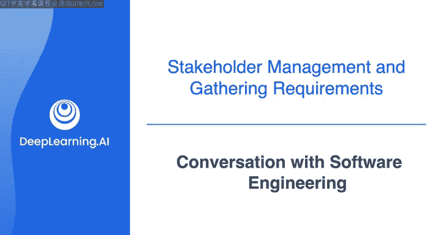
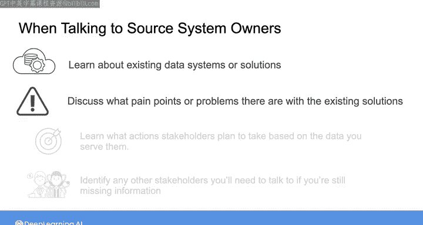

#  067：与软件工程师的对话 👨‍💻

在本节课中，我们将学习如何与源系统的软件工程师进行有效沟通，以收集数据管道需求，并共同应对数据流中断、格式变更等常见挑战。通过与源系统所有者的协作，我们可以构建更健壮的数据系统。

---

上一节我们介绍了与数据科学家和产品营销经理的沟通。本节中，我们来看看如何与负责生成数据的软件工程师进行对话。

与源系统所有者沟通时，你仍然可以使用需求收集过程的前两个关键要素来引导对话。你可以询问系统所有者关于生成下游利益相关者所需数据的现有系统，并与所有者讨论你的利益相关者当前解决方案遇到的任何问题。在后续课程中，你将了解更多关于源系统的知识，以及在与源系统所有者合作时需要考虑的事项。

以下是对话的核心内容：

*   **数据共享现状**：目前，销售平台团队通过每日提供文件下载的方式，向数据科学家提供产品销售数据，以供营销团队分析。他们无法直接开放生产数据库的访问权限，因为这会给销售平台带来风险。
*   **提议的解决方案**：软件工程师提议建立一个生产数据库的**只读副本**。所有记录在写入生产数据库后，会立即被推送到这个副本中。然后，可以设置一个**API**，允许外部人员查询只读副本中的数据，而不会干扰生产系统。
*   **数据延迟问题**：数据科学家偶尔会遇到数据等待时间过长的问题。新的只读副本设置可以解决因系统维护导致文件导出延迟的问题。然而，服务器或数据中心故障导致的平台暂时宕机，仍可能造成数据不可用。最佳做法是建立自动通知机制，在宕机时提醒下游数据使用者。
*   **模式变更问题**：数据库**模式**（Schema）的变更（例如，因添加新功能、拓展新区域或产品线）可能会破坏下游的数据处理脚本。软件工程师通常会在部署变更前大约一周知晓计划。
*   **协作与沟通**：数据工程师需要被纳入变更通知的循环中，以便提前预知模式变化并相应调整数据管道。双方可以共同努力，确保通过API提供的数据格式保持稳定，或在无法避免变更时，给予充分的事先通知。

---

本节课中，我们一起学习了如何与源系统的软件工程师进行关键对话。通过这次模拟对话，我们看到，开放的沟通渠道对于构建健壮的数据系统至关重要。源系统所有者通常乐于协作，尤其是在他们理解你的需求之后。在下一视频中，我们将继续记录需求的过程，并探讨系统可能的一些非功能性需求。