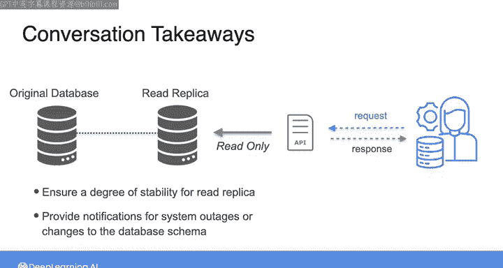
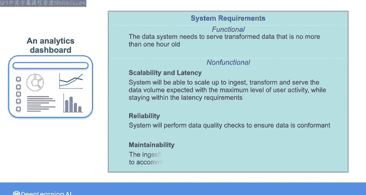
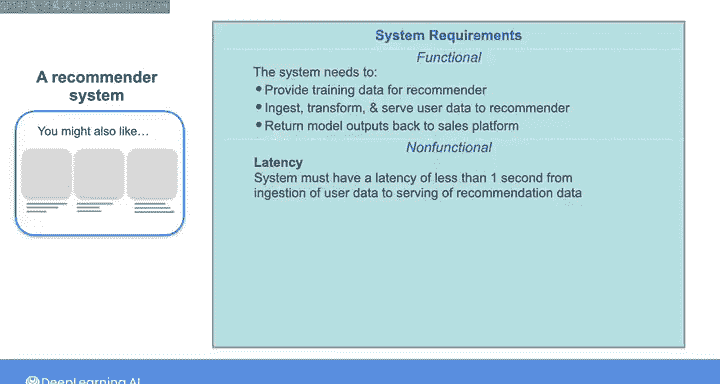
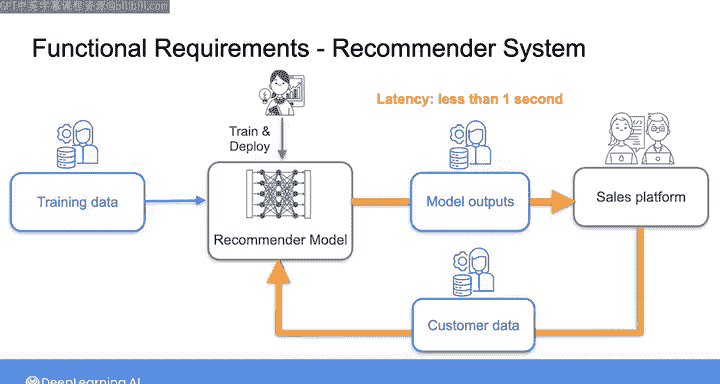
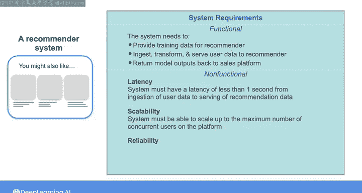

#  068：记录非功能性需求

在本节课中，我们将学习如何记录数据系统的非功能性需求。上一节我们通过与源系统软件工程师的对话，了解了数据访问和稳定性的初步解决方案。本节中，我们将基于这些信息，继续完善系统需求文档，重点关注那些虽未被利益相关者明确提及，但对系统成功至关重要的特性。

## 回顾与启示

在上一节的对话中，我们与负责源系统的软件工程师交流，获得了几点关键信息：
*   他们建议通过建立**读副本数据库**和**API**来解决数据访问问题，这是在保护生产系统的同时提供数据访问的常见方法。
*   他们讨论了确保读副本数据库稳定性的方法，以尽量减少对下游系统的破坏性变更。
*   他们承诺在发生系统中断或计划更改数据库模式时提供通知。

## 需求文档结构

现在，让我们再次审视我们计划构建的数据系统的需求文档。我们采用一种分层格式来记录需求：

*   **顶层**是业务目标。
*   **中层**是利益相关者需求。
*   **底层**是系统需求。

目前，我们已经记录了两项功能性需求：一项针对分析仪表板，另一项针对推荐系统。接下来，我们可以开始为这些系统记录一些非功能性需求。

## 理解非功能性需求

非功能性需求比功能性需求更微妙。它们通常不是利益相关者直接要求的内容，而是系统为了良好完成任务所必须具备的特性或属性。

## 为分析仪表板定义非功能性需求

对于分析仪表板，我们已经记录了一项功能性需求：数据必须在源系统记录后**一小时内**完成摄取、转换并可供仪表板数据库使用。

以下是针对该系统的非功能性需求示例：

**1. 可扩展性与延迟**
考虑到摄取的数据量会随平台用户数量波动，一项非功能性需求可以是：
> 系统必须能够扩展到足以处理平台处于最高用户活动水平时期望的数据量，并在满足延迟要求（一小时）的前提下，完成数据的摄取、转换和服务。换言之，数据处理速度不能因数据量增加而减慢。

**2. 可靠性与可维护性**
基于与软件工程师的对话，我们可以设置数据检查以确保其符合预期格式，并且源系统工程师会在数据模式变更时提前通知。
*   **可靠性**需求可以表述为：
    > 系统将执行数据质量检查，以确保摄取的数据符合规范。
*   **可维护性**需求可以表述为：
    > 摄取和转换阶段必须易于调整，以适应数据模式的任何变更。

## 为推荐系统定义非功能性需求

现在，让我们思考推荐系统的非功能性需求。

**1. 延迟**
可以想象，如果目标是在用户浏览或购买商品时提供产品推荐，那么推荐必须相对即时。我们之前一直说“实时”或“接近实时”，但在实践中这意味着什么？
定义“实时”取决于所构建系统的具体细节。这里我们假设，数据系统从摄取用户数据到提供推荐数据的延迟必须**小于一秒**。
> `latency = time(serving_recommendation) - time(receiving_user_data) < 1 second`
换句话说，从系统接收平台客户数据到向平台返回产品推荐数据所经过的时间应少于1秒。这个要求可能根据具体情况变高或变低，但一秒至少是典型推荐系统所期望的数量级。

**2. 可扩展性**
与仪表板应用类似，推荐系统也需要一项关于可扩展性的非功能性需求。系统需要能够扩展到平台的最大并发用户数。

**3. 可靠性**
系统在可靠性方面也可能有一项非功能性需求。例如，如果系统无法生成推荐或遇到其他错误，我们可能希望执行一种可预测的行为，以避免造成糟糕的用户体验。
因此，我们可以这样描述可靠性需求：
> 系统必须始终在一秒内返回一组推荐结果。如果推荐流水线因任何原因失败，它应默认回退到仅提供一组最受欢迎的产品。

## 总结

现在，我们已经为这两个系统记录了一些非功能性需求。在实践中，任何数据系统都可能有许多功能性和非功能性需求，这里我们只记录了针对这两个系统相对明显的一部分。

从这些需求收集示例中，需要理解的关键点是：重要的是不仅要理解你构建的系统将如何运行，还要理解这些功能将如何服务于利益相关者和业务的最终目标。

本节课中我们一起学习了如何识别和记录非功能性需求，包括可扩展性、延迟、可靠性和可维护性等方面。下一节视频中，我将在我们基于系统需求选择工具和技术之前，总结本课的一些主要主题。