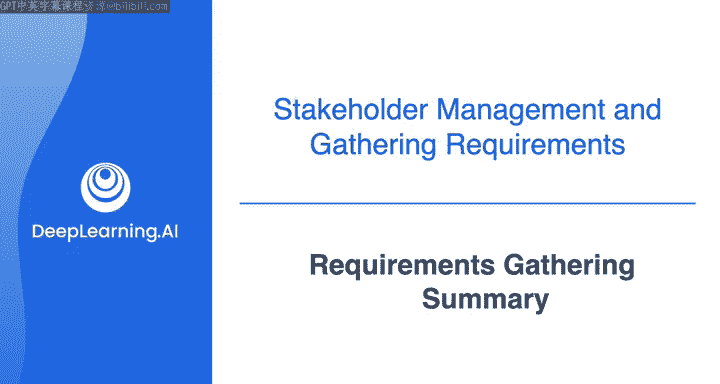
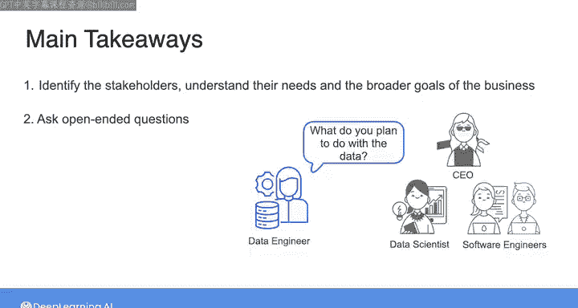
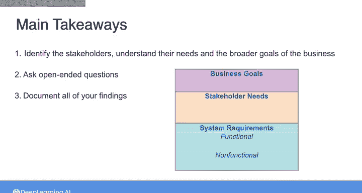
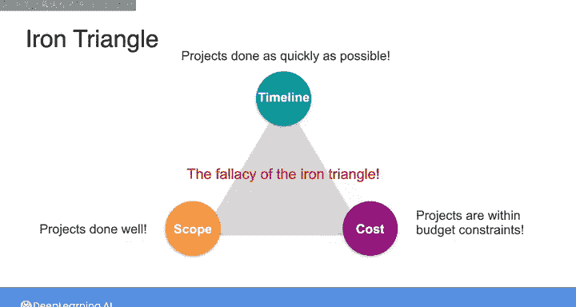
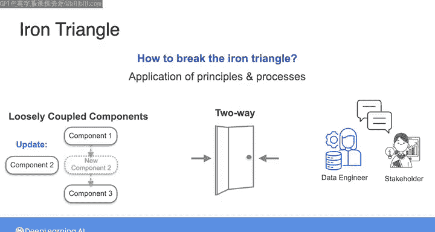

#  069：需求收集总结 📝

在本节课中，我们将总结需求收集的核心要点，并探讨如何在项目约束（如时间、成本、范围）之间进行权衡。理解这些原则是构建成功数据系统的基石。

## 需求收集的核心价值

本课程的重点是需求收集，以及如何确保你详细理解所构建的系统将为利益相关者创造何种价值。

你或许曾期待一门数据工程入门课程会专注于工具和技术，用于构建大型复杂系统。感谢你坚持学习至此，我可以向你保证，你的时间投入是值得的。根据我的经验，失败的数据工程项目比成功的更为常见。我的目标是确保你为构建成功的数据系统做好准备。请放心，在后续课程中，我们将深入探讨各种工具和技术。

## 需求收集的关键要点 🎯

以下是本节课的主要收获：

在着手构建或修改任何数据系统之前，你需要识别将要服务的利益相关者，并在更广泛的业务目标背景下理解他们的需求。

具体做法是与组织中的许多人进行交流，可能包括从公司领导层到与你并肩工作的数据科学家和软件工程师在内的每个人。

在这些对话中，提出开放式问题至关重要，以便了解现有系统、系统存在的潜在问题以及利益相关者计划利用数据采取的行动。

记录所有发现同样重要。对收集到的需求进行适当记录，将使你能够与利益相关者确认，你计划构建的系统是否能够满足他们以及业务的需求。

总而言之，一旦你理解了利益相关者的需求，并为你的系统写下了一套功能性和非功能性需求，你就已经走上了为组织创造价值的正确道路。

## 需求权衡与“铁三角” ⚖️

到目前为止，我们一直专注于如何构建以服务利益相关者需求为最优化的数据系统。

本周我们尚未讨论的一个话题是如何在需求收集中评估权衡取舍。例如，你的利益相关者可能希望你尽快构建一个数据系统；或者在成本方面，你可能需要在有限的预算内工作。当然，在现实中，时间线和预算约束将是你参与的任何项目的一部分。因此，你与利益相关者的对话需要包括讨论什么是最重要的：系统的功能特性、部署时间线，还是成本。

项目管理中有一个被称为“铁三角”的概念，其中项目的三个方面从根本上相互制约。这三个方面是：项目的时间线、工作范围和成本。

所谓“相互制约”，是指你可以将每个方面想象成朝不同方向拉扯。例如，如果你增加项目的工作范围，那么时间线或成本或两者都必须增加。或者说，如果你想在更短的时间线内完成项目，那可能需要增加成本或减少范围，或两者兼而有之。

甚至有一句围绕这个概念的老话：**好、快、便宜，你只能选两个**。

换句话说，如果你想要**又好又快**，那么它就不会便宜。或者如果你想要**又快又便宜**，那么它就不会好，依此类推。

在现实中，每家公司都希望项目做得好，并且通常希望它们在合理范围内尽可能快地完成，同时符合一定的预算约束。那么你该怎么办呢？

自“铁三角”概念出现以来，许多作者指出，你无法同时优化这三件事的想法实际上是一种谬论。我现在不深入细节，但我鼓励你搜索“铁三角谬论”或类似内容，看看你能发现什么。

这并不是说你可以避免在构建系统时对成本、范围和时间线进行权衡取舍的需要。简而言之，打破铁三角的方法是通过应用我们在本课程中一直讨论的原则和流程，例如构建松散耦合的系统、优化“双向门”决策以及深入理解利益相关者的需求。通过应用这些原则和流程，你将能够更好地在可预测的时间线和预算内构建和维护高质量的数据系统。

## 下节预告

我们将在下一课中更深入地探讨权衡取舍的考量，届时你将了解可用于构建系统的不同工具和技术的实际成本与能力。我们下节课见。