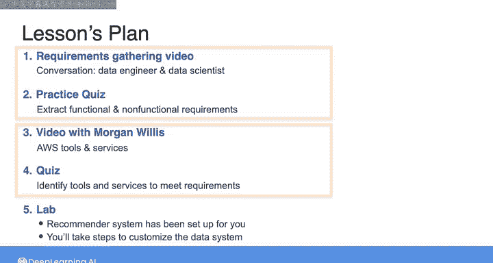

#  070：需求收集与系统设计模拟 🎯

在本节课中，我们将通过一个模拟项目，练习如何将需求收集转化为系统实现。我们将回顾课程中已学的知识，并体验从需求分析到工具选型的完整流程。这是一个简化版的实战模拟，旨在帮助你理解真实项目中数据工程师的工作。

---

## 项目背景与目标 🎯

上一节我们介绍了推荐系统的基本概念，本节中我们来看看如何为一个具体的推荐系统项目收集需求并设计解决方案。你的目标是将一个项目从需求收集阶段推进到实施阶段，运用本课程所涵盖的知识。

这是一个微观模拟，真实世界中从需求收集到系统最终实现可能需要数周、数月甚至更长时间。而在这里，我们将在几小时内完成从一端到另一端的流程。这仍然是一个非常有用的练习，能帮助我们实践目前讨论过的内容。

## 课程计划与步骤 📋

以下是本练习的具体步骤安排。

首先，在下一个视频中，你将看到数据工程师与数据科学家之间的对话。这位数据科学家我们在第一周课程中已经接触过。对话将聚焦于我们在上一课中详细讨论过的推荐系统。你将可以访问对话的文字记录以及视频后的阅读材料，以便轻松回顾对话的任何细节。

你的目标是，通过回顾这段对话，提取出功能性和非功能性需求。这些需求将补充我们在上一课中写下的内容。

以下是完成此目标的具体步骤：
1.  通过完成文字记录阅读材料后出现的测验来回答问题，从而识别需求。
2.  完成需求识别测验后，在下一组视频中，你将听到AWS的Morgan介绍各种可用于实现解决方案的AWS工具和服务。
3.  在有机会回顾这些内容后，你将准备进行下一个测验。在该测验中，你需要确定哪些工具和服务满足你的数据系统需求。
4.  最后，你将进入实验环境。推荐系统的基础设施已为你设置好，你将根据测验中所做的工具选择，逐步定制该系统。

正如已经提到的，这是一个微观模拟，其体验比作为数据工程师在工作中所预期的要简短和有限得多。

但是，如果你花点时间想象自己在现实世界中经历这个过程，并思考在没有所有这些辅助的情况下构建这样一个系统可能会是怎样的，那么我认为这将是一个非常有用的练习。

## 总结 🏁

本节课中，我们一起学习了如何为一个推荐系统项目进行需求收集。我们概述了从分析对话、提取需求，到评估AWS工具并做出选择，最终在预设环境中实施定制方案的完整模拟流程。这个练习旨在帮助你初步建立从需求到实现的系统性思维。现在，让我们开始吧，请继续完成阅读材料和测验，我将在后续的视频中与你一起 walkthrough 实验练习。