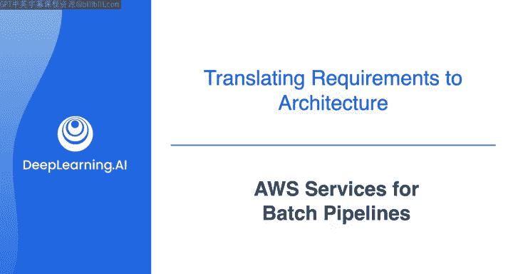
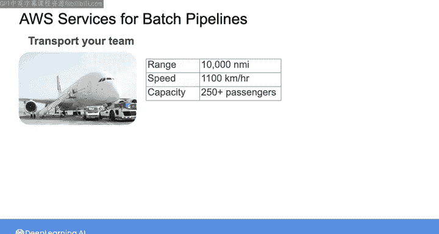
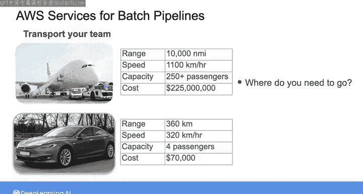
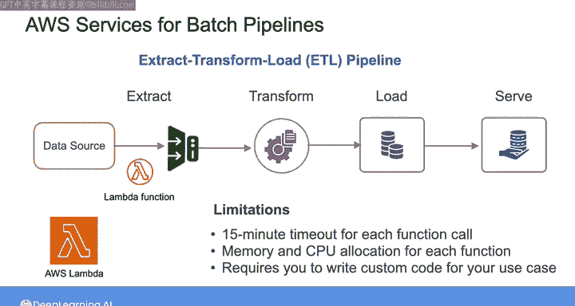
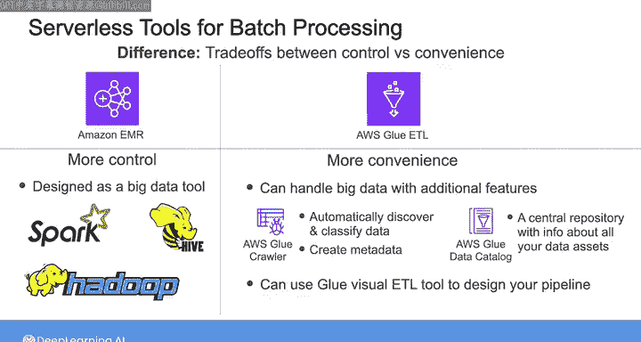
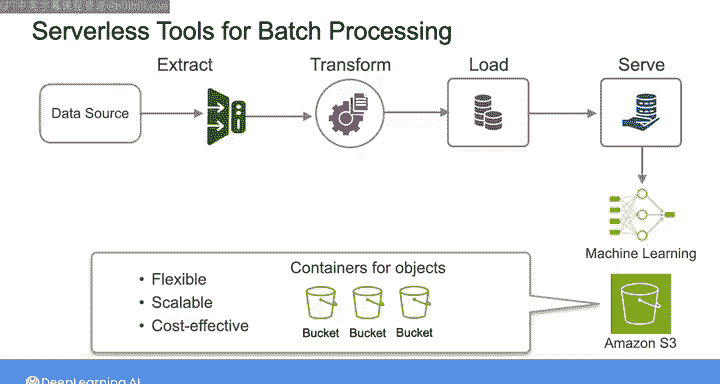

#  072：AWS批处理管道服务 🚀

在本节课中，我们将学习如何将系统需求转化为具体的技术选型，并重点介绍AWS平台上可用于构建批处理数据管道的核心服务。我们将从理解需求与工具的匹配关系开始，逐步探讨不同的AWS服务选项及其适用场景。

## 从需求到工具选择

上一节我们讨论了如何收集系统需求，本节中我们来看看如何将这些需求转化为具体的技术和工具选择。

将系统需求转化为实际的数据系统时，你需要熟悉不同服务的用途。这就像为一次旅行选择交通工具。假设你需要将整个数据团队从A地运送到B地，你会如何选择？

以下是两种交通工具的参数对比：

*   **大型喷气式客机**：航程10,000海里，最高时速1100公里/小时，可容纳250多名乘客，成本2.25亿美元。
*   **特斯拉 Model S**：续航360公里，最高时速320公里/小时，可容纳4名乘客，成本约7万美元。

你会选择哪种交通工具？答案显然取决于你的具体需求。如果是从纽约到巴黎，可能需要飞机。如果只是从纽约到波士顿且只有四个人，特斯拉或许更合适。如果预算紧张，四辆自行车也可能是选项。

这个类比说明，除了系统需求，你还需要熟悉可供选择的技术，了解它们的用途以及如何组合它们来实现目标。

## 批处理工作负载的AWS服务

对于本周你将构建的数据系统，它包含批处理和流处理两个部分。在本视频中，我将介绍一些支持AWS上批处理工作负载的基础服务。下一视频我们将探讨支持流处理工作负载的AWS服务。

正如上周所见，批处理数据的一个常见方法是**提取-转换-加载（ETL）** 管道。在本周的练习中，你需要从源系统摄取数据，应用一些转换以使其符合数据科学家所需的格式，然后将其加载到存储中并提供访问权限。因此，ETL范式似乎是合适的。

你将摄取的数据是表格数据。我们假设你将使用的源系统是**Amazon关系数据库服务（RDS）**。正如Joe在课程早期提到的，数据库是数据工程师非常常见的源系统。通常，你无法控制源系统本身。因此，我们不会花时间比较不同的源系统，而是假设你需要做的选择在于下游的摄取和转换组件。

对于接下来的摄取和转换步骤，有多种不同的方法可供选择。

例如，你可以直接启动一个**EC2实例**，编写一系列脚本来连接数据库、摄取和转换数据，然后将其发送到某个存储位置。这当然可行，但请记住Joe关于避免“无差别的繁重工作”的建议。采用基于EC2的方法，你将负责安装软件、管理安全以及部署云服务器带来的所有复杂性。因此，在这种情况下，为一个相对简单的ETL管道创建自定义解决方案可能不是最佳的时间利用方式。

在比较服务的无服务器、传统服务器和容器选项时，Joe的建议是首先考虑无服务器工具，如果无法满足需求，再考虑容器和服务器选项。我同意这个建议，因此让我们看看在这种情况下有哪些无服务器选项。

**AWS Lambda** 是最早也是最流行的AWS无服务器工具之一。使用Lambda函数，你可以让代码响应触发器或事件运行。对于本周的ETL管道，你当然可以考虑使用Lambda函数从源系统提取数据、应用转换并将其发送到存储。然而，Lambda函数存在限制，例如每次函数调用有15分钟的超时限制，以及每次函数的内存和CPU分配限制等。这可能意味着你需要将任务分解成更小的块以适应这些限制。此外，编写Lambda函数需要你为特定用例编写自定义代码，这同样可能不是最佳的时间利用方式。

在专门用于数据批处理的无服务器工具中，有两个服务需要介绍。

## 核心批处理服务：Glue ETL 与 EMR Serverless

从某种意义上说，**Amazon Glue ETL** 和 **Amazon EMR Serverless** 这两个服务在功能上存在相当多的重叠，具体项目的细微差别可能决定了哪个工具最能满足你的需求。但概括来说，两者的区别在于**控制力与便利性之间的权衡**。简单来说，EMR Serverless 让你对能做的事情有更多控制权，而 Glue ETL 提供了更便捷的体验。让我们深入细节以便理解。

**EMR** 是作为一个大数据工具设计的，支持广泛的框架，如 **Apache Spark** 和 **Apache Hive**。因此，如果你的团队正在进行PB级别的数据分析，可能使用Hadoop，或者需要灵活性来集成自定义组件，那么EMR或EMR Serverless可能是正确的选择。

**Glue ETL** 也能处理大数据工作负载，但其真正的优势在于你可以访问的附加功能。例如，当你连接到源系统时，Glue使用称为**爬虫程序**的工具，自动发现和分类数据，并在此过程中创建元数据，包括表定义和模式等信息。这些元数据随后用于填充 **Glue数据目录**，这是一个包含所有数据资产信息的中央存储库。

有了数据目录中的信息，你可以使用 **Glue可视化ETL工具** 在AWS管理控制台中以图形界面设计管道，该工具会自动生成管道中需要运行的Spark代码。当你运行管道时，服务会维护Glue数据目录以跟踪你应用的转换，该目录可以在下游用于更轻松地与其他AWS服务集成。

在AWS上构建ETL管道的摄取和转换部分，还有其他选项可以考虑，但以上是我想要与你分享的主要选项。在本视频后的阅读材料中，你会找到关于我们提到的服务以及其他服务的更多详细信息。

## 存储与提供数据

当涉及到本周你正在处理的批处理管道的存储和服务方面时，你的选择主要取决于所服务的下游用例。

例如，如果你正在摄取规范化的表格数据，然后应用转换以星型模式对其进行建模以进行分析，那么你可以选择在另一个RDS实例中存储和提供数据。

或者，如果你想对海量数据集运行复杂的分析查询，并利用数据仓库提供的其他功能，你可以选择在 **Amazon Redshift** 中存储和提供数据，这是一个强大的数据仓库解决方案，尽管成本显著高于RDS。

本周，你将服务于一个机器学习用例，数据将用于训练推荐模型。当你的下游数据消费者是另一位技术数据专业人员，计划操作数据并将其集成到他们自己的系统中时，通常最佳且最便宜的存储和服务选项是 **Amazon S3** 上的对象存储。

在现实世界中，对于基于AWS构建的数据系统，S3作为此类“暂存区”相对常见，因为S3灵活、可扩展且具有相对成本效益。它允许你存储几乎任何类型的数据，并能轻松与其他AWS服务集成。

在S3中，你将数据存储在**存储桶**中，存储桶是对象的容器。构建数据管道时，根据手头的任务，你可能会在管道的不同阶段使用多个S3存储桶。

## 总结

本节课中我们一起学习了如何根据系统需求选择AWS批处理服务。我们探讨了从需求分析到工具选型的思路，比较了自定义脚本、AWS Lambda、Amazon Glue ETL和Amazon EMR Serverless等不同方案的优缺点，并了解了如何根据下游用例（如分析、机器学习）选择合适的存储服务（如RDS、Redshift、S3）。关键在于权衡控制力与便利性，并选择最符合项目目标且高效的工具组合。下一节，我们将把目光转向流处理工具。