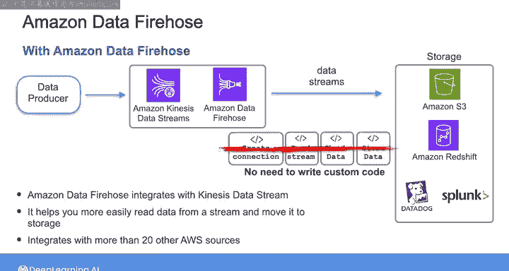

#  073：AWS流处理管道服务 🚀

在本节课中，我们将学习AWS平台上用于构建流处理管道的核心服务。我们将探讨如何摄取、处理和存储实时数据流，并比较不同服务的特点与适用场景。

上一节我们介绍了AWS的批处理管道服务，本节中我们来看看用于处理实时数据流的服务。

## 流处理概述

在构建数据系统时，除了批处理组件，系统通常还需要一个流处理组件来处理连续到达的数据。流数据可能来自多种不同的源头。

以下是常见的流数据来源：
*   IoT设备传感器数据
*   网站或移动应用的点击流数据
*   通过变更数据捕获（CDC）过程持续捕获的数据库变更

## 自定义流处理方案的挑战

与批处理类似，一种潜在的流数据摄取方式是启动一个EC2实例并编写自定义脚本来执行CDC或连接其他流数据源，然后转换数据并将其发送到下游。

这种基于EC2的方法意味着您需要负责安装软件、管理安全以及处理在云上部署服务器带来的所有复杂性。

遵循与批处理相同的思路，您也可以考虑使用Lambda函数作为无服务器选项来创建自己的流处理系统。但这同样需要为您所需的功能编写自定义代码，并且Lambda可能对您的特定用例存在潜在限制。

此外，与流数据源交互可能比运行批处理工作负载更复杂。因此，除非您100%确定现有开源或托管工具无法满足您的用例，否则您可能不应该使用EC2或Lambda构建自定义的流处理解决方案。

## AWS流处理服务

现在，让我们看看一些可以支持流处理工作负载的AWS服务。

### Amazon Kinesis Data Streams

Amazon Kinesis Data Streams是一项流行的AWS服务，支持实时数据摄取。

其工作方式是：数据生产者将数据发送到Kinesis Data Streams。Kinesis本身对您发送的数据类型并不挑剔，它是数据无关的。因此，您可以将JSON、XML、结构化或非结构化数据发送到数据流。

数据由生产者发布到流中，然后在Kinesis中存储一段可配置的时间。默认和最短保留时间为24小时，但也可以延长。存储的数据随后可以被数据流的消费者拉取。多个消费者可以拉取相同的数据并以不同的方式进行处理。

Kinesis消费者通常会将数据转移到其他地方（例如存储服务或数据仓库），或者对流过流的数据进行一些实时分析。这些消费者可能是从流中拉取并处理数据的软件应用程序，该应用程序可以运行在EC2或Lambda等计算服务上。

### Amazon Managed Streaming for Apache Kafka (MSK)

除了Kinesis，您还有另一个选择：Amazon Managed Streaming for Apache Kafka，简称MSK。MSK是一项提供与Kinesis Data Streams许多相同功能的服务。

Apache Kafka本身是一个开源的流处理平台，是许多不同流处理用例的热门选择。MSK是一项完全托管的服务，使构建和运行使用Apache Kafka处理流数据的应用程序变得更加容易。

MSK运行开源版本的Kafka，这很有用，因为Apache Kafka社区的任何现有应用程序、工具或插件都受支持。

MSK的工作方式是：您首先创建一个Apache Kafka集群，MSK服务负责为您配置和运行Kafka节点的繁重工作。这使您可以避免那些无差别的繁重工作，将更多时间集中在自定义应用程序逻辑上。然后，您作为用户与MSK为您管理的所谓Kafka数据平面进行交互，以创建主题、生产和消费数据。数据生产者和数据消费者随后连接到集群以发送和接收消息。

### 服务比较与选择

Kinesis Data Streams和MSK都可以扩展到处理来自多个数据源的PB级数据量，延迟在毫秒级别，从而实现实时处理和分析。

在选择使用哪一个时，就像为数据系统的其他方面在类似工具之间做选择一样，这将取决于您的具体用例。但概括来说，您可以再次将其视为在控制力和便利性之间的权衡。

如果您是数据流架构的新手，通常推荐使用Kinesis，因为它相对用户友好且操作开销较低。另一方面，如果您已经在运行Kafka集群，或者团队内部拥有现有的Kafka技术经验，或者您寻求更高程度的灵活性和控制力，那么MSK可能是更好的选择。

## 数据摄取与存储：Amazon Kinesis Data Firehose

关于从流中读取数据并将其存储在其他地方的用例，接下来我想介绍的服务是Amazon Kinesis Data Firehose。

首先了解一下Data Firehose服务存在的原因：事实证明，Kinesis是作为流数据系统的服务首先推出的，AWS意识到许多Kinesis Data Streams用户只是简单地将流数据存储在S3或其他地方。但要以这种方式使用Kinesis，您需要编写自定义代码来创建与数据流的连接、读取流、分块数据然后存储它。

为了使整个过程更容易，AWS创建了Amazon Kinesis Data Firehose服务。它可以与Kinesis Data Streams集成，旨在让您能够从流中获取数据并将其存储在S3或Redshift等目的地，或发送到HTTP端点或Datadog、Splunk等第三方服务提供商。

Data Firehose的主要要点是，它帮助您更轻松地从流中读取数据并将其移动到存储，而无需编写自定义代码或自己创建任何复杂的集成。

除了Kinesis Data Streams，Data Firehose还与超过20个其他AWS源集成以摄取流数据，包括MSK等。

## 总结与实践预告

与我们在本课程中讨论的所有其他AWS云主题一样，关于流处理资源和服务还有很多需要了解的知识，但我认为您现在已掌握了所需的基础。

接下来是时候亲自动手实践这些服务了。在接下来的测验中，您将确定在本课程中一直关注的产品推荐系统的数据管道中，批处理和流处理组件应使用哪些服务。

之后，Joe将带您完成本周的实验练习，您将在其中实现这个批处理和流处理管道。祝您实践愉快，我们下节课再见。