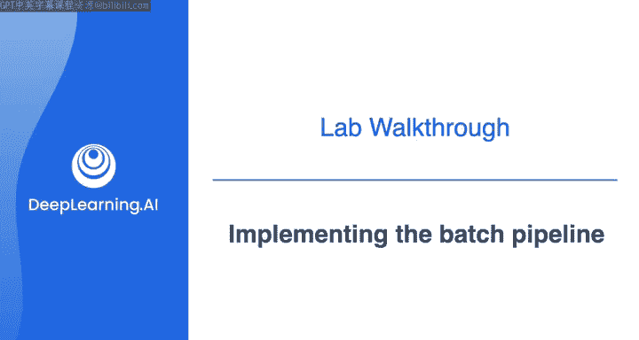
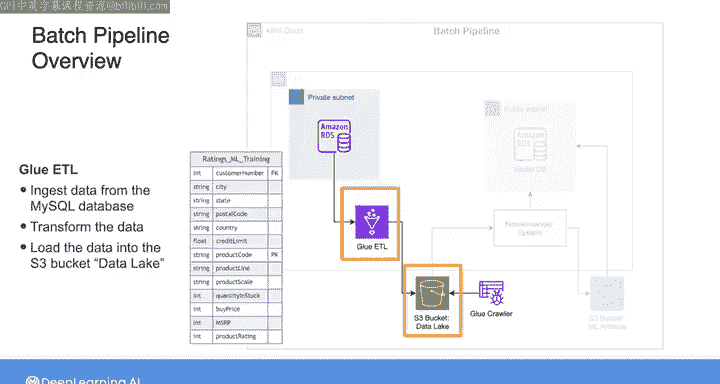
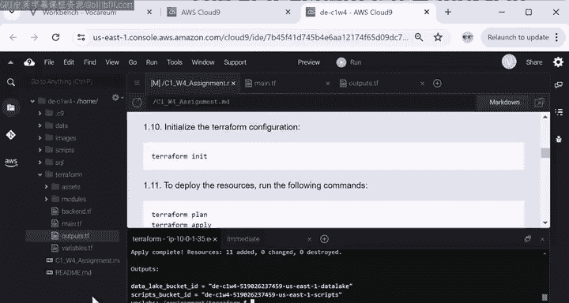
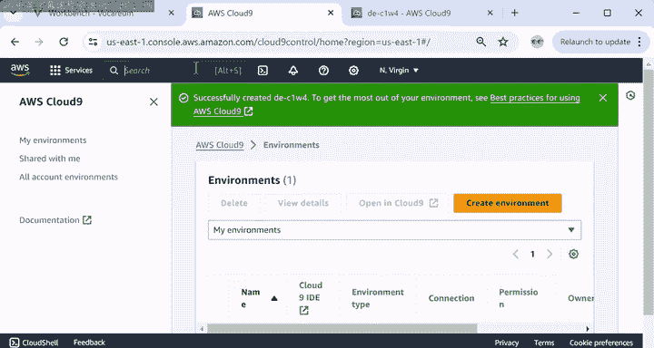
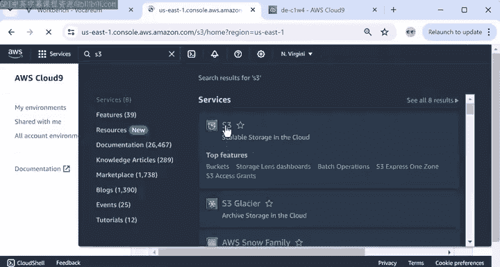
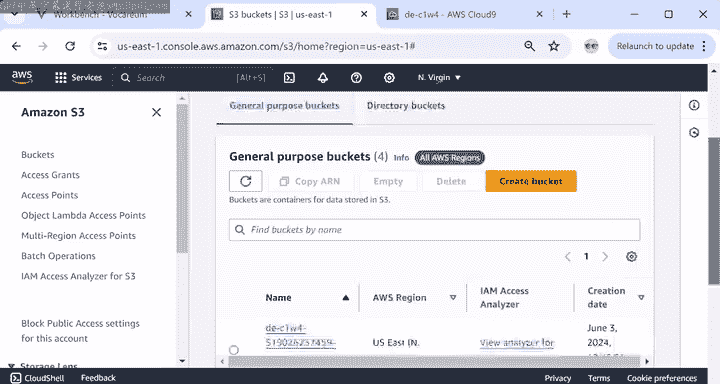
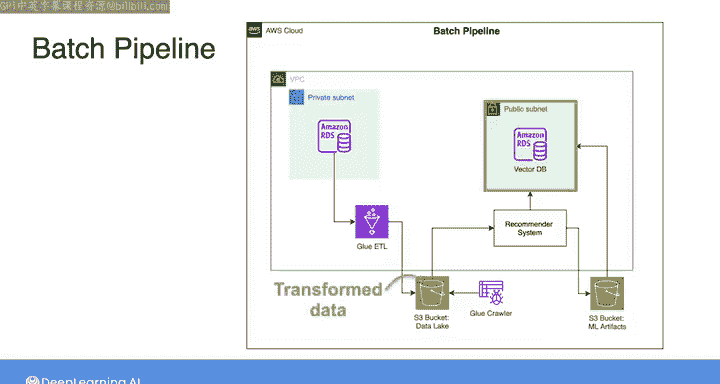

#  074：实现批处理管道 🧪



在本节课中，我们将学习如何为一个推荐系统实现批处理架构。我们将使用 AWS 服务来转换数据，为后续的机器学习模型训练做好准备。

## 概述

在观看了与数据科学家的对话、探索了架构选择并完成了测验之后，现在是为推荐系统实现批处理和流处理架构的时候了。你将首先实现批处理管道，为数据科学家提供训练推荐系统所需的数据。接着，你将设置一个向量数据库来存储推荐系统的输出嵌入。最后，你将实现流处理管道，该管道使用训练好的推荐系统和向量数据库，根据用户的在线浏览活动输出产品推荐。

本实验包含详细说明，指导你如何使用 Terraform 创建资源以及如何在命令行终端中与它们交互。不必完全理解所有细节，本实验的主要目标是帮助你熟悉 AWS 上数据管道的批处理和流处理组件。

以下是批处理管道的架构图。


实验的第一部分聚焦于架构的这一部分，它负责转换数据，使其为训练做好准备。

## 探索源数据

与你在第二周看到的实验类似，这里提供了一个包含经典模型数据的 RDS MySQL 数据库，以及一个额外的表，该表由用户为他们购买的产品分配的评分组成。这些评分将作为训练数据的标签，推荐系统将在后台使用监督式机器学习模型进行训练。

为了准备训练阶段的数据，你将使用 AWS Glue ETL 从 MySQL 数据库摄取数据，然后将数据转换成特定形式。最后，你将把转换后的数据存储到标记为“数据湖”的 S3 存储桶中。你将使用 Terraform 创建 Glue ETL 和 S3 存储桶。

按照实验设置说明，我创建了这个 Cloud9 环境并下载了实验的详细说明。让我们从探索源数据库中提供的评分表开始。

要连接到源数据库，我们需要知道它的终端节点。



我将从实验说明中复制此命令，粘贴到终端中，将 `MySQL DB name` 替换为 `D E， C1 W4 RDS`，然后运行该命令。

这将返回数据库终端节点。接下来，我将使用 `mysql` 命令连接到数据库。主机是上一步获得的终端节点，数据库用户名是 `admin`，密码是 `admin PWRD`。


连接建立后，我将选择 `classicmodels` 数据库以查看其中的表。你可以看到有一个额外的 `ratings` 表。让我们通过运行以下查询来检查该表的内容：

```sql
SELECT * FROM ratings LIMIT 20;
```

该查询返回表的前 20 行。每一行包含客户编号、产品代码和产品评分。

探索完数据库后，你可以输入 `exit` 退出与数据库的连接。你将在课程 2 中了解更多关于连接和使用数据库的知识。

## 使用 Terraform 创建资源

在实验的下一部分，我将使用 Terraform 为批处理管道创建资源，包括 Glue ETL 和 S3 存储桶。首先，我需要在此环境中安装 Terraform。

`scripts` 文件夹包含一个名为 `setup.sh` 的脚本，其中包括用于安装 Terraform 和为 Terraform 定义一些环境变量的 shell 命令。该脚本还包含安装 PostgreSQL 的命令，你将在实验后期用它来设置向量数据库。

为了运行这些命令，我将复制该语句并粘贴到终端中。软件包安装完成后，我将把工作目录更改为 `terraform` 文件夹。

在运行 Terraform 之前，让我们快速查看一下这个文件夹的结构。在左侧，我将点击 `Terraform`，然后点击 `modules`。在本实验中，实验每个部分所需的资源被分组在文件夹或模块中。所以，如果我点击 `etl`，你可以看到用于 Glue 和 S3 存储桶的 Terraform 文件。

当你将 Terraform 文件组织成模块时，你需要在主 Terraform 文件中声明这些模块，该文件位于 `modules` 文件夹之外，这样你就可以向任何输入变量传递值，并在主文件中使用模块的任何输出值。

有一个声明 `etl` 模块的部分，其中包含指向该模块的链接以及传递给其输入变量的一些值。通过删除每一行中的 `#` 号来取消注释该部分，或者你也可以使用快捷键 `Ctrl + /` 或 `Cmd + /` 一次性取消注释整个部分。确保保存对文件的更新。

接下来，我将编辑 `outputs.tf` 文件，并取消注释声明 `etl` 模块输出变量的部分，即 S3 存储桶 `data_lake` 的 ID。如果你在此处取消注释第一行，请确保 `etl` 注释前没有空格。你将在课程 2 中更深入地理解这些各种 Terraform 文件。

保存更新后，我回到详细说明。在终端中，我将输入：

```bash
terraform init
```

然后：

```bash
terraform plan
```

最后：

```bash
terraform apply
```

Terraform 在创建资源之前总会提示确认。资源创建完成后，你可以看到输出文件。



## 运行 Glue 作业

现在，让我们运行将数据转换为所需形式的 Glue 作业。如果你好奇这个 Glue 作业的脚本是什么样子，可以打开 `terraform` 文件夹，点击 `assets`，然后点击 `glue_job` 来查看包含转换逻辑的 Python 脚本。

我回到说明中，复制此命令并粘贴到终端中以启动 Glue 作业。你可以通过写入以下命令来检查 Glue 作业的状态：

```bash
aws glue get-job-run --job-name <你的作业名> --run-id <上一步返回的ID>
```


我将用上一个命令返回的 ID 替换 `job run ID`。所以当前状态仍在运行，但如果你等待几分钟，状态将变为“成功”。我们将在课程 4 中进一步深入了解 AWS Glue 的细节。

## 验证输出数据

现在让我们检查 S3 存储桶 `data_lake` 是否包含训练数据。



在控制台中，我将输入 `S3`，点击该服务。




然后选择名称中包含 `data_lake` 的存储桶。





在这里，你可以看到一个标记为 `ratings_ml_training` 的文件夹，其中包含额外的文件夹，每个文件夹都与一个客户编号相关联。在对象存储中，这种组织数据的方式称为分区，它可以帮助你快速定位与任何客户相关的信息。

至此，我们已经将评分数据转换为可用于训练推荐系统的格式。在下一个视频演练中，我们将查看实验的下一部分，在那里你将设置一个向量数据库来存储推荐模型的输出。



## 总结


本节课中，我们一起学习了如何为一个推荐系统实现批处理管道。我们探索了源数据库中的评分数据，使用 Terraform 自动化创建了 AWS Glue ETL 作业和 S3 数据湖存储桶，并运行了数据转换作业。最终，我们将原始评分数据转换并分区存储，为后续的机器学习模型训练做好了准备。下一节，我们将继续学习如何设置向量数据库。