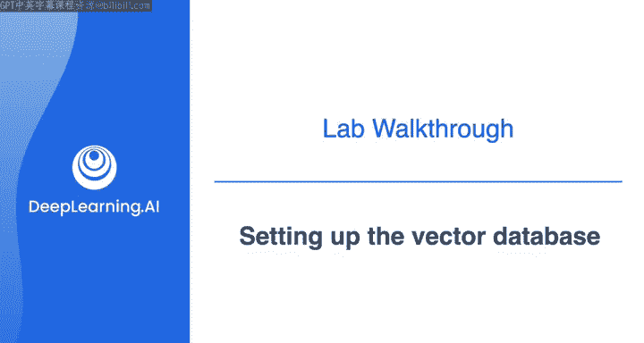
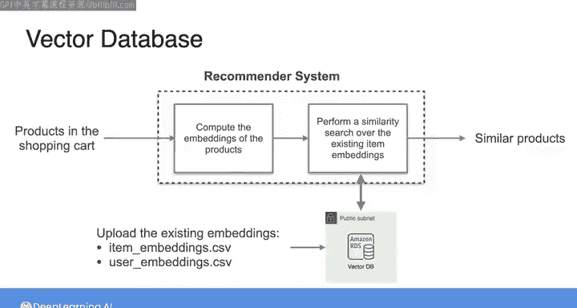
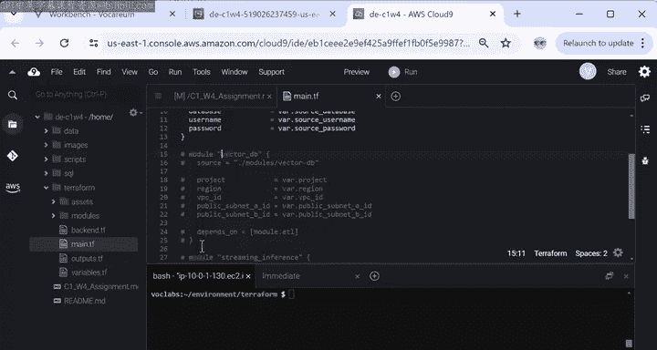
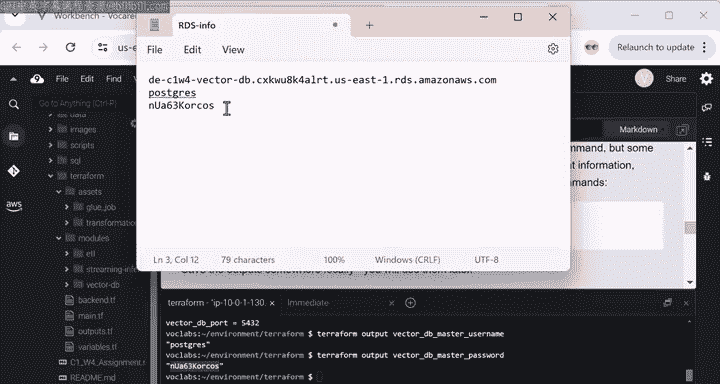
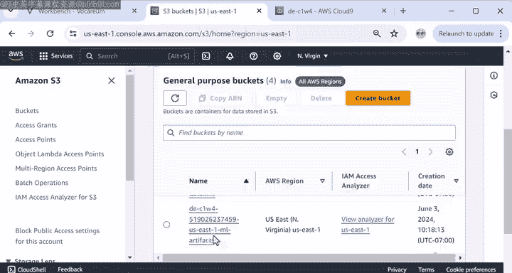
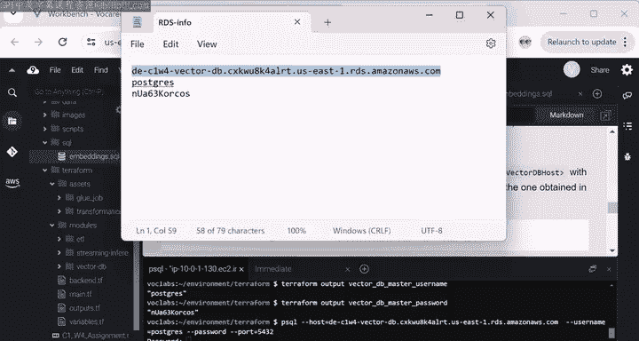
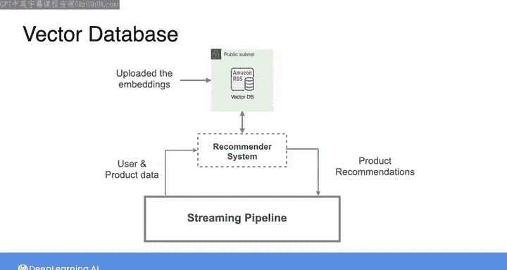

#  075：设置向量数据库 🗄️



## 概述

在本节课中，我们将学习如何设置一个向量数据库。这个数据库将用于存储和高效检索推荐模型生成的用户与商品嵌入向量。我们将从检查模型输出开始，然后使用 Terraform 创建数据库，最后将嵌入向量数据从云存储加载到数据库中。

---

## 检查模型输出

上一节我们介绍了批处理管道的架构。现在，转换后的数据已存储在 S3 数据湖中，并与数据科学家共享，用于训练推荐系统。

在本实验中，您无需亲自训练推荐系统，那是数据科学家的工作。您将使用一个已训练好的模型。

模型的输出存储在名为 “ML artifacts” 的 S3 存储桶中。我们通过检查该存储桶的内容来开始实验的第二部分。

在控制台中，回到可用存储桶列表，选择名称中包含 “ML artifacts” 的存储桶。

该存储桶包含三个文件夹：`embeddings`、`models` 和 `scalars`。
*   `embeddings` 文件夹包含模型生成的用户和商品（即产品）的嵌入向量。
*   `models` 文件夹包含用于推理的已训练模型。
*   `scalars` 文件夹包含训练预处理阶段使用的对象。

目前，我们只关注嵌入向量。点击该文件夹，您会看到两个 CSV 文件：一个用于商品（产品），另一个用于用户。

这些嵌入向量将被模型用来为给定用户查找推荐商品。例如，商品嵌入向量将用于检索与用户购物车中商品相似的产品。

推荐模型首先会计算购物车中商品的嵌入向量，然后在商品嵌入向量中执行相似性搜索以找到类似产品。

数据科学家要求您将商品嵌入向量 CSV 和用户嵌入向量 CSV 文件上传到向量数据库，以使检索相似产品的过程更高效。



以下是创建向量数据库并上传嵌入向量的步骤。

---

## 创建向量数据库



按照实验第 2 部分的说明，我将打开 `main.tf` 文件，并取消声明向量数据库模块部分的注释。

接着，在 `outputs.tf` 文件中，取消注释 Spectre 数据库模块的输出变量。当您创建此数据库时，诸如数据库用户名、密码、主机（或端点）等输出文件将返回给您，以便您可以使用它们建立与数据库的连接。

请确保保存对 `main.tf` 和 `outputs.tf` 文件的更新。

现在，我们可以在终端中创建与 Spectre 数据库相关的资源。我将依次运行以下命令：
```bash
terraform init
terraform plan
terraform apply
```
在确认要创建这些资源后，创建 PostgreSQL 数据库大约需要七分钟。请注意，Terraform 不会覆盖之前创建的任何资源，它会保留它们并专注于创建新资源。

数据库创建完成后，您将能够找到主机名或端点。由于我需要此信息来连接向量数据库，我将复制此链接并粘贴到单独的笔记中备用。

我还需要密码和用户名，但它们被标记为敏感信息。因此，我需要从实验说明中运行这些命令，并将密码和用户名复制到单独的笔记中。



---

## 加载嵌入向量到数据库

现在，让我们将嵌入向量添加到向量数据库中。



点击左侧的 SQL 文件夹，然后打开其中的 SQL 文件。在这里，您可以找到一些 SQL 指令，用于将商品和用户嵌入向量从 ML artifacts S3 存储桶传输到向量数据库。

在此文件中，您需要指定存储桶的名称。我们回到控制台，进入存储桶列表，然后复制 ML artifacts 存储桶的完整名称。

接着，在 SQL 文件中，将存储桶名称粘贴到这两个 `SELECT` 语句中。请确保保存文件。

现在，您需要连接到向量数据库并执行 SQL 语句。



要连接到数据库实例，我将从实验第 2 部分的说明中复制连接命令，然后用我之前保存的数据库主机名替换命令中的主机部分。

系统将提示您输入密码，同样使用您之前保存的密码。输入时看起来不会显示任何字符，但按回车键后密码会被读取。

现在，为了在名为 `postgres` 的特定数据库中工作，我将在终端中运行以下命令：
```bash
\c postgres
```
同样，系统会提示您输入密码，请使用与之前相同的密码。

现在，为了运行来自 `embedding.sql` 脚本的 SQL 语句，我将在终端中运行以下命令：
```bash
\i sql/embedding.sql
```
然后，我运行以下命令来查看所有可用的表：
```bash
\dt
```
使用方向键向下滚动，查找包含嵌入向量的表。然后输入 `q` 退出查看。完成后，可以通过输入 `\q` 来退出连接。

---

## 总结



本节课中，我们一起学习了如何设置向量数据库。我们从检查已训练推荐模型的输出（即用户和商品嵌入向量）开始。接着，我们使用 Terraform 基础设施即代码工具创建了一个 PostgreSQL 向量数据库实例。最后，我们通过执行 SQL 脚本，成功地将存储在云存储中的嵌入向量数据加载到了新创建的数据库中，为后续高效的相似性搜索做好了准备。在下一节中，我们将介绍用于实时处理用户和商品数据的流处理管道部分。