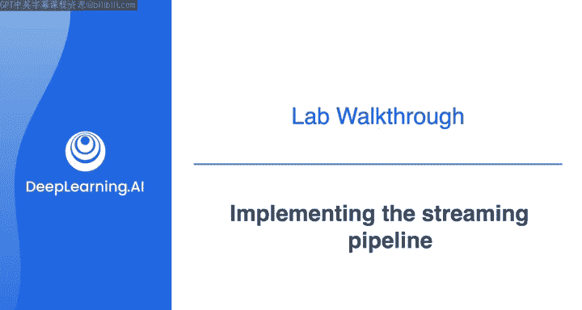
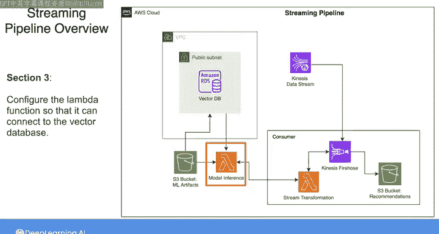
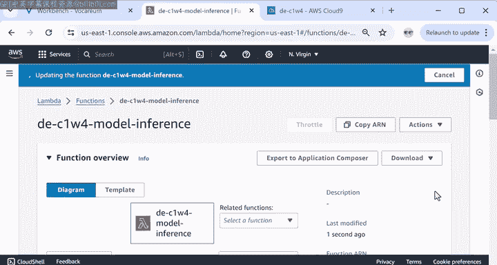
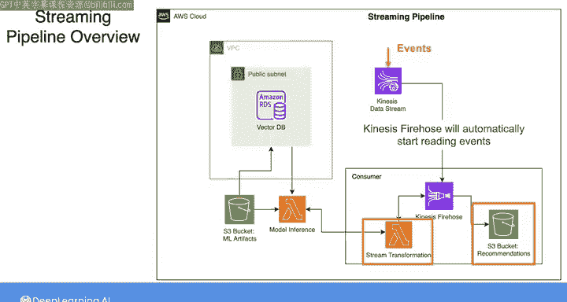
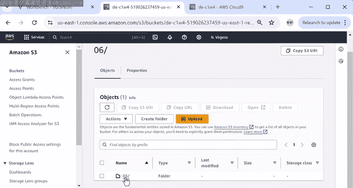
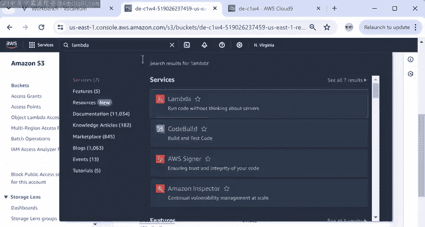
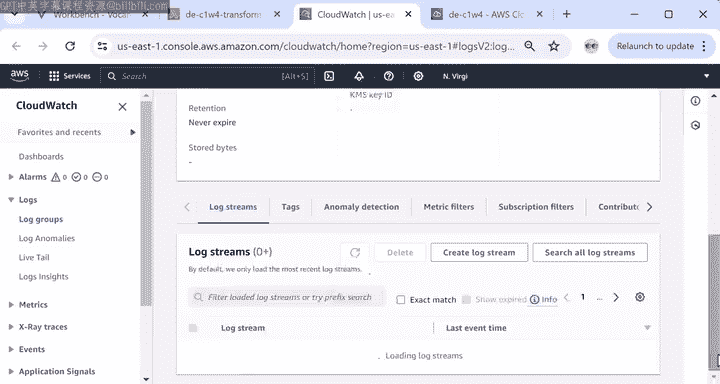
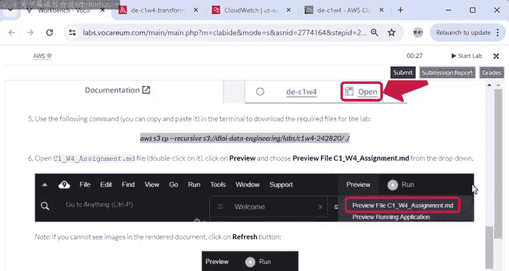
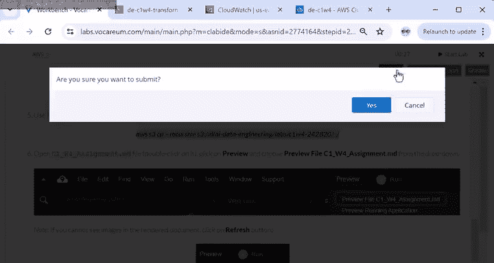
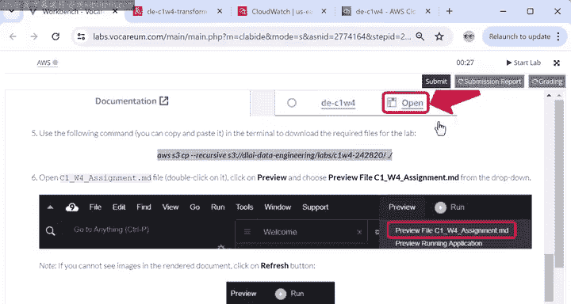

#  076：实现流处理管道 🚀



在本节课中，我们将学习如何实现一个完整的流处理管道。我们将基于之前训练好的推荐系统和向量数据库，构建一个能够实时处理用户活动、生成产品推荐并存储结果的自动化工作流。

---

## 概述

上一节我们完成了推荐系统的训练和向量数据库的准备。本节中，我们将动手实现一个流处理管道。该管道的核心架构是：通过AWS Kinesis接收用户活动日志，使用Lambda函数进行数据处理和模型推理，最终将推荐结果存储到S3中。

以下是整个流处理工作流的架构图：


---

## 配置模型推理Lambda函数

在开始构建流管道之前，我们需要先配置一个关键的组件：模型推理Lambda函数。这个函数已经预先实现，但需要正确设置环境变量才能连接到我们准备好的向量数据库。

以下是配置步骤：

1.  在AWS控制台中打开Lambda服务。
2.  找到名称中包含 `model inference` 的Lambda函数。
3.  向下滚动并点击 **Configuration** 选项卡。
4.  在左侧选择 **Environment variables**，然后点击 **Edit**。
5.  在此处粘贴之前保存的数据库主机地址、用户名和密码。
6.  点击 **Save** 保存更新。



**核心概念**：环境变量允许我们在不修改代码的情况下，动态配置Lambda函数的行为，其配置格式类似于：
```bash
DB_HOST=your_database_host
DB_USER=your_username
DB_PASSWORD=your_password
```

---

## 使用Terraform部署流处理管道

配置好Lambda函数后，接下来我们将使用基础设施即代码工具Terraform来部署整个流处理管道。这能确保我们的环境是可重复和一致的。

以下是部署流程：

1.  根据实验指南第4部分的说明，在 `main.tf` 文件中声明流处理模块。
2.  同样地，在 `outputs.tf` 文件中进行相应配置。




3.  在终端中依次运行以下三条Terraform命令来初始化和部署资源：
    ```bash
    terraform init
    terraform plan
    terraform apply
    ```

执行这些命令后，Terraform将创建Kinesis Data Firehose、用于存储推荐的S3桶以及流数据转换Lambda函数。


**请注意**：Kinesis数据流本身不会由Terraform创建，因为它已作为实验的预置资源提供。当你启动实验时，一个后台进程会自动向该数据流中注入模拟的用户活动事件。

---

## 验证管道运行结果

部署完成后，整个管道将自动运行。Kinesis Data Firehose会开始从数据流读取事件，调用Lambda函数将数据转换为推荐结果，并最终将这些结果传送到S3桶中。

为了验证管道的运行情况，我们可以进行以下检查：

### 1. 检查S3桶中的推荐结果

在AWS控制台中搜索并进入S3服务。



找到名称中包含 `recommendations` 的桶。进入桶内，你会发现数据已按照年、月、日、小时进行了分区。




**核心概念**：分区是一种将数据按特定维度（如时间）组织到不同文件夹的策略，其路径模式通常为：
```
s3://bucket-name/year=YYYY/month=MM/day=DD/hour=HH/
```
这种结构能帮助S3和查询引擎（如Athena）更快地定位和读取特定时间范围的数据。


### 2. 查看转换Lambda函数的日志

我们还可以查看数据处理过程的日志，以确认函数被正确调用和执行。



1.  在AWS控制台中搜索并进入Lambda服务。
    
2.  点击进入负责数据转换的Lambda函数。
3.  点击 **Monitor** 选项卡，然后点击 **View CloudWatch logs**。
    


这里显示的日志记录了该函数在执行转换任务期间生成的信息，是调试和监控管道健康状态的重要依据。

---

## 总结与下一步

本节课中，我们一起完成了一个流处理管道的实现。我们配置了模型推理Lambda函数，使用Terraform自动化部署了包含Kinesis Firehose和S3的流处理架构，并验证了管道能够自动处理数据并生成分区存储的推荐结果。





现在轮到你了。请仔细按照实验指南的步骤操作，如果需要可以回看本视频。完成实验所有任务后，别忘了在实验设置说明页面提交你的成果。


**重要提示**：
*   实验环境将在**两小时后**过期，请合理安排时间。
*   如果对实验步骤有任何不清楚的地方，请不要担心。你将在后续的课程中对这些工具有更深入的理解。
    


完成实验后，我们将回到这里，对本门课程进行总结。