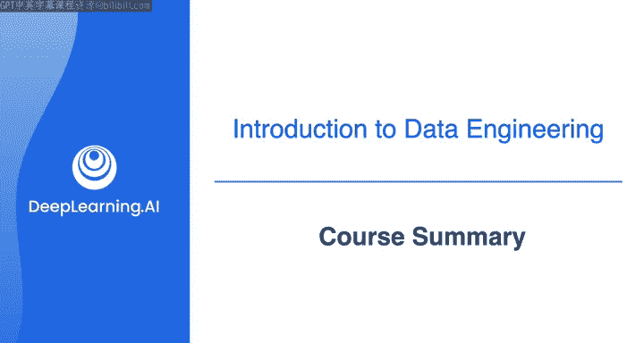
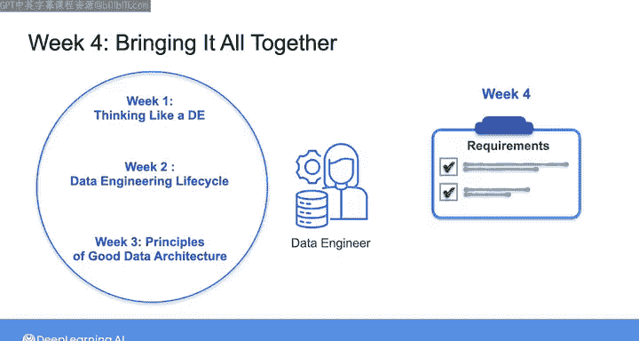

#  077：数据工程导论课程总结 📚

在本课程中，我们共同学习了数据工程的基础概念、生命周期及其核心组成部分。通过本课程，您已经迈出了成为成功数据工程师的重要一步。

## 课程回顾

上一节我们介绍了课程的整体框架，本节中我们来回顾一下各周的核心内容。

### 第一周：宏观视角与思维框架

在第一周，我们着眼于宏观图景。探讨了数据工程的历史及其发展脉络。我们审视了数据工程的定义及其生命周期，并以一个“像数据工程师一样思考”的框架结束了本周的学习。该框架可作为从需求收集到数据系统实施的参考。

### 第二周：数据工程生命周期详解

在第二周，我们深入探讨了数据工程生命周期的各个阶段。以下是生命周期的关键阶段：
*   **数据生成与源系统**
*   **数据摄取**
*   **数据存储**
*   **数据转换**
*   **数据服务**（用于分析、机器学习等最终用例）

同时，我们也研究了生命周期的底层支撑要素，包括：
*   **安全**
*   **数据管理**
*   **数据运维**
*   **数据架构**
*   **编排**
*   **软件工程**

这部分内容理论性较强，但理解这个高层思维框架至关重要。许多数据工程师在未理解此框架的情况下设计架构，常导致系统故障或安全漏洞。现在您已掌握此框架，它将指导您在后续课程中的工作。

### 第三周：数据架构与设计原则

在第三周，我们聚焦于数据架构以及构建良好架构的原则。这些原则将在您未来进行架构决策时反复用到。

### 第四周：综合实践

在第四周，我们进行了综合实践。您经历了从收集多方利益相关者需求，到最终实现一个产品推荐系统的完整过程。

如果您此刻感到有些信息过载，这完全正常。本课程涵盖了大量内容，且理论多于实践。因此，感觉知识储备激增但尚不确定如何应用，是可以理解的。

## 展望后续课程

但请不必担心，专项课程的后三门课程将全部围绕应用本课程所学的基础知识展开。

> 下一门课程将带您亲身体验源系统、数据摄取和数据管道。

期待在下一门课程中与您相见！

---

本节课中我们一起学习了数据工程的核心概念与生命周期框架，为后续的实践课程奠定了坚实的理论基础。