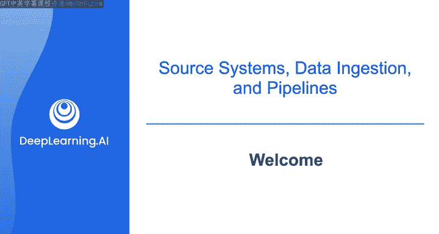

#  078：欢迎来到第2课程 🚀

在本课程中，我们将深入学习数据工程专业化的核心环节。你将了解如何从各种源系统获取数据，并掌握数据运维与端到端数据管道编排的关键知识。

欢迎来到数据工程专业化的第二门课程。在第一门课程中，你获得了数据工程领域的高层概述，了解了良好数据架构的原则，以及如何将利益相关者的需求转化为数据系统的需求和工具。

在本课程中，你将学习更多关于从源系统摄取数据、数据运维以及端到端数据管道编排的内容。

我们再次请到你的讲师乔·维兹，他也是畅销书《数据工程基础》的合著者。乔，你可以简要介绍一下学习者在本课程中将看到什么内容。

当然，安德鲁。正如你所说，本课程重点聚焦于数据工程生命周期的前两个阶段，即**数据生成与源系统**，以及**从这些源系统进行数据摄取**。

因此，我们将首先了解不同类型的源系统，例如数据库、对象存储和流处理系统。我们将深入探讨，作为一名数据工程师，你将如何在实际工作中与这些源系统进行交互。

之后，我们将研究从源系统摄取数据、数据运维与编排方面，以及构建数据管道。

这听起来很棒。对于许多人工智能系统而言，数据工程或数据摄取占据了约80%的工作量，而机器学习建模可能只占20%。但人们的注意力在这两个主题上常常是颠倒的，80%的注意力集中在AI建模上，而对数据摄取的关注、最佳实践和工具投入却远远不够。

事实上，在我早期于一家大型科技公司工作时，我曾负责公司的用户数据仓库。因此，每一条涉及单个用户的数据都应该进入我的数据仓库，这为公司创造了巨大价值。但设计数据库、数据库模式、摄取系统以及维护数据等智力工作，结果证明是一项相当庞大的工程。

这确实是一项庞大的工程。我一直认为，当我们谈论从源系统摄取数据时，这就是一切。如果你无法获取数据，那么你几乎无法对它进行任何处理。这听起来似乎很简单，但正如你指出的，很多时候摄取环节被忽视，或者重点放在了其他方面。因此，这是你需要正确完成的一项基础工作。如果无法获取数据，你确实无法进行其他任何操作。

所以，在本课程的这一部分，我们肯定会讨论如何理解你将从中获取数据的源系统、不同的数据摄取方式，以及编排这些数据管道工作流并对其进行监控的不同方法，以确保你能够保持数据质量、摄取性能和其他特性。这对于你作为数据工程师的工作至关重要。

事实上，我发现这对于许多不同的数据工作流都适用，从结构化的表格数据，到随着网络处理更多非结构化数据（如文本和图像），这一点似乎一直未变。甚至当我与训练大型语言模型的朋友交流，以及向领先的AI团队提供建议时，很多时候（虽然不是全部）实际上都花在了思考数据上，然后才是一些模型训练。但对于所有这些AI工作负载而言，数据摄取占据了如此多的时间，这真的很有趣。我想知道他们在数据摄取方面遇到了哪些复杂性，我猜想是在非常庞大的规模上工作。

是的，我认为确实存在很多互联网数据。例如，Common Crawl就有大量数据。但有了数据之后，你如何摄取它、处理它、筛选它以保证高质量？此外，如果你的数据存在缺口，你注意到你的模型在某些主题上表现不佳，你如何找出这些不足，以及究竟该去哪里获取数据（如果这些数据存在的话）来填补这些缺口？这些都是许多智力上的挑战。

我发现，即使是训练一些最大的开源大型多模态模型和其他大型基础模型的一线人员，也在花时间担心这些问题。

这很吸引人。我们在本课程中将要讨论、并且你将学习到的内容之一，就是从多种类型的源系统摄取数据。显然，我们会讨论摄取表格数据，但这只是当今整个数据宇宙中很小的一部分。当我们谈论从文本一直到图像和视频的非结构化数据集时，这个宇宙正变得越来越大。

我认为这在传统的数据世界中并未被充分考虑。因此，本课程将涵盖的内容之一，不仅仅是来自数据库的结构化数据集，我们还将涉及处理文本、图像数据等。这将帮助你作为一名数据工程师做好准备，不仅是为了今天的工作负载（例如，如果你在数据仓库领域工作），更是为了未来的工作负载。

到目前为止，数据的价值可能大部分来自结构化数据。但随着我们处理非结构化数据能力的增长，我们可能会看到这种平衡发生转变，也许已经在转变。世界上非结构化数据的体量远大于结构化数据的体量。因此，我认为这对数据工程师来说将是更大的挑战，也是更多的工作机会。

确实如此。希望这将是对数据工程生命周期的一次非常激动人心的介绍。再次强调，从源系统摄取数据、编排这些工作负载并监控这些工作负载，对于你作为一名数据工程师至关重要。正如安德鲁指出的，这只会变得更加有趣、更加激动人心，规模也会更大。

那么，让我们进入下一个视频，深入探讨所有这些主题。