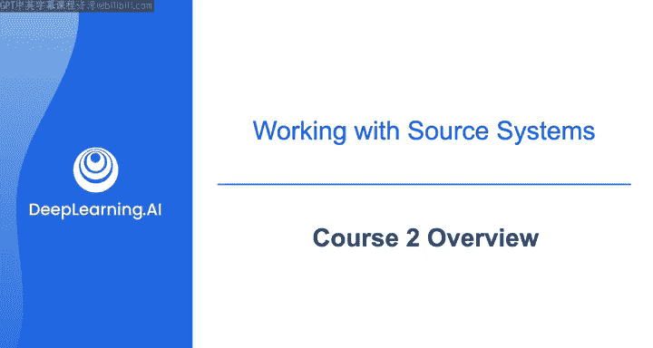
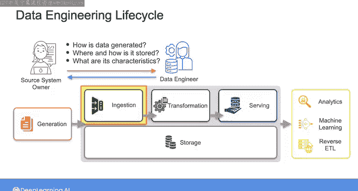
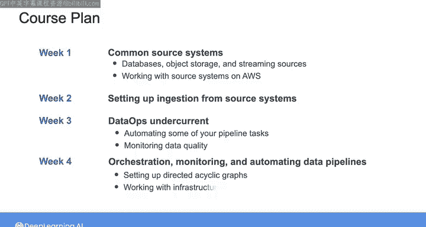

#  079：数据工程（导论，源系统、数据摄取和管道，数据存储和查询｜1-2-3课） - 第2课概览 📚

在本节课中，我们将要学习数据工程专项课程第二门课“源系统、数据摄取和管道”的整体结构与核心内容。课程将深入探讨数据生命周期的起点——源系统，并逐步引导我们构建稳健的数据管道。

欢迎来到“源系统、数据摄取和管道”课程的第一周。本周我们将从了解不同类型的源系统以及如何与这些系统交互开始。正如您在专项课程第一门课中所见，**数据生成和源系统是数据工程生命周期的第一阶段**。作为数据工程师，您通常不负责亲自生成这些数据或维护源系统，但从源系统进行数据摄取是所有数据管道的起点。因此，理解这些数据如何生成、存储在哪里、如何存储以及其部分特性至关重要，这样您才能为这些上游系统作为数据源构建稳健的数据管道。

在本课程的第一周，我们将深入探讨一些常见源系统的细节，包括不同类型的数据库、对象存储和流式数据源。在实验环节，您将有机会在AWS上实际操作这些源系统。

在第二周，我们将重点学习如何设置从源系统进行不同类型的数据摄取。

之后，在本课程的第三周，我们将关注数据运维（DataOps）的基础。您将使用**基础设施即代码（Infrastructure as Code）** 来自动化部分管道任务，并使用各种工具来监控数据质量。

最后，在本课程的第四周也是最后一周，我们将学习编排（Orchestration）技术，以协调数据管道中的各项任务。您将使用Airflow设置**有向无环图（DAGs）**，使用基础设施即代码框架，并为您的数据管道实施监控解决方案。

总而言之，本课程将涵盖广泛的内容。

在下一个视频中，请与我一起开始，更深入地了解不同类型的源系统。

---

本节课中我们一起学习了第二门课程“源系统、数据摄取和管道”的总体路线图。课程将从剖析各类源系统开始，逐步过渡到数据摄取方法、DataOps实践，最终完成数据管道的编排与监控，为我们构建完整的数据工程能力打下坚实基础。