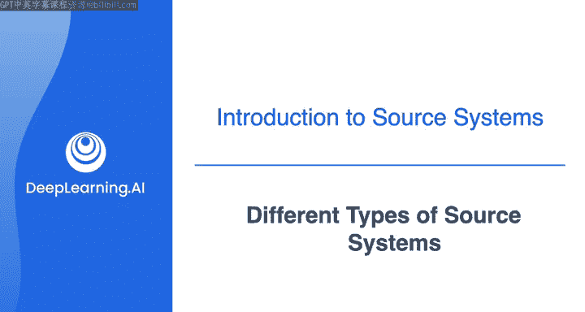
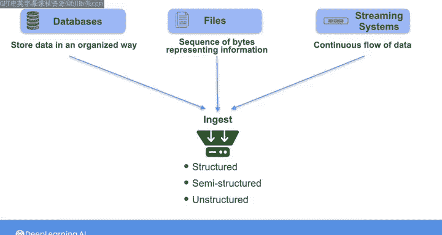

#  080：不同类型的源系统 📚




在本节课中，我们将要学习数据工程师在工作中会遇到的不同类型的源系统。我们将了解这些系统如何提供数据，以及这些数据通常以何种形式存在。课程将涵盖结构化、半结构化和非结构化数据，并详细介绍数据库、文件和流式系统这三种主要的源系统类型。

## 数据的主要类型

数据工程师处理的数据主要分为三种类型：结构化数据、半结构化数据和非结构化数据。

### 结构化数据

结构化数据以行和列组成的表格形式组织。你很可能在过去的工作中接触过结构化数据，无论是在电子表格、关系型数据库中，还是使用Python读取CSV文件。

### 半结构化数据

半结构化数据不以表格形式存在，但仍然具有一定的结构。一种常见的半结构化数据格式是JavaScript对象表示法，即JSON。

以下是JSON格式的一个示例：

```json
{
  "first_name": "Joe",
  "last_name": "Reese",
  "address": {
    "city": "Wholesale",
    "code": "12345",
    "country": "USA"
  }
}
```

JSON文件包含一系列键值对。每个值可以是不同的数据类型，例如数字、字符串或数组。键值对甚至可以包含另一系列键值对，从而形成嵌套的JSON格式。因此，即使数据不以表格形式呈现，它仍然具有一定的结构。

### 非结构化数据

非结构化数据没有预定义的结构。例如，文本、视频、音频和图像都是非结构化数据的例子。但需要注意的是，像视频、音频和图像这样的数据在幕后确实有其固有的结构，例如像素的维度以及红、蓝、绿等颜色信息。我们将在本课程中更深入地探讨非结构化数据。

## 源系统的三种主要类型

在摄取这些不同类型的数据时，可以将相关的源系统大致分为三类：数据库、文件和流式系统。

这三种源系统类型并不一定与上述三种数据类型一一对应。但可以说，从数据库中，你最常摄取的是结构化和半结构化数据；从流式系统中，你通常摄取的是作为数据格式的半结构化消息；而文件则可以是任何形式，从文本、图像、音频、视频到常规的行列式表格数据。

接下来，让我们逐一深入了解这三种源系统。

### 数据库

数据库以有组织的方式存储信息，允许你查找、检索、更新和删除数据。实现这一功能的核心操作被称为CRUD。

**CRUD** 代表创建、读取、更新和删除。创建操作排在首位，因为数据必须先被创建，然后才能被读取、更新或删除。

通常，一个称为数据库管理系统（DBMS）的软件接口位于物理数据库存储与用户或应用程序之间。DBMS允许你访问和操作数据库中存储的数据。

本周我们将关注两种类型的数据库：一种是存储行列表格信息的关系型数据库；另一种是非关系型数据库，也称为NoSQL或“不仅仅是SQL”数据库，它们存储非表格形式的数据。我们将在本周晚些时候更仔细地研究这两种数据库。

### 文件

除了数据库，你将与之交互的另一种最常见的源系统是文件。毫无疑问，你已经有很多处理各种类型文件的经验。

这些文件可能是存储在计算机中的文档、用手机拍摄的图像或视频，甚至可能是同事通过电子邮件发送给你的CSV文件。将普通的旧文件视为数据工程的源系统可能看起来有些奇怪，但从本质上讲，文件只是表示信息的一系列字节。各种类型的应用程序都将数据写入文件，因此文件是数据交换的通用媒介。

信不信由你，文件是数据工程师工作中最常见的源系统之一。文件就像数据一样，可以是结构化的（如电子表格）、半结构化的（如JSON或XML文件）或非结构化的（如文本、图像、视频或音频文件）。你可能从像Google Drive这样的文件系统、像Amazon S3这样的对象存储系统，或者仅仅是作为电子邮件附件来接收或访问这些文件。

### 流式系统

你可能摄取数据的第三种源系统是流式系统。你可以将流式系统视为提供连续的数据流，这些数据被记录为包含事件信息的消息。

这些事件包括世界上发生的某些事情或系统状态的改变。在实践中，你可能通过消息队列或其他流式平台与事件流进行交互。

例如，像智能恒温器这样的物联网设备可能会记录一个包含最新温度读数的事件，并将该事件作为消息发布到像Kinesis或Kafka这样的流式平台。然后，作为数据工程师，你可以设置另一个服务来摄取此消息，并向嵌入式分析仪表板发送更新。在这种情况下，你可以将流式平台视为从中提取原始数据的源系统。

在本课程后面的几周里，你将看到这些流式系统如何也能跨越数据工程生命周期，并在摄取和转换阶段用于处理各种下游用例的数据。

事实上，无论是数据库、文件还是流式系统，所有类型的源系统都可能扮演双重角色：它们可能是你摄取原始数据的系统，也可能是你在生命周期另一个阶段构建到数据管道中的系统。

## 总结

本节课中我们一起学习了数据工程师需要处理的不同类型的源系统。

我们了解到，数据工程师将从不同的源系统中提取原始数据。这些原始数据可能是结构化的、半结构化的或非结构化的。而源系统则可能是数据库、文件或流式系统。

在接下来的系列视频中，我将更详细地介绍每种不同类型源系统的特性。我们将从数据库开始，然后看看对象存储如何作为文件的数源，之后我们将更深入地探讨消息队列、日志和流式平台。请加入下一个视频，开始了解关系型数据库。




