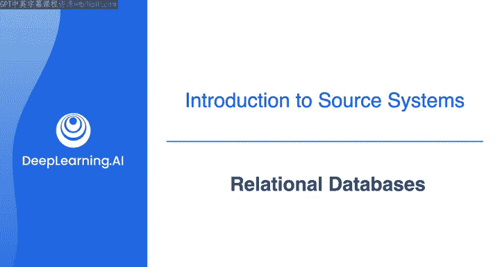
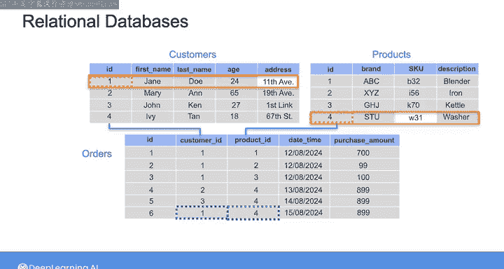
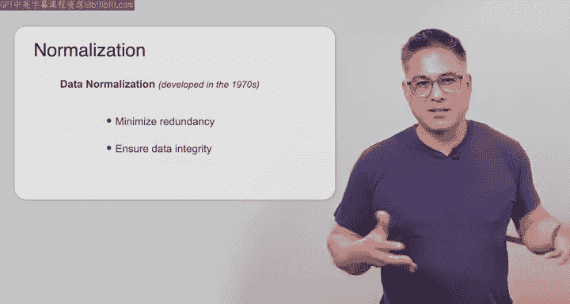
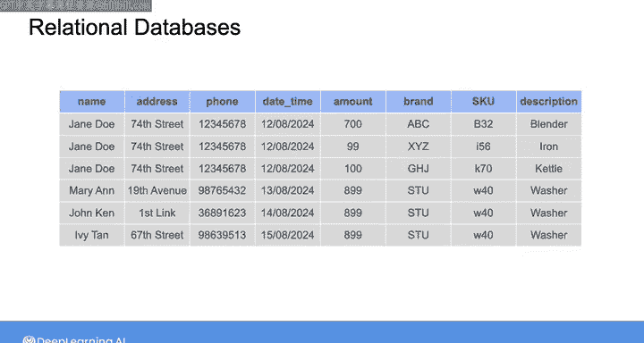
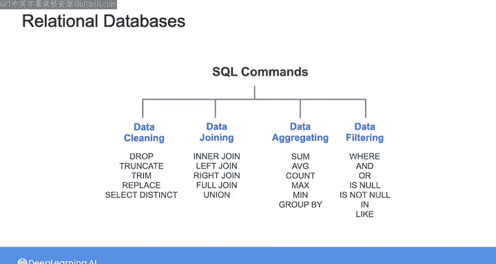

#  081：关系型数据库 🗄️

## 概述

在本节课中，我们将要学习关系型数据库。作为数据工程师，关系型数据库是最常见的源系统类型。我们将了解其基本概念、结构、优缺点以及如何与之交互。

---

## 什么是关系型数据库？

关系型数据库无处不在。许多Web和移动应用程序在后端使用关系型数据库。许多企业系统，如客户关系管理、人力资源和企业资源规划系统，也使用它们。关系型数据库还常用于在线事务处理系统，这些系统需要并发执行大量事务，例如银行或在线预订系统。

“关系型”一词源于这类数据库通常用于将数据存储在多个相互关联的表中。这些表通过一组键或共同属性相互关联。这些表通常根据业务中的信息结构进行组织。

例如，作为一名在电子商务公司工作的数据工程师，你可能需要处理一个关系型数据库。其中一个表存储客户信息，另一个表存储产品信息，第三个表存储订单信息。

---

## 数据库结构：多表与单表

上一节我们介绍了关系型数据库的基本概念，本节中我们来看看其具体的结构设计。

以这种方式构建数据库可以减少冗余，并使数据更易于管理。其核心在于避免同一信息在数据库的多个行或表中重复存储。

为了理解这一点，可以想象一下，如果不使用多个表，而是创建一个大表来存储每个单独的客户订单数据。在这种情况下，你的表可能包含大量列，包括客户的所有信息（如姓名、地址、电话号码等），以及他们购买产品的所有信息（如品牌、SKU编号、产品描述等），还有订单的详细信息（如日期、时间、购买金额和支付金额等）。

在这种场景下，如果一个客户为三种不同产品下了订单，这将被记录为数据库中的三行。那么表中将有三行包含完全相同的客户数据。或者，如果三个不同的客户购买了同一产品，那么数据库中会有三行包含该产品的相同信息。

简而言之，信息会在表的多个行中重复。除此之外，跨行的数据可能存在不一致。例如，如果客户更改了地址，除非你回去更新所有包含其旧地址的行，否则行之间就会出现不一致。如果某个产品的详细信息发生变化，你需要回去更新所有包含旧信息的行。

---

## 规范化与键

当你将客户、产品和订单的信息分离到多个表中时，情况就不同了。客户表中的一行代表一个客户，产品表中的一行包含一个产品的信息。如果客户更改地址或产品详情发生变化，你只需要更新包含该客户或产品信息的单一行。

数据库被组织成相关表的方式被称为**数据库模式**。关系型数据库通过使用**键**来表示表之间的关系。

*   **主键**：是表中唯一标识每一行的特殊列或列集合。对于客户表，主键可以是名为`ID`的列。
*   **外键**：订单表和客户表之间的关系可以通过在订单表中设置`customer_id`列来建立，该列引用客户表中的`ID`列。在这种情况下，订单表中的`customer_id`列被称为**外键**，它引用了客户表的**主键**（即`ID`列）。

除了行结构，在关系型数据库中，每一列都有唯一的名称和指定的数据类型。例如，在客户表中，可能有包含字符串的列，如`ID`、`first_name`和`last_name`，以及包含整数的列，如`age`。表中的每一新行都必须遵循相同的列结构，即相同的列序列和数据类型。这也是数据库模式的一部分。

现在，在具有此类模式的数据库中，要记录现有客户的新订单信息，你可以在订单表中创建一条新记录，并指明来自客户表的`customer_id`、来自产品表的`product_id`以及订单详情（如日期、时间、支付信息等）。同样，如果该客户更改地址或所订购产品的SKU编号发生变化，这些更改只影响客户表或产品表中的单一行，信息保持一致。

可以想象，建立表之间关系的方式有很多种，这就是**数据规范化**概念发挥作用的地方。数据规范化是20世纪70年代发展起来的一种方法，旨在通过以逻辑方式跨表存储数据来最小化冗余并确保数据完整性。

---

## 规范化的优缺点

但值得停下来思考一下：为什么首先要如此担心冗余或重复信息？像我描述的那样构建数据似乎合乎逻辑且有序，但有什么缺点吗？

事实证明，虽然规范化的关系型数据库结构提供了高度的完整性并最小化了冗余，但在查询数据时可能实际上很慢。如今，存储相对便宜，而速度往往至关重要。当然，数据完整性也极为关键。但如何存储表格数据的答案，可能取决于你试图优化什么。

作为一名数据工程师，你可能正在从关系型数据库系统中摄取规范化的数据。但根据你所服务的最终用例，你可能会决定在自己的存储系统中按照不同的模型来组织数据。如今，甚至有一些用例中，数据工程师选择采用所谓的“一个大表”方法，将所有数据记录在一个SQL表中以实现更快的处理，这在传统关系型数据库中连接多个表时可能无法实现。我们将在专业课程的第4课中更深入地探讨数据建模的细节。

---

## 关系型数据库管理系统与SQL

当需要与数据库交互时，你会使用**关系型数据库管理系统**。这是一个位于关系型数据库之上的软件层。市面上有许多流行的RDBMS，包括MySQL、PostgreSQL、Oracle和SQL Server。

大多数RDBMS都支持**结构化查询语言**。SQL提供了一组用于在关系型数据库上执行各种操作的命令。作为一名数据工程师，SQL将是你日常工作的一部分。

在下一个视频中，我将引导你了解一些在实验中将需要用到的SQL命令。然后在实验中，你将有机会练习使用SQL查询来查询关系型数据库中的数据。

---

## 总结

本节课中我们一起学习了关系型数据库。我们了解到它是数据工程中最常见的源系统类型，通过多表结构和键来组织数据以减少冗余。我们探讨了数据规范化的概念及其在确保数据完整性和减少冗余方面的作用，同时也指出了其在查询性能上可能的权衡。最后，我们介绍了通过RDBMS和SQL语言与数据库进行交互。接下来，让我们在下一个视频中一起看看NoSQL数据库。