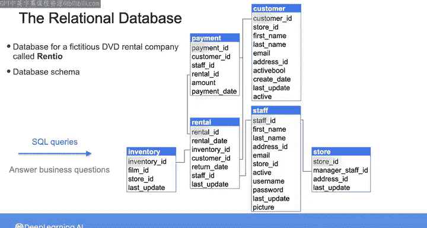
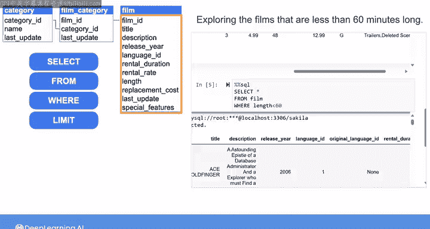
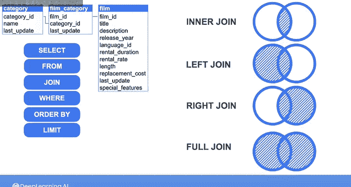
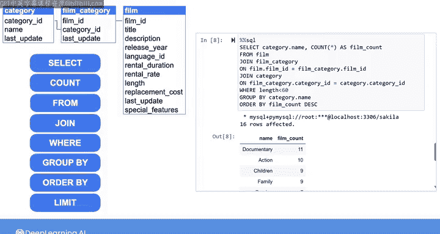
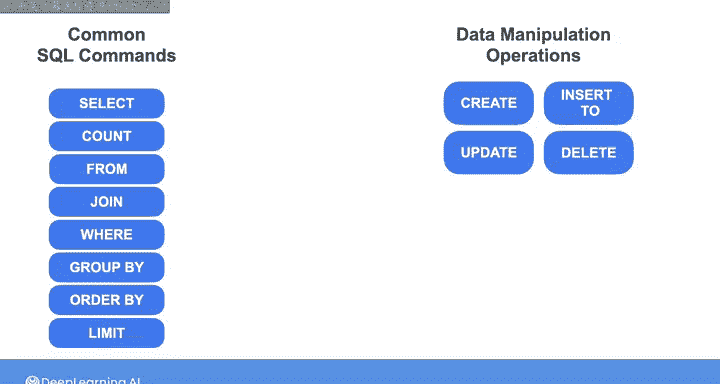

#  082：SQL查询基础 🗃️


## 概述

在本节课中，我们将要学习SQL查询的基础知识。我们将从一个虚构的DVD租赁公司数据库入手，学习如何使用`SELECT`、`FROM`、`WHERE`、`JOIN`、`GROUP BY`等核心命令来检索和操作数据。课程内容将帮助你理解如何通过编写SQL语句来回答业务问题。

## 数据库与实验介绍

在实验中，你将使用一个名为“Bnio”的虚构DVD租赁公司的事务数据库。该数据库包含多个表，记录了商店、员工、客户、DVD库存和租赁交易等信息。

你将在Jupyter笔记本中编写SQL语句或查询，以从数据库中检索信息。为了有效地查询数据，你必须理解数据库的模式。

换句话说，你必须知道表的名称、它们包含的列，以及表之间如何通过主键和外键相互关联。

这个数据库是规范化的。这意味着像商店、员工和客户的地址这类数据被存储在单独的表中，以减少冗余，并在数据变更时更容易更新。

同样，关于电影和租赁交易本身的数据也存储在单独的表中。你可以参考这个实体关系模型，它展示了Rio数据库中表的关系和属性。



## SQL基础：从单表查询开始

上一节我们介绍了实验的背景数据库。本节中，我们来看看最基本的SQL语句。我们将只关注三个表：包含电影标题和时长等信息的`film`表、包含电影类别列表的`category`表，以及显示电影ID与对应类别ID的`film_category`表。

最基本的SQL语句以`SELECT`子句开始，用于指定你想要的数据，后跟`FROM`子句，用于指定你想从哪个表检索这些数据。

例如，假设我想查看`film`表中的标题和发行年份。我可以这样写：

```sql
SELECT title, release_year
FROM film;
```

运行此查询后，我将获得所有标题和发行年份的列表。结果显示，`film`表中有1000部电影。如果我不想看到整个列表，可以使用`LIMIT`子句来限制返回结果的数量。

例如，如果我在查询末尾添加`LIMIT 10`，我将只从`film`表中获得前10个标题和发行年份。

但是，如果你想检索表中所有列的数据呢？

你可以在`SELECT`子句中列出所有列名，或者使用快捷方式，输入`SELECT * FROM film`。这将从`film`表中检索所有行和列的数据。

你将在下一门课程中学习查询在后台是如何执行的。但现在，你只需要知道，检索所有列的所有数据可能会消耗大量处理资源，尤其是在数据集非常大的情况下。

因此，我建议仅在需要查看表中所有数据时使用`SELECT *`。

## 使用WHERE和ORDER BY过滤与排序数据

上一节我们学习了如何选择数据。本节中，我们来看看如何通过布尔条件过滤结果。

例如，假设你只对时长少于60分钟的电影感兴趣。你可以在`FROM`子句后添加一个`WHERE`子句，根据`length`列过滤结果。

```sql
SELECT *
FROM film
WHERE length < 60;
```

这将返回96部时长少于一小时的电影列表。



你也可以按任意列对结果进行排序。例如，我可以在`WHERE`子句后添加`ORDER BY length`，以按电影时长升序排列结果。

如果我希望结果按电影时长降序排列，我可以在`ORDER BY`子句的末尾添加`DESC`关键字。

如果我想将结果限制为，比如说，10条记录，我可以在查询末尾添加`LIMIT 10`。

## 使用JOIN组合多表数据

你刚刚看到了如何使用`SELECT`、`FROM`、`WHERE`、`ORDER BY`和`LIMIT`子句从单个表中检索数据。如果你想探索来自多个表的数据呢？

你可以使用`JOIN`子句，基于表之间的共享列来组合两个或多个表中的记录。

例如，假设我想获取所有时长少于60分钟的电影标题及其对应的电影类别。

让我们扩展之前的查询，即`SELECT * FROM film WHERE length < 60`。我想基于匹配的`film_id`，将`film`表中的行与`film_category`表中的行组合起来。

因此，在`FROM`子句的末尾，我会写：`JOIN film_category ON film.film_id = film_category.film_id`。

这样，返回的结果将包括`film`表的所有列，以及每个匹配的`film_id`在`film_category`表中的列。

请注意，`film_category`表只包含`category_id`，而不包含类别名称。因此，我们需要再做一次`JOIN`，基于`category_id`将这些记录与`category`表中的行组合起来。

我将添加：`JOIN category ON film_category.category_id = category.category_id`。

现在，结果将包括`film`表的所有列、`film_category`表的所有列以及`category`表的所有列。

由于我只想要电影标题和对应的电影类别，我可以修改`SELECT`语句，指定我只想要`film.title`列和`category.name`列。

默认情况下，`JOIN`子句只组合两个表中在`ON`语句指定的列上具有匹配值的记录。它不会包含任一表中没有匹配值的任何记录。

例如，如果`film`表中有一行的`film_id`没有出现在`film_category`表中，那么该行将不会包含在结果中。这种类型的连接被称为**内连接**。你可以将连接结果想象成维恩图中中间重叠的部分。

其他类型的连接包括：
*   **左连接**：返回第一个表的所有记录，以及第二个表中任何匹配的记录。
*   **右连接**：返回第二个表的所有记录，以及第一个表中任何匹配的记录。
*   **全连接**：返回两个表的所有记录，并组合具有匹配值的记录。

回到上一个查询的结果，我可以看到相当多的短片属于儿童或纪录片类别。

## 使用GROUP BY进行数据分组与聚合

上一节我们学习了如何连接多个表。本节中，我们来看看如何对数据进行分组和聚合计算。

假设我想确切知道短片中最受欢迎的类别。我可以使用`GROUP BY`命令根据电影类别对行进行分组，然后使用`COUNT`命令计算每个电影类别的记录数。

`GROUP BY`命令写在`WHERE`子句之后。所以在这里，我将添加`GROUP BY category.name`。

然后，我将修改`SELECT`语句，选择`category.name`和`COUNT(*)`，后者用于计算每个类别的所有行数。

我还可以使用`AS`命令为这个计数结果赋予一个别名，例如`film_count`。

最后，我将按`film_count`降序排列结果。



```sql
SELECT category.name, COUNT(*) AS film_count
FROM film
JOIN film_category ON film.film_id = film_category.film_id
JOIN category ON film_category.category_id = category.category_id
WHERE film.length < 60
GROUP BY category.name
ORDER BY film_count DESC;
```

如你所见，时长在一小时以内的短片中，最受欢迎的类别是纪录片，其次是动作片，然后是儿童片等等。

## 总结与后续

本节课中，我们一起学习了一些最常见的SQL命令，现在你已经准备好开始实验了。

实验还涵盖了一些数据操作操作，包括`CREATE`、`INSERT INTO`、`UPDATE`和`DELETE`。因此，在尝试每个练习时，请确保仔细阅读说明。





完成实验后，请加入我，一起了解NoSQL数据库。