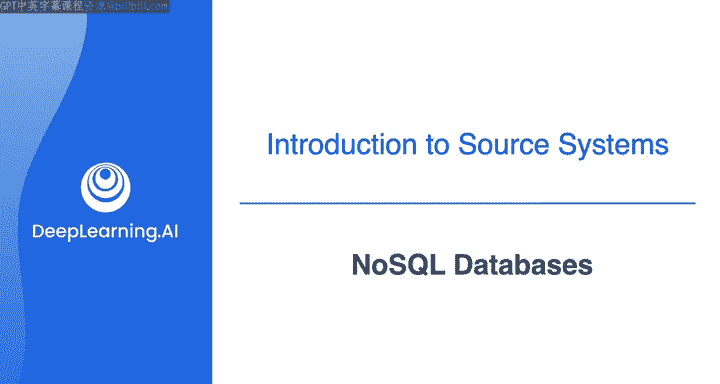
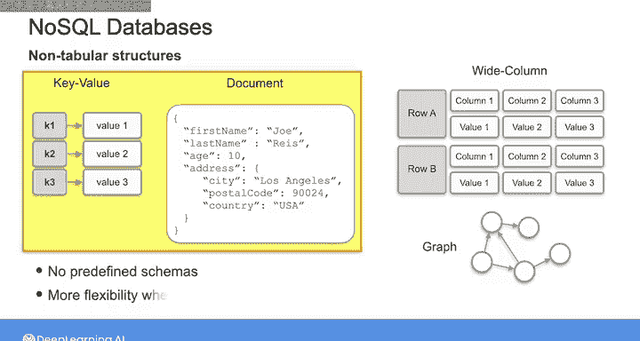
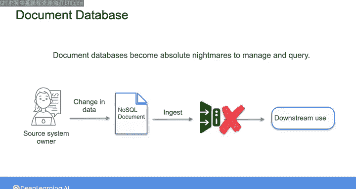

#  083：NoSQL数据库 🗄️

在本节课中，我们将学习NoSQL数据库。我们将了解它们为何被创建，它们与关系型数据库有何不同，以及两种常见的NoSQL数据库类型：键值数据库和文档数据库。

---

21世纪初，像谷歌和亚马逊这样的科技巨头开始发现关系型数据库已无法满足其需求。

他们需要处理来自不同来源的大量数据，而这些数据无法整齐地放入关系型数据库模型中。

强制使用表格结构会导致数据冗余和大规模性能问题。

因此，这些公司引领了开发新型分布式非关系型数据库的道路，以扩展网络平台。

就这样，NoSQL数据库被开发出来，以克服关系型数据库的局限性。

它们牺牲了关系型数据库管理系统（RDBMS）的某些特性，如强一致性、连接操作和固定模式，以换取更高的模式灵活性、可扩展性和更好的性能。

在深入之前，我们先澄清一点。NoSQL并不代表“没有SQL”。

它的意思是“不仅仅是SQL”。这是一类数据库，它们摆脱了我们在上一个视频中看到的关系型框架，但一些非关系型数据库仍然支持SQL或类SQL查询语言。

---

## NoSQL数据库基础

让我们回顾一下NoSQL数据库的基础知识。

NoSQL数据库具有非表格结构。

它们可以支持各种数据格式，包括键值、文档、宽列、图等。

我将在本视频后面讨论键值型和文档型，你会在接下来的几门课程中看到其他一些类型。

与关系型数据库不同，NoSQL数据库不需要预定义的模式。

这意味着你在决定如何存储数据时拥有更大的灵活性。

NoSQL数据库擅长水平扩展，这意味着可以自动将数据和工作负载分布在多个服务器上，以应对增加的流量需求。

当用户向一个分布在多个服务器或节点上的NoSQL数据库写入数据时，该写操作首先在单个节点上执行。

在这个分布式系统中，数据库的一个版本正在运行，然后这些更改传播到系统中所有其他节点可能会有轻微的延迟。

与关系型数据库不同，NoSQL数据库遵循最终一致性原则，而不是强一致性。这意味着数据库允许你从一个尚未收到最新写入更新的节点读取数据，你可能无法获得最新的数据。但只要有足够的时间，数据库将达到一致状态，从任何节点读取数据都会得到相同的数据。

对于提供强一致性的关系型数据库，在系统中的所有节点都更新之前，你将无法读取数据。

通过这种方式，最终一致性允许NoSQL数据库优先考虑速度，这对于系统可用性和可扩展性比实时一致性更重要的应用程序来说是完美的，例如社交媒体平台或内容分发网络。

在数据完整性方面，并非所有NoSQL数据库都保证原子性、一致性、隔离性和持久性原则，也就是我们将在下一个视频中看到的ACID合规性。

但有些数据库确实保证，例如MongoDB。

这意味着，如果你从NoSQL数据库获取数据，那么你可能需要采取额外的步骤来确保数据完整性。

最后，NoSQL数据库使用专门针对其数据模型定制的查询语言，这些语言通常（但不总是）与SQL不同。

---

## 两种常见的NoSQL数据库

现在，让我们更仔细地看看两种常见的NoSQL数据库类型：键值数据库和文档数据库。

键值数据库将数据存储为键值对的集合，类似于你在JSON文件或Python字典结构中可能找到的。

键作为唯一标识符来检索对应的值。

键和值都可以是从简单到复杂的任何对象。

这种类型的NoSQL数据库非常适合需要快速数据查找的场景，例如缓存Web或移动应用程序中的用户会话数据。

例如，当用户登录一个应用程序时，查看不同产品、将商品添加到购物车和结账等操作都可以存储在键值数据库中，以用户会话ID作为唯一标识符。

文档存储是一种特殊类型的键值数据库，它以类似JSON的文档形式存储数据。

每个文档都有一个唯一的键，用于标识文档并允许你检索该文档的数据。

文档被组织成集合，因此你可以将集合视为类似于关系型数据库中的表，而文档则类似于表中的一行。

在这个例子中，数据存储在一个名为“用户”的集合中。每个文档代表一个用户，ID是唯一标识每个用户的键。

这种局部性使得检索特定用户的所有信息比在关系型数据库中更容易，因为在关系型数据库中，用户信息可能分布在多个表中。

然而，文档存储不支持连接操作，因此与在关系型数据库中跨多个表组合信息相比，组合来自多个文档的信息更加困难且效率较低。

但它的优势在于灵活模式的概念。正如你在关系型数据库中看到的，所有记录都需要符合固定的模式，但对于键值数据库和文档存储，数据记录没有固定或预定义的结构。

文档存储通常用于涉及内容管理、目录和传感器读数的应用程序。例如，来自物联网设备的每次交互、产品或传感器读数，都可以存储为具有灵活模式的单个文档。

但要小心，这种灵活性可能有缺点。我曾见过文档数据库变得难以管理和查询，成为一场噩梦。如果你从NoSQL文档存储作为源系统获取数据，模式的灵活性使得源系统所有者更容易做出更改，从而破坏你的数据管道。

---

## 应用场景与总结

关系型数据库和NoSQL数据库都可以用于广泛的应用。

在处理在线事务的应用程序中，例如银行、金融和电子商务等领域，事情发生得很快，资金在流动，产品在移动。

在这些类型的在线事务处理（OLTP）应用程序中，数据中的任何错误或不一致都可能导致重大问题。

在下一个视频中，我们将看看原子性、一致性、隔离性和持久性原则，也就是所谓的ACID原则。在处理OLTP系统时，这些原则对你的数据源和数据管道至关重要。

---

本节课中，我们一起学习了NoSQL数据库。我们了解了它们诞生的背景、核心特性（如灵活模式、水平扩展和最终一致性），并深入探讨了键值数据库和文档数据库这两种常见类型的工作原理与适用场景。我们还比较了它们与关系型数据库的差异，并指出了在数据工程实践中需要注意的潜在挑战。