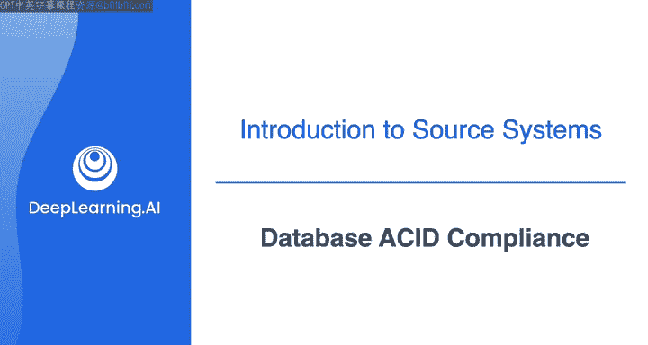
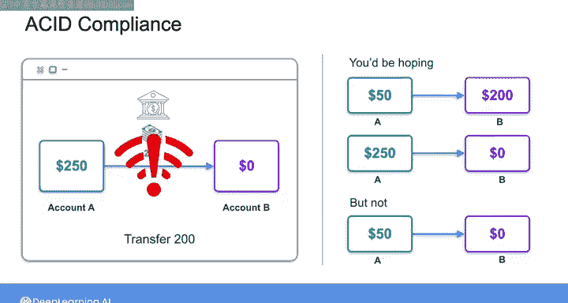
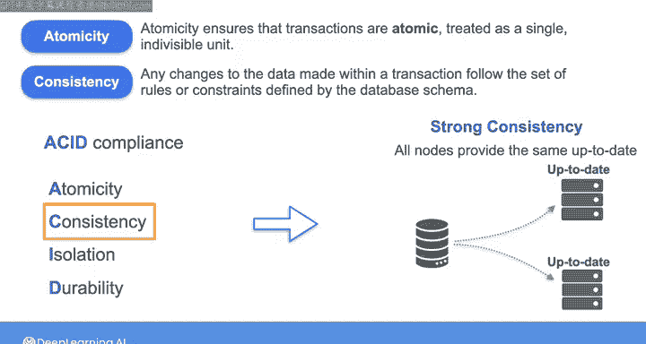
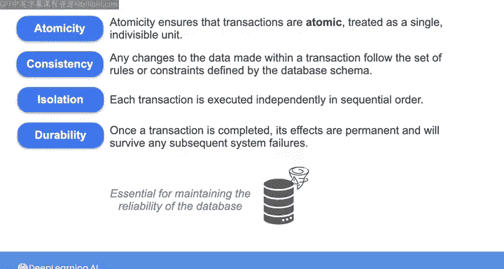
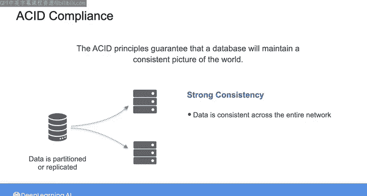

#  084：数据库ACID合规性 🧱

在本节课中，我们将要学习数据库事务处理中的一个核心概念——ACID合规性。理解ACID原则对于确保数据在交易过程中的可靠性和准确性至关重要，尤其是在处理银行转账、在线购物等关键业务时。

---

## 概述

关系型数据库和非关系型数据库都能支持高事务处理率，因此它们常被用于在线事务处理系统。这些系统通常需要存储快速变化的应用程序状态，例如银行账户余额或在线订单的详细信息。大多数关系型数据库系统默认是ACID合规的，这意味着它们支持原子性、一致性、隔离性和持久性原则，以确保OLTP系统中的事务被可靠且准确地处理。相比之下，许多NoSQL数据库默认并不完全ACID合规，但通常允许你通过配置来实现。

---

## ACID原则详解

上一节我们介绍了ACID合规性的重要性，本节中我们来看看这四个原则的具体含义。

### 原子性

原子性确保事务被视为一个不可分割的单元。一个事务可能包含多个操作，但原子性原则保证这些操作要么全部成功执行，要么全部不执行。

**公式/概念描述**： `事务 = {操作1, 操作2, ...}`， 原子性保证 `ALL(操作) 成功` 或 `NONE(操作) 成功`。

例如，客户下单购买商品的事务可能包含两个操作：从客户账户扣款和更新库存。如果在扣款后、更新库存前发生网络错误，原子性原则将回滚已完成的扣款操作，确保整个事务失败，客户不会被错误扣费。

### 一致性

一致性原则要求事务对数据所做的任何更改都必须遵循数据库模式中定义的一组规则或约束。这确保了数据库从一个有效状态转换到另一个有效状态。

**公式/概念描述**： `事务前状态` 符合约束 → `事务后状态` 也符合约束。

例如，如果库存数据库模式规定库存水平不能低于零，当前某商品库存为1。当客户试图订购2件该商品时，事务将失败并回滚，以保持数据库与预定义模式的一致性。

> **注意**：这里的“一致性”与上节课提到的分布式系统中的“强一致性”概念相关但不完全相同。数据库系统的强一致性是ACID合规的结果，而ACID中的“C”更侧重于事务层面的约束遵循。

### 隔离性

隔离性确保当多个客户端尝试并发执行事务时，每个事务都像是被独立、按顺序执行的。

**公式/概念描述**： 并发事务 `T1` 和 `T2` 的效果，等同于某种顺序执行（如 `T1 → T2` 或 `T2 → T1`）的效果。

例如，假设库存显示某商品剩余10件，两个客户同时各自订购5件。隔离性原则保证，即使两个事务的时间戳相同，它们也会被独立、按顺序处理。最终库存将变为0，而不是5。如果一个订单是5件，另一个是10件，那么先被处理的订单会成功，后一个则会因库存不足而失败。

### 持久性

持久性原则保证，一旦事务完成，其效果就是永久性的，能够经受住任何后续的系统故障（如断电）。这对于在面临自然灾害等意外事件时保持数据库的可靠性至关重要。

**公式/概念描述**： `提交(事务)` → `效果持久化`， 即使发生系统故障。

---

## ACID在分布式环境中的意义

ACID原则保证了数据库能维持一个一致的世界观。在现实世界中，数据库可能因为规模过大而被分区到多个服务器上，或者为了冗余和速度而被复制到多个数据中心。在这些情况下，确保你在整个服务器网络中读写的数据保持一致变得尤为关键。

这就是**强一致性**原则，它是ACID合规的一个关键特性。即使对于分布式数据库系统，这一原则也成立。

---

## ACID合规性的权衡

需要注意的是，虽然关系型数据库通常默认是ACID合规的，但并非所有数据库都需要完全遵守所有ACID原则来支持应用程序后端。

以下是关于权衡的一些要点：

某些NoSQL数据库只具备一定程度的ACID合规性。通过放宽一个或多个约束，可以提高数据库的某些性能方面，使其更具可扩展性。

作为数据工程师，理解你的数据库何时需要ACID合规，可以帮助你预防灾难。

---

## 总结

本节课中，我们一起学习了数据库ACID合规性的四个核心原则：**原子性**、**一致性**、**隔离性**和**持久性**。我们了解了这些原则如何确保事务的可靠处理，以及在分布式环境下的重要性。同时，我们也认识到，在实际应用中，有时需要在严格的ACID合规性与系统性能、可扩展性之间做出权衡。

在接下来的实验中，你将使用DynamoDB（一种NoSQL键值数据库）进行实践。请跟随下一个视频，在开始实验前快速了解一下实验内容。