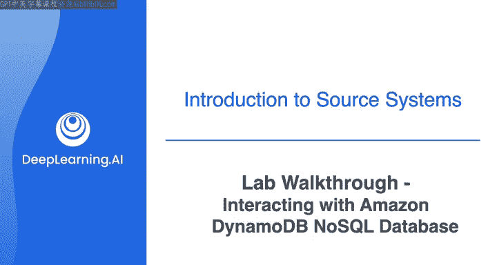
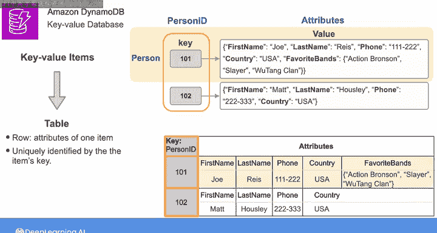
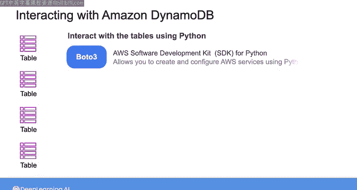
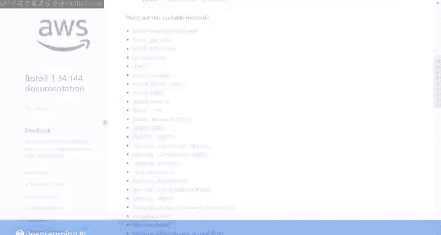
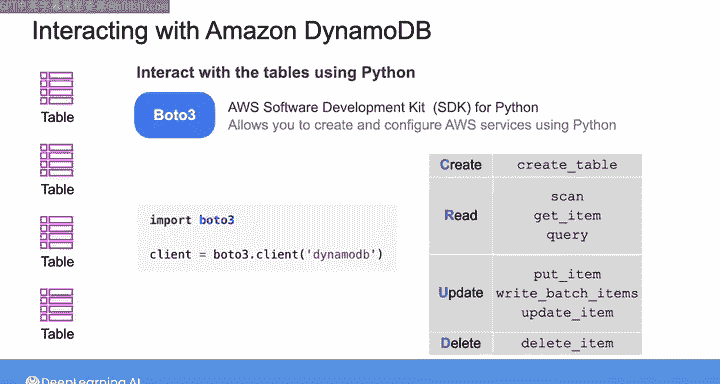
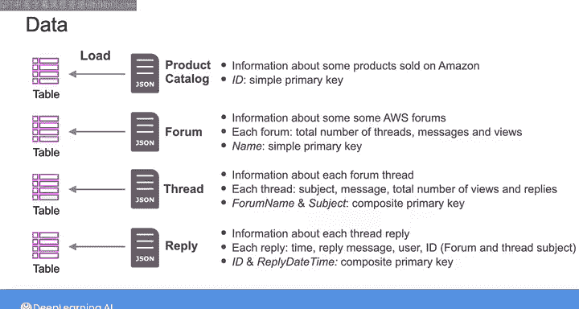
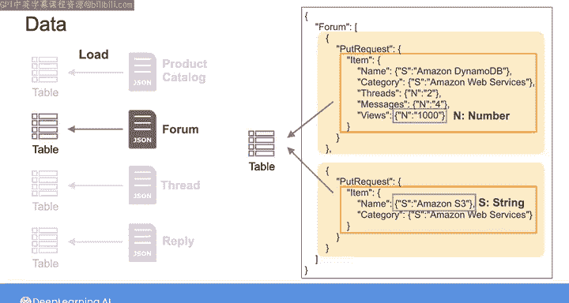
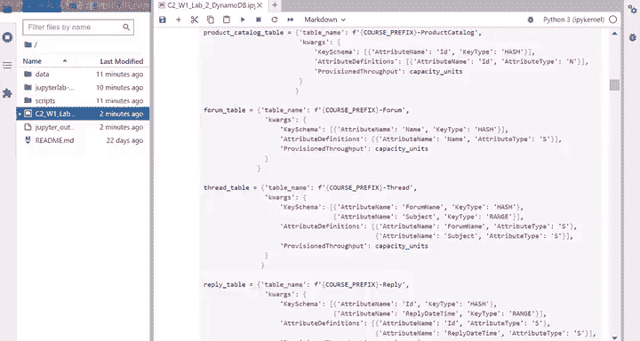

#  085：与Amazon DynamoDB NoSQL数据库交互 🗄️

## 概述

在本节课中，我们将学习如何与Amazon DynamoDB这一键值型NoSQL数据库进行交互。我们将通过Python代码在Jupyter Notebook中执行创建、读取、更新和删除（CRUD）操作。课程将涵盖DynamoDB的核心概念、数据结构以及使用Boto3 SDK进行实际操作的方法。

## DynamoDB核心概念

上一节我们介绍了本实验的目标，本节中我们来看看DynamoDB作为键值数据库的基本工作原理。

DynamoDB是一种键值数据库，它将一组键值对项目存储在表中。每一行包含一个项目的属性，并由项目的键唯一标识。

例如，以下是两个键值项目，每个对应一个人：
*   键代表人员的ID。
*   值由一组描述该人员的属性组成。

DynamoDB将此类数据存储在如下所示的表中，每行包含人员ID和相应的属性。由于人员ID列唯一标识每一行，因此它代表此表的**主键**。

在处理DynamoDB时，你也可以将主键称为**分区键**。这是因为DynamoDB使用主键来确定分区，即项目将存储的物理位置。

你还可以为DynamoDB表定义**复合主键**。

例如，这里有一个表，其中每一行代表一个订单项，并由一个复合主键唯一标识。此复合键由两个键组成：
*   第一个代表订单ID，称为**分区键**。
*   第二个代表订单中的商品行号，称为**排序键**。

使用此复合键，你可以拥有两个具有相同分区键的项目，但它们必须具有不同的排序键，以便你仍然可以唯一地标识每个项目。DynamoDB使用分区键来确定项目将存储在哪个分区，并使用排序键对同一分区内的项目进行排序。

在这两个表中，你可以看到每个项目都可以拥有自己独特的属性。这是因为DynamoDB表是**无模式的**，这意味着你无需预先定义所有属性。

## 实验工具与数据

在本次实验中，你将使用Jupyter Notebook中的Python代码创建并与四个DynamoDB表进行交互。为此，你将使用**Boto3**，这是AWS软件开发工具包，允许你使用Python创建和配置AWS服务。

以下是Boto3的文档，你可以在其中找到用于与各种AWS资源交互的方法列表。如果你点击这里的DynamoDb，可以找到处理DynamoDB表时可用的所有方法。

在实验中，你将重点学习用于执行CRUD操作的方法，例如：
*   `create_table`：创建表。
*   `put_item`， `batch_write_item`， `update_item`：在表中添加或更新项目。
*   `scan`， `get_item`， `query`：从表中读取项目。
*   `delete_item`：从表中删除项目。

要调用这些方法，你首先需要创建一个客户端对象，如下所示，它为你提供了一个代表Amazon DynamoDB表的接口。使用此客户端对象，你可以调用任何DynamoDB方法来创建表。

实验提供了从Amazon DynamoDB开发者指南下载的四个JSON文件。你将读取每个文件的内容并将其加载到DynamoDB表中。

以下是四个数据文件的简要说明：

*   **产品目录文件**：包含在Amazon上销售的某些产品的信息。每个产品由其ID定义，你将使用该ID作为相应表的简单主键。
*   **论坛文件**：包含有关某个AWS论坛的信息，用户可以在该论坛上发布有关AWS服务的问题或发起主题。对于每个论坛，你可以找到主题总数、消息数和浏览量。每个论坛由其ID定义，你将使用该ID作为相应表的简单主键。
*   **主题文件**：包含有关每个论坛主题的信息，例如主题标题、主题消息、总浏览量和给定主题的回复数。每个主题由论坛名称和主题标题定义，你将使用它们作为相应表的复合主键。
*   **回复文件**：包含有关每个主题回复的信息，例如回复时间、回复消息、发布回复的用户以及回复的ID（ID是论坛和主题标题的连接）。每个回复由其ID和回复时间定义，你将使用它们作为相应表的复合主键。

让我们看一下论坛文件。它包含一个`put`请求元素列表，每个元素包含一个将被提取并加载到DynamoDB表中的项目。请注意，每个属性由另一个键值对定义，用于指定属性的类型及其值。

因此，这里的字母`N`（代表数字）和`S`（代表字符串）是DynamoDB数据类型描述符的示例，它们告诉DynamoDB如何解释每个属性的类型。所有剩余的JSON文件都遵循相同的模式。建议你快速浏览其他JSON文件，以更好地理解每一个。

## 实验步骤演练

现在，让我们完成实验的第一个练习。我已经启动了实验并按照说明启动了Jupyter Notebook。我将运行这个单元格来导入所需的包，然后运行这个单元格来定义将在实验中用于标记目的的变量。

在这两个单元格之后，你会找到一些关于数据和DynamoDB表的解释，这些内容已在本视频中介绍过。

你的第一个练习是创建四个表，你将使用Boto3的`create_table`方法。如果查看文档，你会看到此方法需要表名和主键定义。你可以使用`AttributeDefinitions`参数定义构成主键的属性。使用`KeySchema`参数，你可以为每个属性指定它是分区键还是排序键（`HASH`表示分区键，`RANGE`表示排序键）。

在实验中，你无需为每个表编写这些参数代码。相反，实验提供了这些字典，它们代表了创建每个表所需的参数。

要创建表，实验提供了`create_table_db`函数，你将在其中调用Boto3的`create_table`方法。函数`create_table_db`接收表名和`kwargs`（关键字参数的缩写），`kwargs`是一个包含Boto3方法额外参数的字典。`kwargs`旁边的两个星号意味着字典中的元素被解包成一系列参数。

在这里，你需要完成调用Boto3方法的代码部分。使用客户端对象，对于表名，我将使用输入的表名，然后我将使用`kwargs`传入剩余的参数。

我现在将运行该单元格以及接下来的两个单元格来创建表。从这里，你可以继续完成剩余的练习。

请注意，有些练习被标记为可选。因此，你可以自由跳过可选部分。

## 总结

本节课中，我们一起学习了Amazon DynamoDB NoSQL数据库的基础知识，包括其键值存储模型、主键（分区键与排序键）以及无模式的特点。我们了解了如何使用Boto3 SDK通过Python与DynamoDB进行交互，并初步演练了创建数据库表的实验步骤。完成本实验后，你将掌握对DynamoDB执行基本CRUD操作的技能。