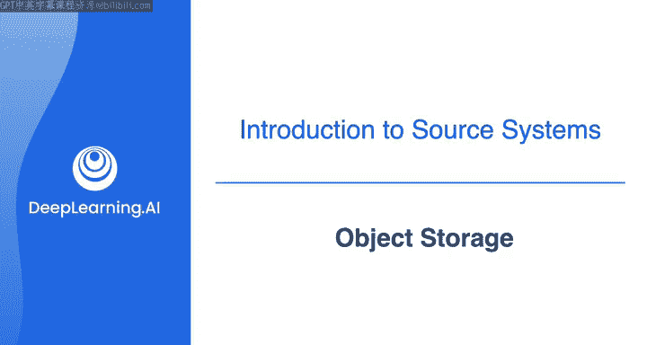
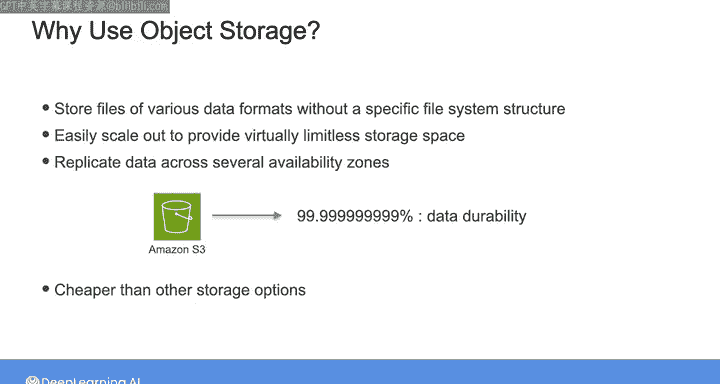

#  086：对象存储 📦

在本节课中，我们将学习对象存储的核心概念。对象存储是现代数据工程中用于文件存储和检索的重要机制。我们将探讨其工作原理、关键特性以及它为何成为数据湖等架构设计的首选存储方案。

---

正如本周早些时候提到的，文件是数据工程师日常工作中最常见的数据源系统之一。你可能从Google Drive等文件系统、S3等对象存储系统接收或访问这些文件，或者它们只是作为电子邮件的附件。文件可能来自许多不同的地方。

对象存储可以说是当今数据工程师工作中最重要的文件存储和检索机制。

## 对象存储的核心概念

对象存储将数据文件视为独立的对象，并将它们存储在**不遵循传统文件系统层次结构**的扁平结构中。这意味着，虽然你可能习惯于在本地计算机的文件夹和子文件夹层次结构中存储文件，但对象存储没有这种层次结构。

需要说明的是，这种扁平结构的概念可能会令人困惑。例如，如果你进入亚马逊S3，会看到一个“创建文件夹”的按钮，你可以随意创建文件夹和子文件夹，并愉快地将文件存储在看起来非常像分层文件系统的结构中。

然而，这实际上只是用户界面的一个功能，目的是让界面以一种熟悉的方式看起来井井有条。**实际的存储机制是扁平的**。这意味着，尽管在用户界面中看起来有文件夹和子文件夹，但所有文件实际上都存储在最顶层。这是有意设计的，因为它允许快速、直接地访问所有对象，而无需担心文件夹结构的开销。

## 对象的组成与特性

对象可以是任何东西，从CSV、JSON、文本、视频、图像或音频文件，到机器可读的二进制数据。这种多功能性使对象存储成为**半结构化和非结构化数据**的完美存储库，这在支持为训练机器学习模型提供数据等应用程序时非常有用。

对象存储作为数据源在后续的课程中扮演着关键角色。你将看到对象存储如何集成到整个数据工程生命周期中。现在，让我们看看对象存储的一些关键组件。

在对象存储中，每个对象都被分配一个**通用唯一标识符**，即UUID。这类似于一个“键”，访问和管理相应对象都需要这个键。

每个对象还有相关的**元数据**，这是关于对象的附加信息，如创建日期、文件类型或所有者。

值得注意的是，在初始写入后，对象在技术上变为**不可变的**，它们不支持随机写入或追加操作。从这个意义上说，对象存储中的文件不像关系数据库中的表或非关系数据库中的文档那样可以更新或追加。要更改存储在对象中的数据，你必须重写整个对象，并让UUID指向这个新对象。

使用对象存储，你可以启用**对象版本控制**，这允许你向对象添加元数据以指定其版本。因此，当你更新一个对象时，不是在同一个UUID下覆盖旧对象，而是可以保留该对象的多个版本。

## 为何使用对象存储？

那么，为什么要使用对象存储呢？

对象存储允许你存储各种数据格式的文件，而无需特定的文件系统结构。这消除了与分层文件夹系统和数据库相关的复杂性。

在云环境中，对象存储可以轻松横向扩展，为海量数据提供几乎无限的存储空间。

在可用性方面，云对象存储中的数据通常会在多个可用区复制，这意味着数据在多个相互隔离的物理数据中心之间复制。这使得数据具有**高持久性和高可用性**，即使在发生自然灾害的情况下也是如此。

例如，正如我在之前的课程中提到的，亚马逊S3提供“11个9”（99.999999999%）的数据持久性，这意味着S3上的对象存储可以承受并发的设备或数据中心故障。

此外，对象存储通常比其他存储选项更便宜，特别是如果你存储的是不需要经常访问的数据。

## 应用与总结

云对象存储用于许多应用程序，并且由于其**灵活性、高可扩展性、成本效益和持久性**，已成为数据湖和数据湖仓等新架构设计的首选存储方案。

接下来，你将有机会使用亚马逊S3对象存储。你将创建一个S3存储桶，从存储桶中查询数据，并实践对象版本控制。完成实验后，请加入下一个视频，了解作为流式系统数据源的应用程序日志。

---

本节课中，我们一起学习了对象存储的基本原理。我们了解到对象存储采用扁平结构管理文件，通过UUID唯一标识对象，并支持元数据和版本控制。其高可扩展性、持久性和成本效益使其成为处理半结构化和非结构化数据（如构建数据湖）的理想选择。