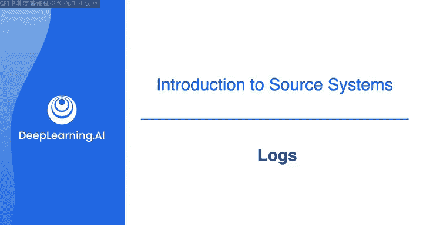
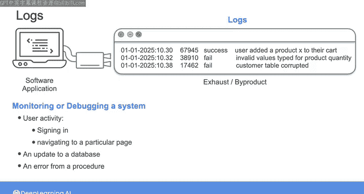
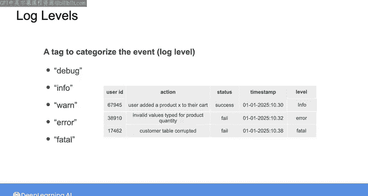

#  087：第9课 - 日志 📝

在本节课中，我们将要学习**日志**这一核心概念。日志是最简单的流式系统形式，它记录了系统中发生的事件信息，是数据工程师工作中重要的数据来源。

---

## 什么是日志？

上一节我们介绍了流式系统的概念，本节中我们来看看其最基础的形式：日志。

我能想到的最简单的流式系统类型就是日志。实际上，日志甚至算不上一个系统。它只是一个关于事件的记录，用于追踪系统或应用程序的活动。在之前的课程中我曾提到，开发者过去常常将来自软件应用程序的数据视为一种“废气”或副产品，其本身不一定具有内在价值，但可用于监控或调试系统。最常被视为“废气”的具体数据，就是软件应用程序生成的日志中包含的数据。

因此，当开发者部署一个产品或平台（如网站或移动应用）时，他们会进行设置，使应用程序内发生的所有活动都记录在日志中。日志可能包括用户活动，如用户登录或导航到特定页面；也可能包括后端事件的记录，例如数据库更新或尝试运行特定程序时生成的错误。在实践中，日志最常用于监控系统的健康状况。

---

## 日志的用途与价值

上一节我们了解了日志的基本定义，本节中我们来看看它的具体用途和潜在价值。

工程师会使用日志来触发警报，或在发生错误时调试问题所在。从这个意义上说，日志可能显得有些枯燥，“应用程序废气”这个描述似乎很贴切。

然而，日志是丰富的数据源，其用途远不止于监控应用程序的健康状况。因此，它们可以成为数据工程师工作中需要摄取数据的重要**源系统**。从本质上讲，日志是一个**按时间顺序追加的记录序列**，捕获了系统中发生的事件信息。

以下是日志可以支持的一些具体用例：

*   **用户行为分析**：例如，如果你是电子商务公司的数据工程师，你的网络服务器日志可以捕获详细的用户活动数据，用于支持下游的用户行为模式分析。
*   **变更数据捕获**：许多数据库系统都有日志，你可以通过一个称为**变更数据捕获**的过程来追踪数据库中的变化。你可以利用这些变化来触发你的摄取流程，使其基于数据库中新数据的到达而运行。
*   **机器学习应用**：或者，你可以摄取日志数据用于某些机器学习应用，如**异常检测**。例如，如果你正在摄取来自安全系统的日志数据。

因此，日志在追踪你将与之合作的许多上游软件系统中发生的情况方面起着至关重要的作用。这使其成为一个丰富的数据源，可以支持下游的多种用例，如数据分析、故障排除、性能监控、机器学习应用和自动化。

---

## 日志的结构与格式

上一节我们探讨了日志的用途，本节中我们来深入了解日志的具体结构和常见格式。

如前所述，日志是关于事件的记录。通常，你在日志中为每个事件找到的第一条记录是**与该事件关联的人员、系统或服务账户**，例如用户ID及其IP地址。

接下来，你会找到**所发生事件的记录及其元数据**。例如，用户将特定产品添加到购物车，以及该操作的状态。

最后，你会找到**事件时间戳**的记录。

日志数据可能被记录为简单的非结构化文本，或采用 **JSON**、**CSV** 格式，甚至可以是二进制编码数据。

除了描述事件时间和内容的数据外，日志通常还会包含一个**标签**，通过为每条记录分配所谓的**日志级别**来对事件进行分类。日志级别可能包括诸如 `DEBUG`、`INFO`、`WARN`、`ERROR` 或 `FATAL` 等标签，让你知道特定记录包含何种信息。

例如：
*   包含基本活动信息的记录会被分配 `INFO` 日志级别。
*   包含错误消息的记录可能被分配 `ERROR` 日志级别。
*   如果发生更严重的情况，例如主要系统故障并需要紧急关注，则可能带有 `FATAL` 日志级别作为标签。

当你开始将日志构建到自己的数据管道应用程序中，而不是仅用于监控自己的系统时，我们将在后面更多地讨论日志级别。

---

## 总结

本节课中我们一起学习了**日志**。

作为数据工程师，理解如何处理日志、它们的类型、格式和应用非常重要。日志将是你所做工作的重要数据来源，可以帮助你排查问题、监控性能并服务于许多下游用例。

在下一个视频中，我们将一起看看一些更复杂的流式系统。