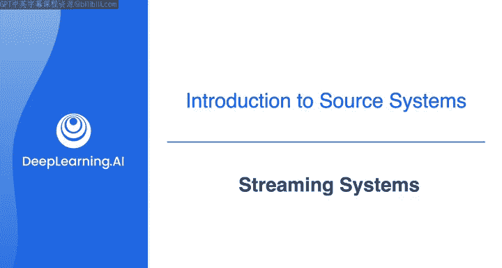
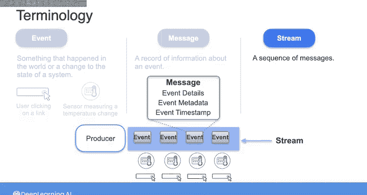
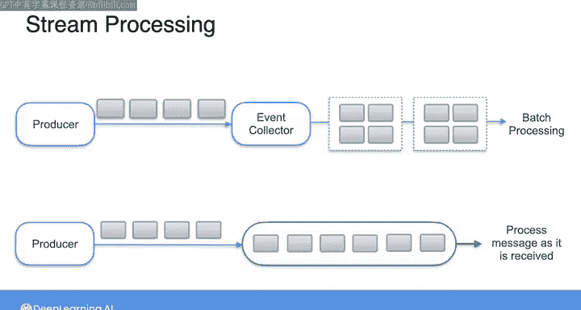
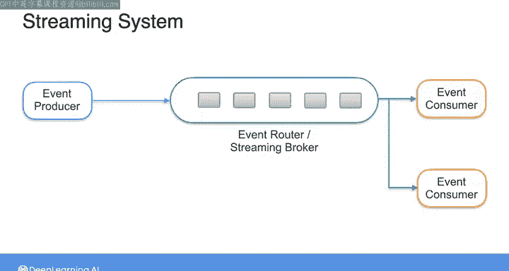
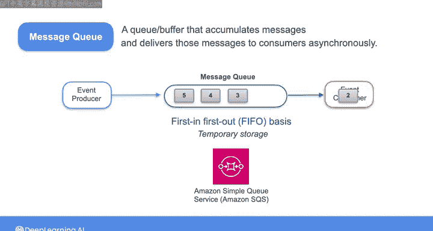
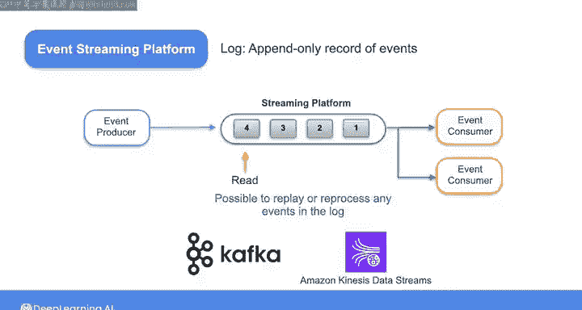

#  088：流系统 📡

在本节课中，我们将深入学习流处理系统的核心概念，包括事件驱动架构、消息队列与流式平台的工作原理，以及它们如何作为数据管道的数据源。

在专项课程的第一门课中，我们探讨了批处理和流处理在数据工程生命周期不同阶段的表现差异。在上门课程的最后一个实验中，你接触了一个数据架构示例，其中批处理和流处理在推荐系统的背景下协同工作。本节视频中，我们将更详细地审视事件驱动架构的细节，以及消息队列和流式平台如何作为数据管道的源系统工作。

## 核心概念定义

首先，让我们定义一些术语。到目前为止，在这些课程中，我们一直从**事件**、**消息**和**流**的角度来讨论流数据。

广义上说，一个**事件**就是世界上发生的某件事，或是系统状态的改变。例如，用户点击链接或传感器测量到的温度变化，都是事件的例子。正如我之前提到的，从某种意义上说，你可以认为所有数据在其源头都是流数据。这是因为本质上所有数据都是由发生在外部世界或某个系统内部的事件记录构成的。

一个**消息**是关于某个事件的信息记录。消息可能包含事件的详细信息，例如用户点击了哪个按钮或传感器记录了什么温度，以及围绕事件的一些元数据和事件发生的时间戳。消息可以持续生成以形成流。

一个**流**是一系列消息的序列，可能是一段时间内的一系列传感器读数或网站点击。消息和流共同构成了流数据。如果你想一次性处理大块数据（例如在特定的时间间隔内），那么这就是应用于消息流的批处理。如果你想在收到每条消息时立即处理，那么你需要一个能够根据传入消息采取行动的系统。这样，你就得到了一个系统，其中消息记录关于事件的信息，并在消息被接收时采取行动，换句话说，这就是一个**流系统**。

在实际应用中，你经常会听到“事件”和“消息”这两个词在描述事件驱动架构的各个组件时几乎可以互换使用。但不必为此担心。虽然严格来说，事件是发生的事情，而消息是关于这些事件记录的信息或数据，但在数据工程中，区分两者并不重要。

因此，当我们谈论事件或消息被生产、消费或存储在队列中时，它们都是指同一回事。

## 流系统的三大组件

无论如何，一个流系统包含三个组件：**事件生产者**、**事件消费者**和**事件路由器**（也称为流代理），它位于生产者和消费者之间。请注意，这里我也可以说消息生产者、消息消费者和消息路由器，意思是一样的。只是你经常会看到这些组件用“事件”来描述，所以我们在这里也沿用这个术语。

*   **事件生产者**：在流中生成消息。生产者可以是物联网设备、移动应用、API或网站等。
*   **事件消费者**（有时称为订阅者）：处理每条单独的消息。在任何一个给定的流系统中，可能有多个消费者。例如，在电子商务场景中，当用户下订单时，订单系统可能会触发一个事件，该事件通过消息传递给支付服务以处理付款，然后传递给库存服务以更新库存。在这种情况下，支付服务和库存服务都是事件消费者。
*   **事件路由器/流代理**：例如 Apache Kafka，它充当缓冲区，过滤事件并将其从生产者分发到消费者。正是这个路由器帮助将生产者与消费者解耦，从而实现它们之间的异步通信。这样，生产者不必等待事件被传递给消费者就可以发送下一个事件。即使消费者暂时不可用，这也能防止事件丢失。

当你将事件系统作为源系统处理时，你的上游源可能是一个简单的事件生产者（如物联网设备），而你的系统则包含事件消费者。或者，你的上游存储系统可能由多个生产者、路由器和消费者组成，而你构建的系统实际上只是事件的下游消费者之一。

## 两种主要的流系统

在构建处理流数据的数据管道时，你会遇到两种主要类型的流系统：**消息队列**和**流式平台**。我经常看到这两种系统被混淆。尽管它们在运作方式上有许多相似之处和潜在的重叠，但它们之间有一个主要区别，那就是**事件路由器的工作方式**。

现在，我们来花点时间讨论一下这个区别。

### 消息队列

在消息队列中，事件路由器充当一个队列，累积生产者发送的消息。事件消费者然后以**先进先出**的顺序从队列中读取消息。一旦消费者从队列中读取消息并确认，该消息就会从队列中删除。

使用消息队列，事件生产者可以随时向队列推送新消息，事件消费者也可以随时读取它们。你可以将队列本身视为一种临时的存储解决方案，它允许事件生产者与事件消费者解耦。

作为一名数据工程师，你可能会遇到的一个消息队列示例是 **Amazon Simple Queue Service**。它是一个完全托管的队列服务，常用于微服务、分布式系统和无服务器应用。

### 流式平台

对于像 **Apache Kafka** 或 **Amazon Kinesis Data Streams** 这样的流式平台，事件生产者将事件流式传输到一个**日志**中。正如我们在上一个视频中看到的，日志是一个**只追加**的事件记录。事件路由器将日志中的消息分发给适当的事件消费者。消费者以**只读**操作的方式顺序处理日志中的消息。

这意味着，与消息队列不同，消息不会从日志中删除，数据是**持久化**的。由于数据以这种方式在流式平台中保留，因此可以从过去的某个时间点**重放**、**批处理**或**重新处理**日志中的事件。

## 总结与展望

因此，流系统将是你作为数据工程师需要从中摄取数据的源系统之一。正如你在上一门课程中看到的，并且在本系列课程中将继续看到的那样，你也可以将流系统构建到你自己的数据管道中，作为生命周期中摄取、转换和服务阶段的一部分。

以上是对你作为数据工程师可能遇到的一些常见源系统的概述。在下一课中，我们将讨论如何连接到这些源系统。我们下节课见。