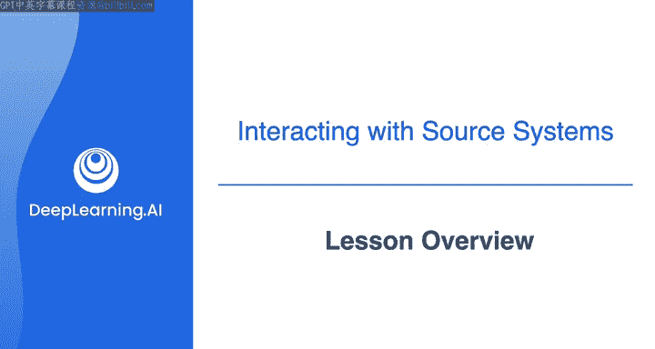
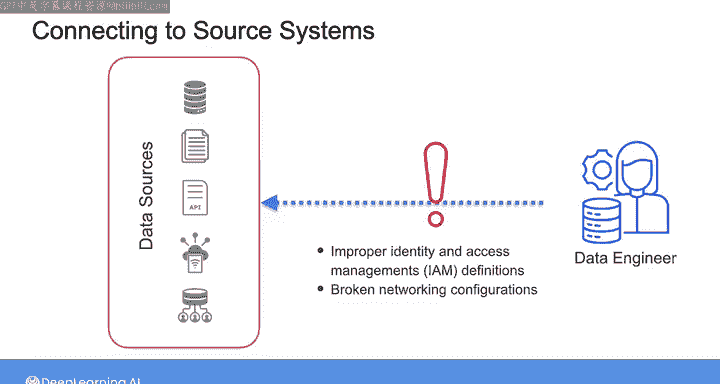
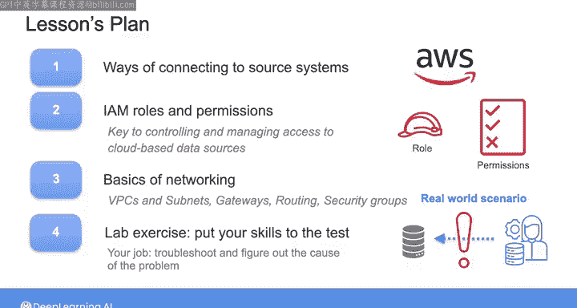

#  089：课程概述 🎯

在本节课中，我们将学习如何连接不同的源系统，并探讨在实际工作中可能遇到的常见访问问题及其解决方法。我们将重点介绍身份与访问管理（IAM）和网络配置的核心概念，这些是确保数据管道顺利运行的关键。

---

在上一课中，我们探讨了数据工程师在工作中会遇到的一些常见源系统的实际细节。

在实验环节中，你练习了操作关系型数据库、NoSQL数据库以及对象存储中的数据。

当在实际工作中连接到源系统时，数据工程师相对经常会遇到阻碍你访问目标数据的意外问题。

这些问题可能源于多种原因，例如身份和访问管理（IAM）定义不当、网络配置损坏，或者仅仅是使用了错误的访问凭证。

这些问题乍听起来可能相对简单，但根据我的经验，在数据工程领域，这类问题会频繁出现。如果你不知道如何正确地调试和解决它们，它们可能会成为主要的障碍。

事实上，我认为解决这类问题是数据工程师的核心技能之一。因此，当我面试新的数据工程师时，我喜欢采用一个可以连接到目标源系统的、可运行的数据管道。

然后，我会破坏一些IAM或网络配置，并要求候选人解决问题。这能向我展示他们为在工作中排查此类问题所做的准备有多充分。

因此，在本节课中，我将首先详细介绍如何连接到不同的源系统。我将在AWS环境中进行演示，但我们将要探讨的原则同样适用于其他云平台。

在IAM规则和权限的背景下，我们将探讨云安全的重要性，其中IAM是控制和管理对基于云的数据源以及数据管道内其他组件访问权限的关键。

最后，我们将深入探讨网络配置。我将从一个高层次概述开始，然后Morgan将带你深入了解AWS上的网络细节，包括VPC、子网、网关、路由、安全组等。

所以，在本节课中，你将基于我们在上一门课程中学习的基础网络概念来构建知识。

在本课之后，你将接受技能测试。就像我在面试过程中对数据工程师候选人做的那样，我在下一个实验练习中为你设置了一个挑战。

在那里，你会发现一个数据管道，它应该与你之前某个实验中的管道相似。

但现在，我已经破坏了它。在那个实验练习中，你将体验到作为一名数据工程师，在云上连接到源系统是什么感觉。

我向你保证，这不会像标准的“Hello World”练习那样一切按预期进行。相反，你将置身于一个场景中，就像在现实世界中一样，事情不会按你希望的方式运行。

你的工作将是进行故障排除，找出问题的原因，然后解决它，以便连接到你需要的数据源。

请加入下一个视频，我将为你概述连接到源系统的方法。

---

**本节课总结**

在本节课中，我们一起学习了连接源系统时可能遇到的实际挑战，特别是身份与访问管理（IAM）和网络配置问题。我们了解到，解决这些访问障碍是数据工程师的一项核心技能。课程还预告了接下来的实践环节，你将在一个被故意破坏的实验环境中，亲身体验故障排除和解决问题的完整过程。