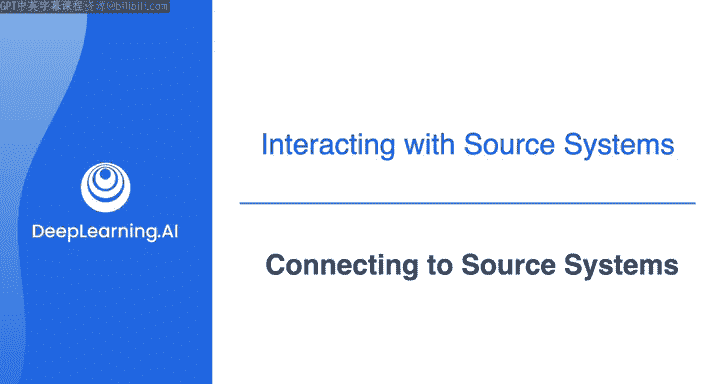
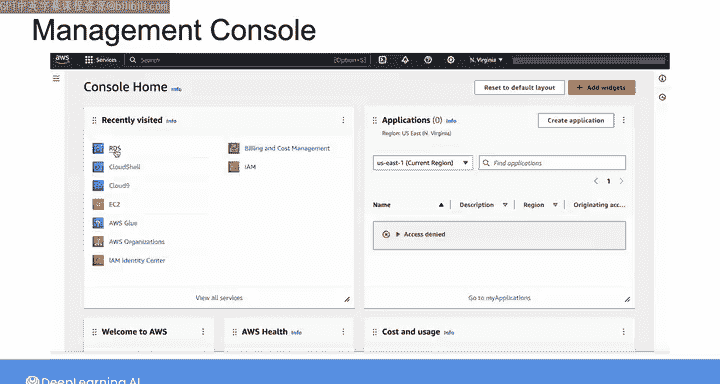
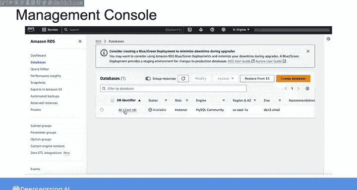
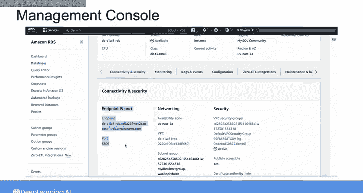
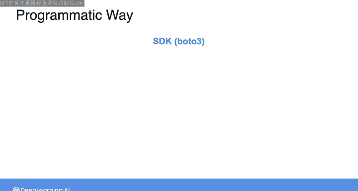
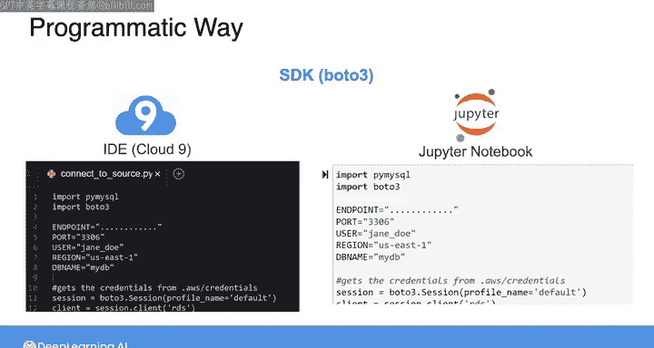
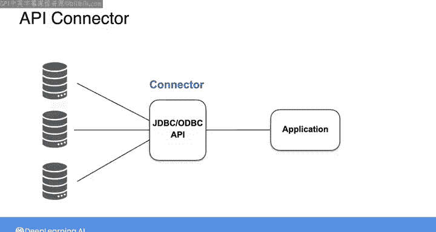

#  090：连接到源系统 🔌

在本节课中，我们将要学习如何连接到数据源系统。在能够摄取数据之前，首先需要建立与数据源的连接，并验证你是否有权从中读取数据。

## 概述

本周我们已经查看了多个源系统的示例。但在实际工作中，建立连接是数据摄取的第一步。事实上，你在之前的实验中已经有过一些连接经验。例如，在DynamoDB实验中，你使用了Boto3（AWS的Python软件开发工具包，即SDK）来创建与DynamoDB中某个表的客户端连接。你也通过在Cloud9 IDE中运行带有正确参数的命令，连接到了Amazon RDS MySQL实例。你在这里看到的端点（endpoint）和端口（port）信息用于定位正确的数据库实例，而用户名和密码凭证则用于验证你是否有访问数据库的适当权限。

由此可见，连接数据库或任何资源的方式不止一种。接下来，让我们更详细地探讨这些方法。

## 通过AWS管理控制台连接

如果源系统位于你所在组织的AWS账户内的某个资源中，你可以从管理控制台获取连接信息。

例如，如果我试图连接到一个RDS数据库实例，我可以导航到RDS服务，像这样定位我想要连接的数据库，并找到连接信息，包括端点和端口号。

需要说明的是，AWS总是在调整控制台界面的显示方式，因此我这里展示的界面可能与你实际看到的略有不同，但基本步骤是相同的。

控制台对于查找此类信息或启动资源和连接非常方便。但请记住，通过控制台工作意味着你需要导航并点击各种小部件和按钮来完成操作。

如果你将来需要重复这个过程，可能很难准确记住你采取了哪些步骤。而且，正如我所说，等到你想再次操作时，AWS可能已经改变了控制台的布局，这会使事情变得更加困难。

总的来说，通过控制台操作非常适合快速完成某些任务，例如在系统中进行原型设计时。但这个过程的可重复性和可追溯性不强。

## 通过命令行接口连接

作为一种更具编程性的方式来查找所需信息并连接到源系统，你可以在命令行接口（CLI）中运行代码。

通过这种方式，你可以获取数据库端点，然后使用特定于你所用数据库管理系统（DBMS）的命令语法连接到数据库。

以下是连接的基本步骤：
1.  使用AWS CLI命令获取数据库实例的端点信息。
2.  使用数据库客户端（如`mysql`）和获取到的端点、端口、用户名、密码进行连接。

在连接和摄取过程中，直接在CLI中发出命令是数据工程师的常见做法，但这仍然相对手动。因此，它通常更适合简单的工作负载，而不是复杂的任务。

## 通过软件开发工具包连接

为了向可重复性和自动化更进一步，你可以使用像Boto3这样的SDK，通过在IDE（如Cloud9）中编写和运行代码来连接到源系统。或者，例如，从Jupyter笔记本中运行。

对于某些源系统，你也可以使用API连接器进行连接。例如，你可能使用Java数据库连接（JDBC）或开放数据库连接（ODBC）API将你的应用程序连接到DBMS，以便查询数据库。

你已经对其中一些连接源系统的方法有了一些经验。在本视频之后的阅读材料中，你会找到更详细介绍每种方法的资料。

## 总结

本节课中，我们一起学习了连接到数据源系统的几种主要方法：通过AWS管理控制台、通过命令行接口（CLI）以及通过软件开发工具包（SDK）或API。每种方法都有其适用场景，控制台适合快速操作和原型设计，CLI提供了更直接的命令控制，而SDK和API则为实现自动化、可重复的流程提供了强大的编程能力。理解这些连接方式是构建可靠数据管道的基础。

在回顾了这些材料之后，请加入下一个视频，我们将概述身份与访问管理（IAM）和权限。