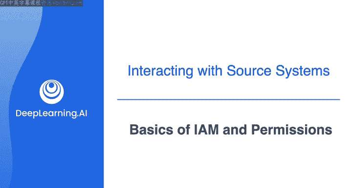
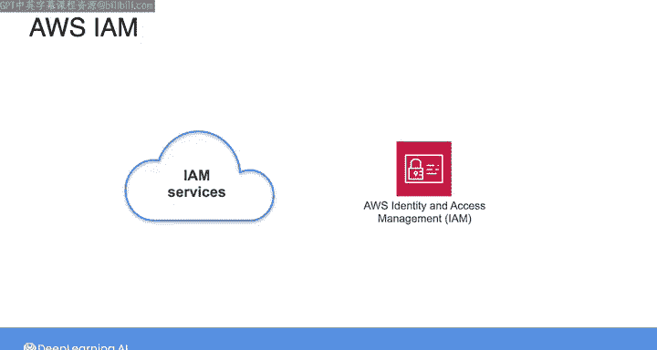
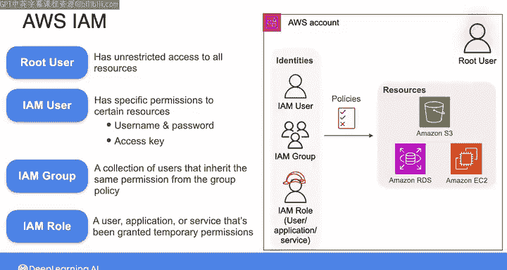
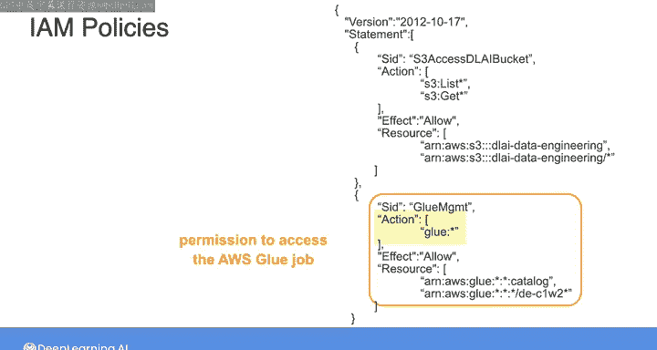

#  091：IAM与权限基础 🔐



在本节课中，我们将学习身份与访问管理的基础知识。IAM是构建云上数据管道时确保数据安全的核心。我们将了解其基本组件、工作原理以及作为数据工程师应如何安全地配置和使用它。

---

在基于云的架构中构建数据管道时，身份与访问管理，也称为IAM，是数据工程师角色的核心。正如我在之前的课程中所说，作为数据工程师，您被委托管理敏感数据。这些数据可能是客户的个人隐私信息，也可能是专有的商业信息。数据所有者相信他们的信息在您手中是安全的。

云安全是一个广泛而复杂的主题，但为了本课程的目的，我们将专注于基础知识。这是因为，只需遵循一套基本的最佳实践，您就能成功避免绝大多数数据灾难。事实上，2023年的一项研究发现，超过一半的云数据泄露是由简单的人为错误引起的，例如密码或其他凭据的不安全存储，或IAM配置错误。这些数据泄露可能造成极其高昂的代价。因此，通过确保数据管道的安全性，您可以帮助公司节省资金，有时是数百万美元甚至更多，并保护公司及您自己的声誉。

在我与客户的工作中，我惊讶地发现许多错误可以通过简单的修复来纠正。我曾见过人们将机密数据存储在公共的S3存储桶中、将访问凭据上传到GitHub，或者为公司里的每个人提供对数据资源的基本管理员访问权限。这类问题很容易修复，但对公司构成重大风险，如果灾难在您负责期间发生，甚至可能让您丢掉工作。因此，我的目标是让您为成功做好准备，避免这种情况在未来发生在您身上。

让我们深入了解作为数据工程师，您将如何与权限和IAM打交道的基础知识。

---

首先，IAM是一个管理权限的框架。权限定义了身份（如个人或应用程序）可以对特定资源集（如数据库或ETL工具）执行哪些操作。IAM确保适当的一组身份在正确的时间访问正确的资源。还记得我们在上一课程中讨论的“最小权限原则”吗？IAM就是您在实践中运用这一原则的方式，因为它允许您仅授予人员或应用程序执行其工作所必需的资源访问权限，并且仅在所需的时间内授予。

例如，系统所有者可以授予数据摄取系统在有限时间内仅从数据库的特定表中读取数据的能力。通过在不必要时不授予对云资源的不必要访问权限，您还可以防止团队产生不必要的云成本。

许多云提供商都构建了IAM服务，帮助用户管理对其云资源的访问和权限。例如，AWS IAM是一项Web服务，可帮助您安全地管理和控制对您账户中AWS资源的访问。事实上，在本课程迄今为止的实验中，我们一直在使用AWS IAM为您提供对AWS资源的适当访问。



作为一名全新的数据工程师，您很可能不会成为在公司云服务账户中高级别设置IAM配置的人。但您将与各种云资源交互，并且可能需要为您作为数据管道一部分部署的资源配置IAM。因此，您至少需要对不同的IAM组件有基本的了解，以便安全地操作并在问题出现时进行故障排除。

接下来，我们将在AWS IAM的背景下了解这些IAM组件。但请注意，其他云提供商（如GCP或Azure）也有相同类型的组件，只是名称可能有所不同。

---


以下是AWS IAM中的核心组件：

*   **策略**：用于授予身份对AWS资源执行操作的权限。策略是一个JSON文档，详细说明了应拥有哪些资源和权限。
*   **身份**：AWS中有不同类型的身份。
    *   **根用户**：创建AWS云账户的用户，对该账户中的所有资源拥有不受限制的访问权限。
    *   **IAM用户**：被授予对特定资源的特定权限。作为初级数据工程师，您很可能会在公司AWS账户中被分配一个IAM用户账户。您将获得一组长期凭证（如用户名和密码或访问密钥），可用于通过代码以编程方式访问AWS资源。
    *   **IAM组**：用户的集合。您可以将策略附加到组上。在这种情况下，策略是一个JSON文档，包含该组应拥有的资源和权限详细信息。这简化了资源配置过程。例如，您的公司可能有一个数据工程师IAM组，该组中的每个用户都有访问构建和维护数据管道所需资源的权限。
    *   **IAM角色**：不与特定人员或应用程序长期关联，而是由用户、应用程序或服务临时担任，以授予他们在有限时间内对您的AWS资源执行指定操作的临时权限。例如，默认情况下，EC2实例没有读取或写入S3存储的权限。但您可以创建一个对特定S3存储桶具有读写权限的角色，并让EC2实例在需要时担任此角色。与在EC2配置中存储长期用户凭证相比，这是授予EC2实例使用S3权限的更安全方式。

如果您在使用临时角色凭证发出请求时收到“访问被拒绝”错误消息，最好检查这些凭证是否已过期。这是IAM配置中另一个非常常见的问题。



---

为了帮助您了解IAM策略的工作原理，让我们看一下在上一课程实验中，授予您访问所需资源的AWS策略的一部分。

```json
{
  "Statement": [
    {
      "Effect": "Allow",
      "Action": ["s3:List*", "s3:Get*"],
      "Resource": "arn:aws:s3:::dl-ai-data-engineering*"
    },
    {
      "Effect": "Allow",
      "Action": "glue:*",
      "Resource": "arn:aws:glue:*:*:job/lab-job-*"
    }
  ]
}
```

从第一个语句中，您可以看到该策略允许用户（在本例中是您）访问名称以 `dl-ai-data-engineering` 开头的任何S3存储桶（因为名称后面有这个星号`*`）。然后，您被允许执行这些操作，包括 `list*` 或 `get*`。同样，这些星号意味着您可以执行任何以 `list` 或 `get` 开头的操作。在本例中，这些操作包括列出存储桶的内容或您有权访问的存储桶名称；或者在 `get` 的情况下，这些操作包括从存储桶获取对象或获取有关存储桶的信息（如存储桶所在的区域）。

第二个语句类似，允许您访问与实验关联的AWS Glue作业。`Action` 下的 `glue:*` 意味着您可以对该Glue作业执行任何操作。因此，在实验期间，当您发出运行AWS Glue作业的请求时，AWS首先会评估此策略，以确定是否允许您使用Glue执行此操作。

---

以上就是IAM的基本组件：根用户、IAM用户、组、角色和策略。您可以在本视频后的阅读材料中找到有关这些组件的更多详细信息。



复习完这些材料后，请加入下一视频，一起了解云中的网络。