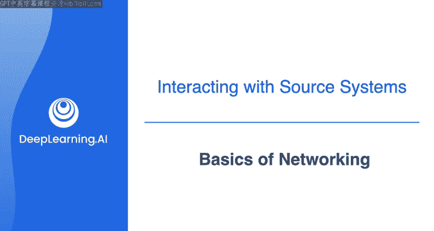
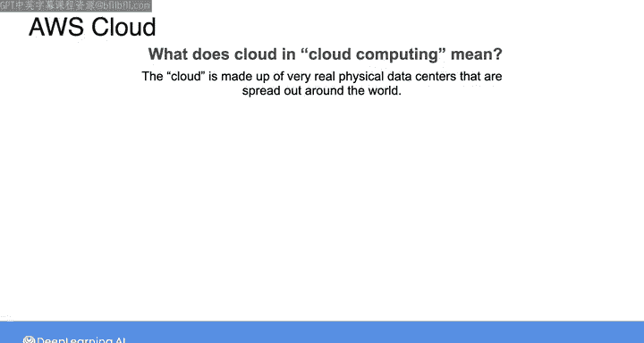
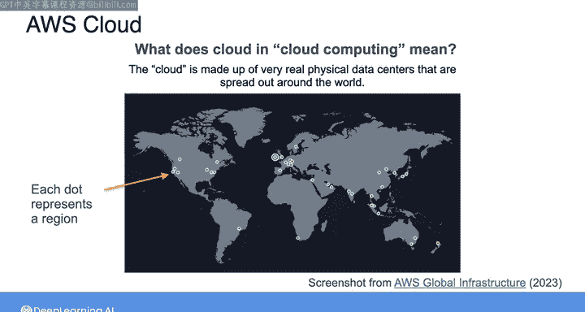
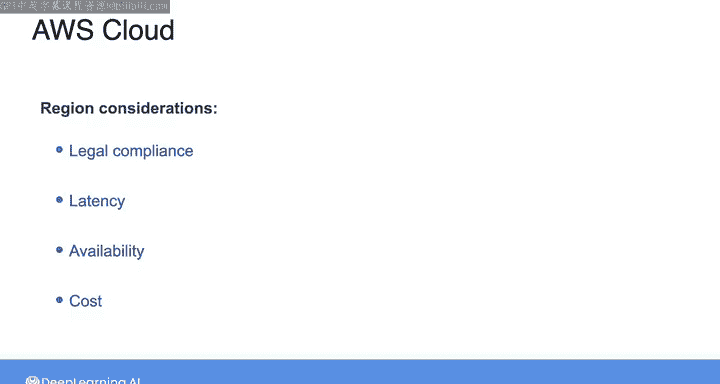
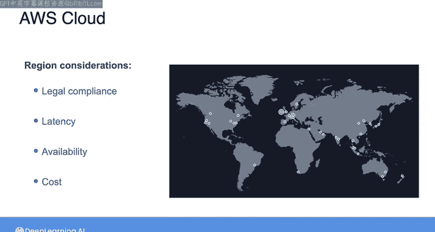
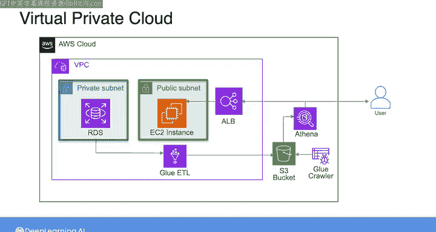

#  092：云中网络基础 🌐

在本节课中，我们将要学习在基于云的架构中构建数据管道时，网络配置的基础知识。网络是连接各种资源的桥梁，其配置方式对于确保数据在管道中顺畅流动至关重要。

上一节我们介绍了网络的基础概念，即网络是能够共享数据和相互通信的互联设备集合。本节中，我们将重新审视并扩展这些基础网络原则，为你解决连接源系统时可能遇到的问题做好准备。

## 云计算与物理基础设施

“云计算”这个术语听起来可能有些抽象，仿佛计算发生在虚无之中。但请明确，云和云计算是由遍布全球的、非常真实的物理数据中心构成的。

正如你在之前的课程中所学，AWS云是一个覆盖不同地理区域（称为“区域”）的全球网络。每个区域包含多个“可用区”集群，而每个可用区则由一个或多个数据中心组成，这些数据中心具备冗余的电力、网络和连接。

在许多云计算应用中，数据和资源会在不同区域和可用区之间进行复制，以确保即使一个或多个数据中心出现故障，系统也能继续运行。

## 区域选择的关键考量

作为数据工程师，在云上启动新资源时，你需要决定在哪个区域进行托管。

以下是选择区域时需要考虑的几个关键因素：

*   **法律合规性**：将数据存储在特定区域可能意味着需要遵守该地区独特的数据隐私或监管要求。
*   **延迟与可用性**：通常，终端用户距离托管资源的区域越近，网络延迟就越低。同时，资源复制的可用区越多，系统从灾难中恢复或抵御灾难的能力就越强。
*   **成本**：不同区域的资源成本可能有所不同，这也可能成为决策的一个因素。

在实际操作云资源时，很容易忽略一个事实：你实际上是在与遍布全球的物理设备网络进行交互。但作为数据工程师，理解这种全球基础设施的搭建方式，以及它如何影响你所构建系统的延迟、成本、可靠性和可用性，是非常重要的。

## 虚拟私有云与子网

回到云网络需要了解的重要内容。在任何给定的区域内，你可以创建自定义的**虚拟私有云**（简称VPC）。

VPC是跨越区域内多个可用区的较小网络。创建VPC可以让你更精细地控制谁可以访问哪些资源。

你可以将VPC内的空间进一步划分为**子网**，这些子网用于容纳你实际的数据管道资源。

每个子网可以拥有自己的安全规则（称为**网络访问控制列表**，简称网络ACL）以及通过互联网网关的路由配置。这使你能够为面向互联网的资源（如Web服务器）创建**公共子网**，并为内部资源（如数据库）创建**私有子网**。

例如，在之前课程的一个实验中，你接触的架构如下：源数据库位于私有子网内，以防止数据通过互联网被访问。然后，一个EC2实例位于公共子网中，使其能够运行一个Web应用程序，通过互联网向客户提供分析数据。

在那个实验中，你通过调整应用程序负载均衡器的安全组来控制对网站的公共访问。你没有保持所有端口开放，而是编辑了入站规则，阻止除端口80之外的所有端口接收所有传入流量。

## 网络配置的复杂性与重要性

在现实世界中，情况会迅速变得复杂，尤其是当你开始设置多个VPC、子网、网关以及资源之间的路由配置时。正是在这种背景下，连接数据库这样一个简单的操作，也依赖于多层网络配置，更不用说身份与访问管理权限了。

因此，理解网络配置的细节对于连接源系统至关重要。它也是成功编排和自动化数据管道所必需的，我们将在本课程的最后一周深入探讨这部分内容。

接下来，Morgan将带你详细了解AWS上的网络配置。之后，我会向你展示在即将到来的实验中你可以期待什么，在那里你将调试与数据库的连接。

本节课中我们一起学习了云网络的基础知识，包括云计算的物理本质、选择资源区域时的关键考量，以及如何通过虚拟私有云和子网来构建和管理安全的网络环境。理解这些概念是构建可靠、高效数据管道的基础。