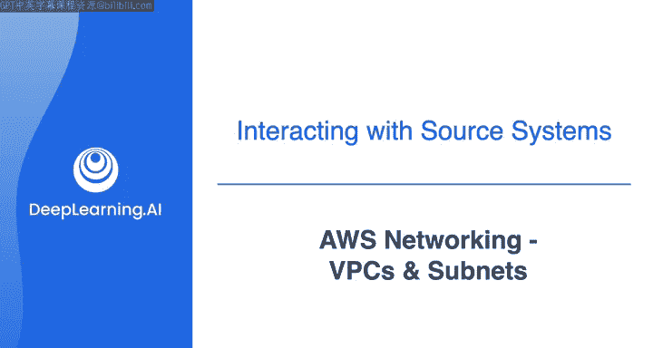
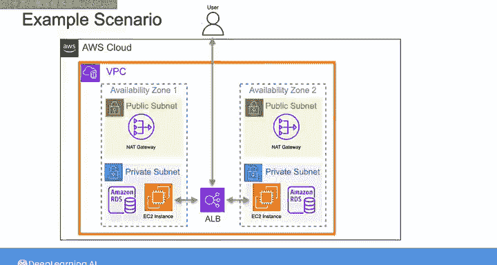
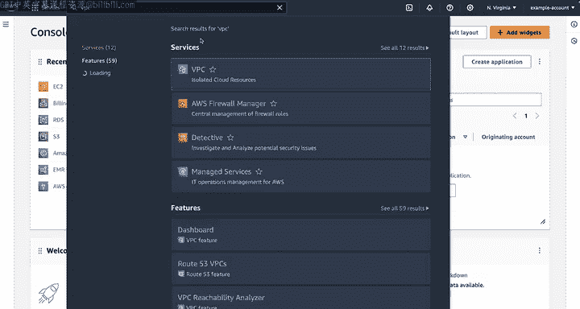
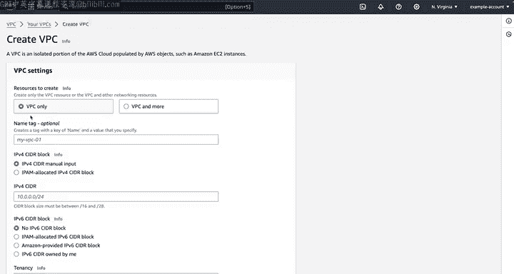
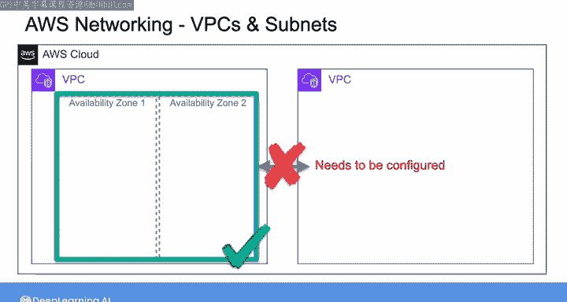
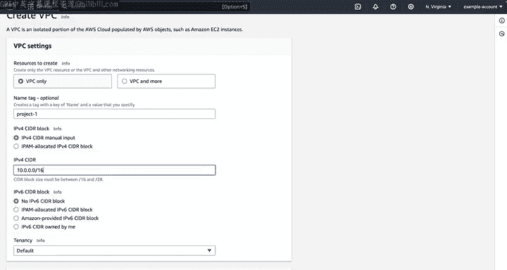
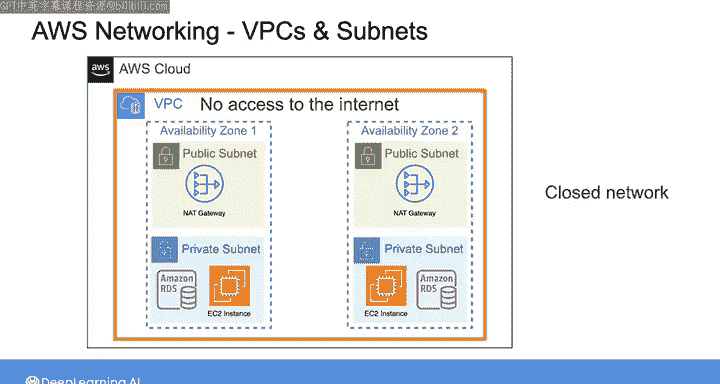

#  093：VPC和子网 🏗️

## 概述

在本节课中，我们将学习AWS网络的核心概念，重点了解**虚拟私有云（VPC）**和**子网**。我们将通过一个具体的应用场景，演示如何为部署在AWS上的数据系统（如EC2实例和RDS数据库）构建安全的网络基础架构。

---

## 网络对数据工程师的重要性

正如Joe所强调的，网络将成为你作为数据工程师工作中的重要组成部分。起初，网络可能会让人感到不知所措，因为它涉及资源间的连接设置、权限、安全等诸多方面。但不必担心，掌握云网络是可以通过时间和理解一系列核心概念来实现的。通过本视频及后续的几个视频，我将详细介绍这些重要的核心概念，包括亚马逊虚拟私有云（VPC）、子网、网关、路由表、网络访问控制列表和安全组，并演示如何在AWS上为你的数据管道实现这些组件。

---

## 示例场景介绍

在接下来的几个视频中，我将通过一系列演示，展示如何为一个需要部署Amazon RDS数据库和Amazon EC2实例的场景构建VPC和网络组件。

在这个示例场景中，假设有一个运行在EC2实例上的Web应用程序，允许你查询运行在RDS上的数据库。这是一个后端带有关系数据库的典型Web应用的简单场景。最终的网络架构将如下所示：一个VPC，包含两个公共子网和两个私有子网；EC2和RDS数据库实例部署在私有子网中；公共子网中设有互联网网关；同时，还有一个应用负载均衡器位于运行EC2实例的Web应用前端。

我将逐步讲解与此场景相关的每个网络设置步骤，并解释所有这些组件。我们实际上不会部署EC2、RDS实例或应用负载均衡器，但会构建其所需的所有网络组件。希望通过一个具体的场景，能让网络概念更容易理解。

---

## 创建VPC和子网

首先，我们需要一个VPC和用于放置EC2和RDS实例的子网。让我们从AWS控制台主页开始完成这个任务。

在搜索栏中输入“VPC”并选择它，这将进入VPC仪表板。在这里，选择“创建VPC”按钮。

在创建VPC页面上，我们只创建一个VPC，然后手动创建子网。在继续之前，需要指出的是，每个区域的AWS账户默认都有一个“默认VPC”。这个默认VPC包含该区域每个可用区中的一个公共子网和一个互联网网关。

使用默认VPC可以让你快速启动面向公共互联网的EC2实例，无需额外设置。这对于实验性地启动公共资源（如简单网站）可能很方便。但对于大多数实际用例，你可能并不希望资源直接面向公共网络，而是希望资源受到网络保护。因此，对于任何实际工作，你的默认做法不应是使用默认VPC。相反，你应该为特定的用例创建自定义VPC。这就是我要在这里演示的内容。

正如你在之前的课程中学到的，AWS在全球范围内运营多个区域，这些区域由多个可用区（AZ）组成。一个VPC能够跨越创建该VPC的区域内的所有可用区。这里我们将创建一个VPC，但一个区域可以包含多个VPC。例如，你可能为不同的项目、环境或其他组织或技术考虑创建不同的VPC。默认情况下，每个VPC与其他VPC是隔离的。同一VPC内的资源可以相互通信，但两个不同VPC中资源间的通信则需要你进行设计和配置。

创建VPC时，需要为其命名、指定私有IP地址范围，并选择要放置的区域。给VPC起一个描述性的名称很有用，这样可以更容易地识别是哪个VPC。

我将这个VPC命名为“project1”。你可以看到，我创建这个VPC的区域是“美国东部（弗吉尼亚北部）us-east-1”，但如果需要，我可以从下拉菜单中选择另一个区域。

接下来，你需要定义IPv4 CIDR块。CIDR代表无类别域间路由，它定义了VPC内可以使用的私有IP地址范围，或者说VPC中可用的私有IP地址数量。任何部署到此VPC中的资源都将从此范围内分配一个私有IP地址。也就是说，如果你想创建一个可通过互联网访问的资源，你还需要为其分配一个公共IP地址。分配给它的任何公共IP地址都将来自AWS管理的公共IP池。因此，这里的CIDR范围仅用于私有IP地址。

这里我将输入“10.0.0.0/16”作为CIDR。我想暂停一下，详细解释这个CIDR，因为如果你不熟悉它，可能会觉得复杂。如果你是第一次深入了解网络细节，我将尝试简化它，使其更容易理解。

IP地址由四个用点分隔的数字组成。每个数字的范围是0到255。换句话说，地址中的每个数字都是一个8位整数值。在这个例子“10.0.0.0/16”中，“10.0.0.0”是我们网络的起始地址，“/16”部分是前缀长度，它告诉你地址中有多少位用于网络部分。因此，在这种情况下，“/16”表示前16位，或者说前两个8位整数，是网络前缀。

在二进制形式中，一个IP地址由32位组成，这再次意味着地址中点之间的每个数字代表8位。四个数字各8位，整个IP地址共有32位。正如我所说，“/16”意味着前16位（即前两个数字）是固定的，定义了网络，而剩余的16位（即另外两个数字）可以变化，用于该网络内的主机地址。这意味着任何部署到此网络中的资源都将拥有一个以“10.0”开头的私有IP地址，然后另外两个数字可以是0到255之间的任何值。如果我写的是“/24”而不是“/16”，那将意味着前三个数字是固定的，只有最后一个数字可用于分配主机地址。在下一步创建子网时，你会明白为什么需要了解这一点。

现在回到AWS控制台，我已经定义了创建VPC所需的不同部分，可以选择“创建VPC”。从这里开始，我需要创建子网。

子网是VPC内的子网络，或者说VPC私有IP空间的更小划分，你可以根据资源的网络访问和安全需求来分组资源。稍后，我们将使用网络访问控制列表和安全组来控制进出每个子网的网络流量类型。每个子网都与一个特定的可用区相关联，这意味着创建子网时，必须指定它位于哪个可用区。通过策略性地将资源放置在不同可用区的不同子网中，你可以增强应用程序的冗余性和可用性。常见的做法是，在你计划使用的每个可用区中至少创建一个公共子网和一个私有子网。

这里，我希望将EC2实例和RDS数据库部署到私有子网中，这样它们就不会暴露在互联网上。为了冗余性，我计划在此VPC的两个可用区中创建两个公共子网和两个私有子网，这是一个常见的模式。这样，例如，如果主数据库实例性能下降，或者可用区本身出现临时可用性问题，你还有在另一个可用区中运行的所有数据和实例，可以在故障转移发生后接管流量。

要创建这些子网，我将在导航中选择“子网”，然后选择“创建子网”。现在需要选择要在哪个VPC中创建子网。我将从下拉菜单中选择“project1” VPC。从这个页面，我可以创建所有四个子网。

对于第一个子网，我将其命名为“public-subnet-1”，然后选择一个特定的可用区，以便稍后确保我将其他子网部署到不同的可用区。为此子网选择“us-east-1a”。然后，我需要给它一个CIDR范围。子网的IP范围必须是VPC IP范围的子集。VPC定义为使用“10.0.0.0/16”，因此我将第一个子网的范围设为“10.0.1.0/24”。这意味着任何部署到此子网的资源都将被分配一个以“10.0.1”开头的IP地址，最后一个数字将用于标识特定的主机。

现在创建我的第一个私有子网，选择“添加新子网”，然后重复相同的步骤，但这次将子网命名为“private-subnet-1”，并给它一个CIDR“10.0.2.0/24”。

现在，让我们为另一个可用区（我将使用“us-east-1b”）再创建另外两个子网：公共子网和私有子网。接下来要做的是创建“public-subnet-2”，其CIDR为“10.0.3.0/24”，然后是“private-subnet-2”，其CIDR为“10.0.4.0/24”。最后，我可以选择“创建”，这将创建所有四个子网。

好了，你现在有了一个包含两个公共和两个私有子网、随时可用的VPC，它看起来像这样。就目前而言，部署到此VPC中的任何东西都无法访问互联网。你可以将EC2和RDS实例添加到这个示意图中，显示它们位于私有子网中。这些资源都无法从互联网访问，它们也无法发起与互联网上任何资源的连接。因此，在这一点上，它是一个封闭的网络。你需要部署和配置更多资源，才能使此VPC中的任何资源实现互联网连接。

---

## 总结

本节课中，我们一起学习了AWS网络的基础——**虚拟私有云（VPC）**和**子网**。我们了解了VPC如何作为你在云中的私有网络空间，以及子网如何进一步划分这个空间以实现资源隔离和高可用性。通过一个具体的部署场景，我们演示了如何创建自定义VPC和跨多个可用区的公共与私有子网，为后续构建安全、可用的数据系统网络架构打下了基础。在下一节中，我们将探讨互联网连接性，了解互联网网关和NAT网关的工作原理。