#  094：互联网网关和NAT网关 🌐

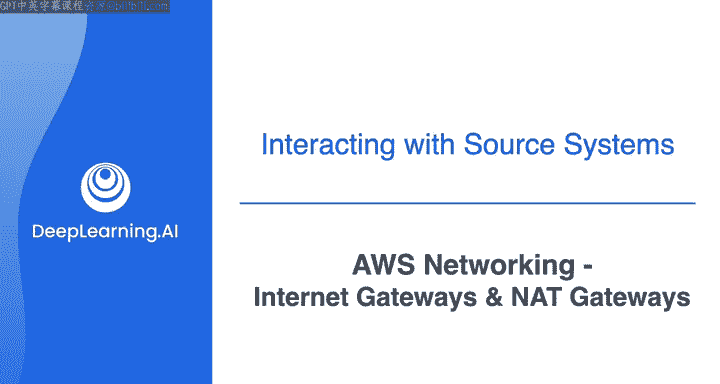

在本节课中，我们将学习如何为AWS虚拟私有云（VPC）配置互联网连接。我们将重点介绍两个核心组件：互联网网关和网络地址转换（NAT）网关。通过它们，我们可以让VPC内的资源安全地与互联网通信，同时保护内部资源不被直接暴露。

---

## 上节回顾与本节目标

在上一个视频结束时，我们创建了一个包含两个公有子网和两个私有子网的VPC。

正如之前所说，如果你将任何资源（如EC2实例）部署到公有子网中，该资源既无法通过互联网访问，也无法主动建立与互联网上其他资源的连接。

这是因为VPC和子网本身创建的是一个隔离的网络，没有流量可以进出。

在本视频中，我们将讨论如何使用互联网网关和网络地址转换（NAT）网关来实现互联网连接。

---

## 应用场景与连接需求

现在，回顾我们正在遵循的场景：你的VPC中会有一个EC2实例和一个RDS数据库。作为最佳实践，运行在EC2实例上的应用程序和RDS数据库都应该位于私有子网中，并且不需要与互联网直接连接。

然而，这里有两个之前未讨论的考虑因素：

1.  运行在EC2上的应用程序偶尔需要从互联网上的资源下载更新，例如应用程序升级和补丁。
2.  你仍然需要通过负载均衡器向运行在EC2实例上的应用程序提交请求，以便查询RDS上的数据。

这两个考虑因素意味着你的VPC实际上需要互联网连接。

---

## 互联网网关：VPC的“大门”

为了实现互联网连接，你首先需要将一个互联网网关附加到VPC上。

为了更好地理解互联网网关是什么及其作用，请将当前状态的VPC想象成一个没有门的房子。如果你建了一个没有门的房子把自己围起来，你将无法离开房子，外面的人也无法进入房子。

如果你在房子里，你可以在房间之间自由移动。但为了出去，你需要安装一扇通往外部世界的门。这就是我们目前的情况：一个没有门的房子。

因此，我们接下来要对VPC做的，就是安装一扇通往互联网的“门”，换句话说，我们将为其附加一个互联网网关。

互联网网关允许你公有子网中的资源与互联网连接。它们支持入站和出站流量。

创建互联网网关并将其附加到VPC只是允许互联网流量流向和流出公有子网的一个步骤。你还需要在路由表中配置路由，并配置网络安全规则。我们将在接下来的几个视频中完成这些操作。

---

## NAT网关：私有子网的“单向通道”

我之前提到，我们的EC2实例将位于私有子网中，而这里我又说我们将附加互联网网关以允许流量流向和流出公有子网。如果我们的资源在私有子网中，这有什么帮助呢？

让我们回顾一下之前的两个考虑因素：
首先，EC2实例需要能够从互联网资源下载更新。这意味着私有子网中的EC2实例需要能够从VPC发起出站连接。
其次，你需要能够从互联网向应用程序提交请求。

让我们谈谈NAT网关和应用程序负载均衡器如何帮助我们满足这些要求。

NAT网关代表网络地址转换。这是一项允许私有子网中的资源连接到互联网或其他AWS服务，但阻止互联网主动与这些资源建立连接的服务。可以把它想象成一个受控的门道。

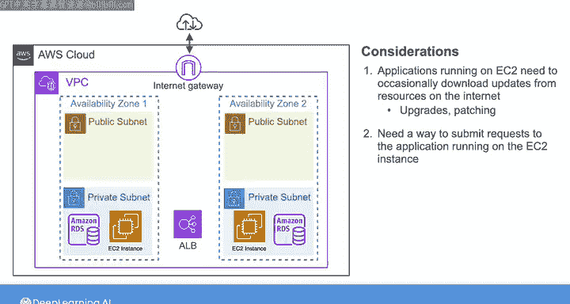

它只允许出站流量，并保护内部发起该流量的资源。

有了NAT网关，私有子网中的EC2实例可以从互联网下载更新和补丁，而不会将它们直接暴露给公共互联网。

---

## 应用程序负载均衡器：外部访问的入口

接下来，我们需要解决第二个考虑因素：允许外部用户向我们的应用程序提交请求。这就是应用程序负载均衡器（ALB）的作用。

ALB将传入的应用程序流量分发到多个后端目标，比如我们的EC2实例，这些实例托管在两个可用区中。ALB作为外部用户的入口点，处理负载并确保应用程序保持响应和可用，同时也允许我们保持这些EC2实例的私有性。

由于本课程我专注于该架构的网络方面，我们实际上不会构建这部分。然而，了解何时使用ALB来允许应用程序连接而不直接暴露后端EC2实例是很有益的。

---

## 实践操作：创建网关

现在，让我们创建并附加一个互联网网关，并向我们在上一个视频中构建的VPC部署两个NAT网关。

以下是操作步骤：

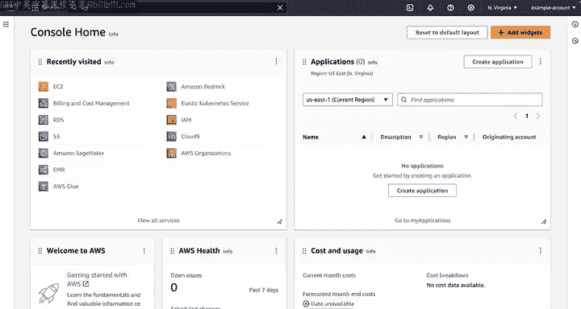

1.  登录AWS管理控制台，在主页搜索栏输入“VPC”。
2.  从VPC仪表板，在导航面板选择“互联网网关”。
3.  在互联网网关页面，点击“创建互联网网关”按钮。
4.  在下一页，为互联网网关命名（例如：Project1 Gateway），然后点击“创建互联网网关”。

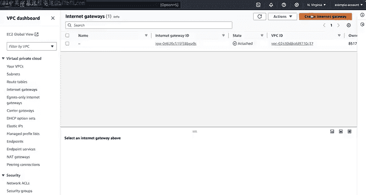

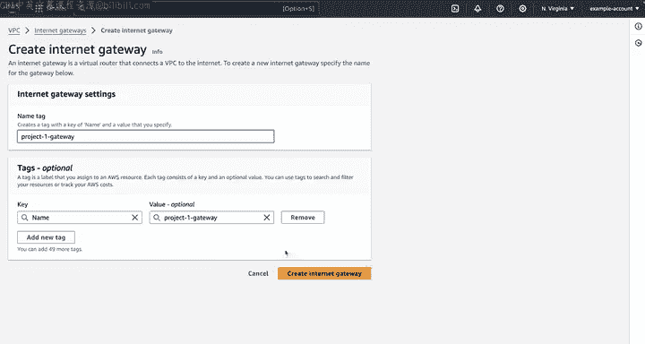

现在我们有了一个互联网网关，但需要将其附加到VPC。请注意，一个VPC只能有一个互联网网关，并且一个互联网网关一次只能附加到一个VPC。这是一对一的关系。

5.  选择“操作”，然后选择“附加到VPC”。
6.  在下一个屏幕的VPC列表中，选择“project1 VPC”，然后点击“附加互联网网关”。现在该网关的状态显示为“已附加”。

这样，我们就为这个VPC安装了“前门”。

---

### 创建NAT网关

最佳实践是在你运营的每个可用区（Az）中创建一个NAT网关。因此，我将创建两个NAT网关，并将它们分别放置在每个公有子网中。

以下是创建NAT网关的步骤：

1.  在导航面板，选择“NAT网关”，然后点击“创建NAT网关”。
2.  在此屏幕配置NAT网关。首先，为其命名（例如：gateway 1）。
3.  从下拉菜单中选择“Subnet1”。
4.  NAT网关需要配置一个弹性IP地址，以提供静态IP。点击“分配弹性IP”来完成此操作。

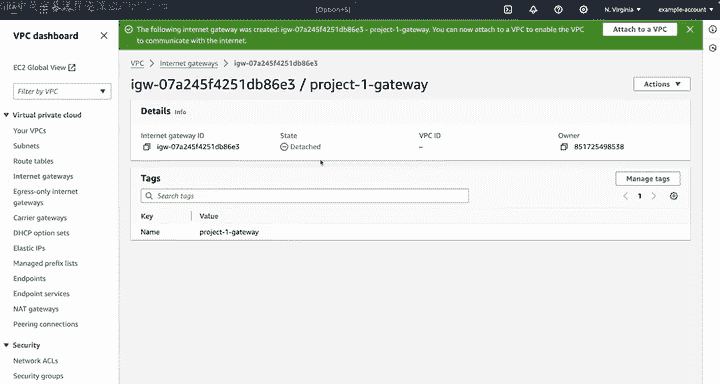

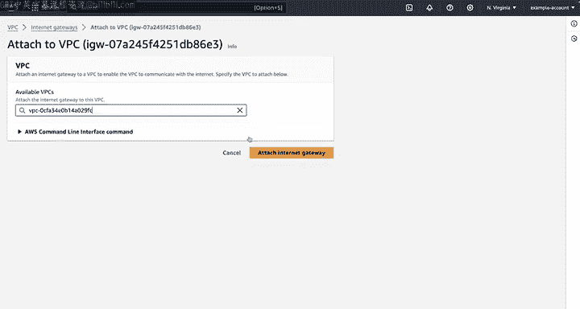

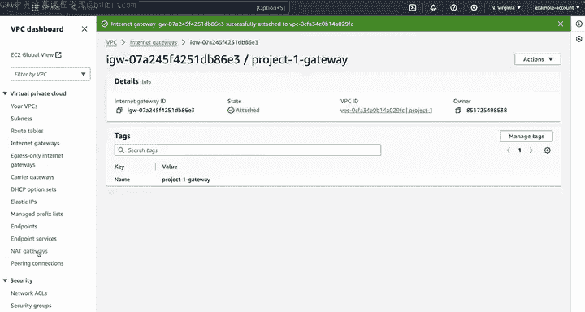

5.  点击“创建NAT网关”。
6.  重复上述步骤，但这次将NAT网关放置到另一个公有子网中。
7.  将其命名为“Nat Gateway2”，从下拉菜单中选择“public Subnet2”。
8.  创建弹性IP地址，最后创建网关。

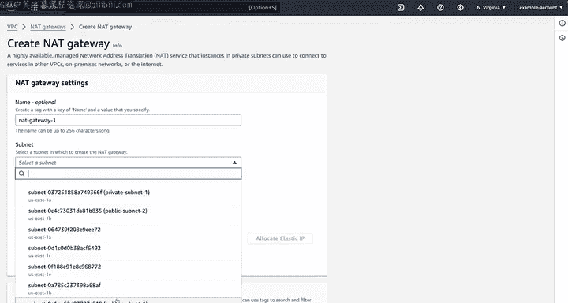

---

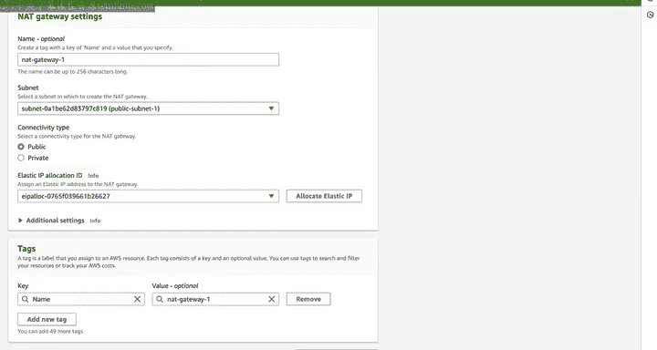

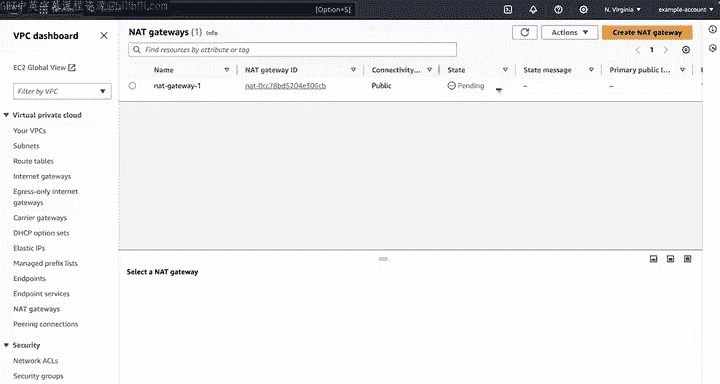

## 当前架构与后续步骤

至此，我们的网络架构如下图所示，包含了EC2实例、RDS数据库和ALB。

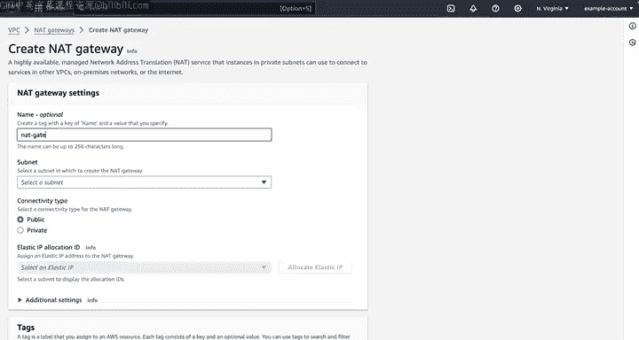

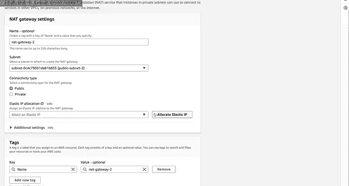

在入站和出站互联网连接正常工作之前，我们还需要完成几个步骤。在接下来的步骤中，我们将完成设置必要元素的过程，包括配置路由表和定义安全规则以保护我们的VPC。

在本系列视频结束时，我们将拥有一个既具备安全互联网连接又具备强大访问控制的VPC。

---

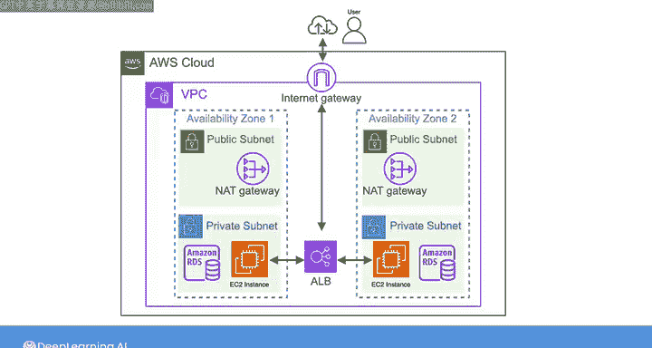

## 本节总结

在本节课中，我们一起学习了如何为AWS VPC启用互联网连接。我们介绍了**互联网网关**作为VPC通往公共互联网的“大门”，以及**NAT网关**作为私有子网资源安全发起出站连接的“单向通道”。通过实际操作，我们创建并附加了互联网网关，并在两个公有子网中部署了NAT网关，为构建安全、可访问的网络架构奠定了基础。下一节，我们将深入配置路由表，将流量正确地引导至这些网关。