#  095：路由表 🚦

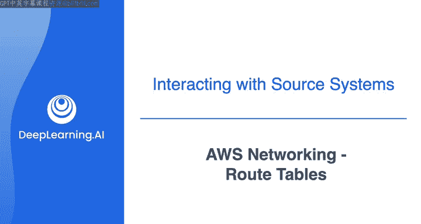

在本节课中，我们将要学习AWS网络中的核心组件之一：路由表。我们将了解路由表的作用，并学习如何为公有子网和私有子网配置路由，以实现互联网连接和内部通信。

上一节我们介绍了VPC、子网和互联网网关的基本架构。本节中我们来看看如何通过配置路由表来控制网络流量的走向。

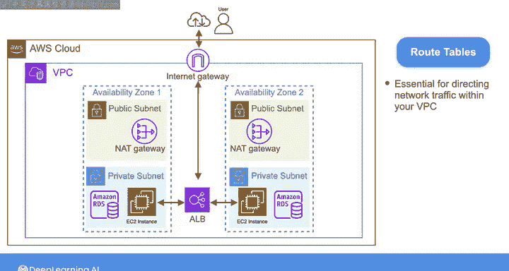

## 概述

路由表是VPC中用于引导网络流量的基本组件。每个子网都可以关联一个路由表，其中包含一组规则（路由），这些规则决定了网络流量的去向。创建VPC时，AWS会自动创建一个默认路由表，允许VPC内的资源进行内部通信，但它不包含通往互联网的路由。因此，我们需要根据需求自定义路由表。

## 路由表的作用

路由表对于引导VPC内的网络流量至关重要。没有正确的路由，子网将不知道如何将流量导向互联网或VPC内的其他资源。

以下是路由表的核心功能：
*   **控制流量方向**：决定数据包从子网发出后的下一跳目的地。
*   **实现网络隔离**：通过为不同子网配置不同路由，可以控制其网络访问权限。
*   **连接内部与外部**：使VPC内的资源能够相互通信，并（有条件地）访问互联网。

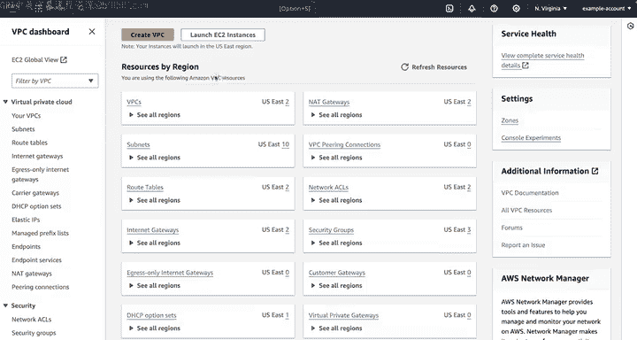

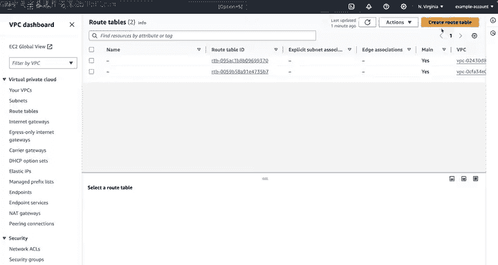

## 配置路由表：分步指南

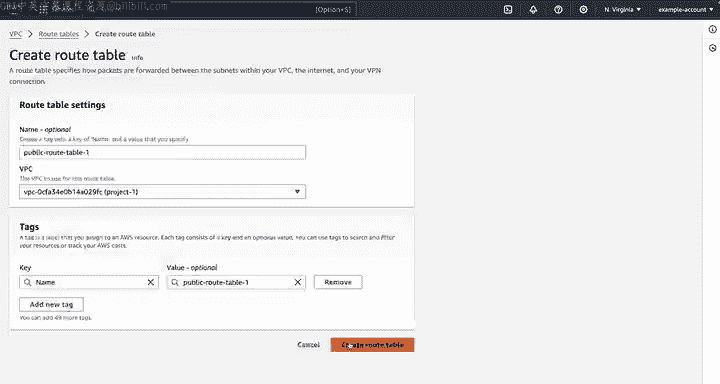

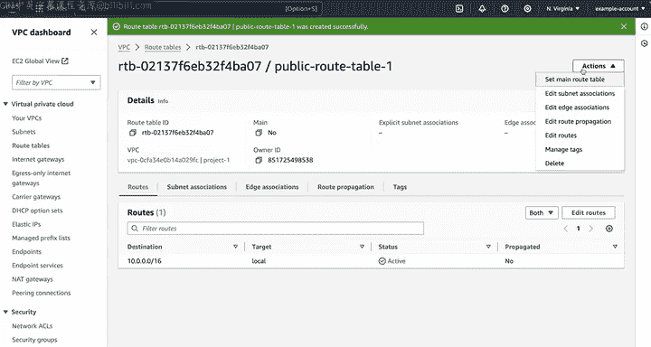

我们将通过AWS管理控制台，为架构中的四个子网（两个公有，两个私有）创建并配置路由表。

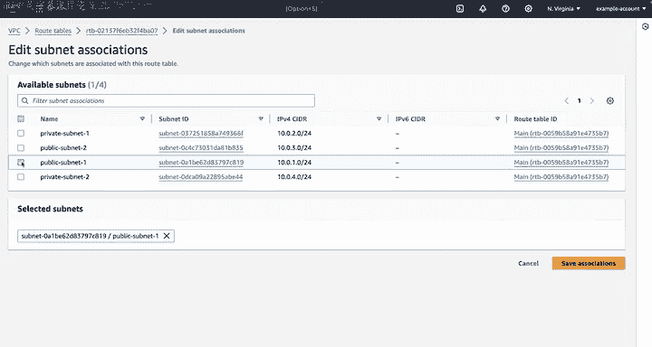

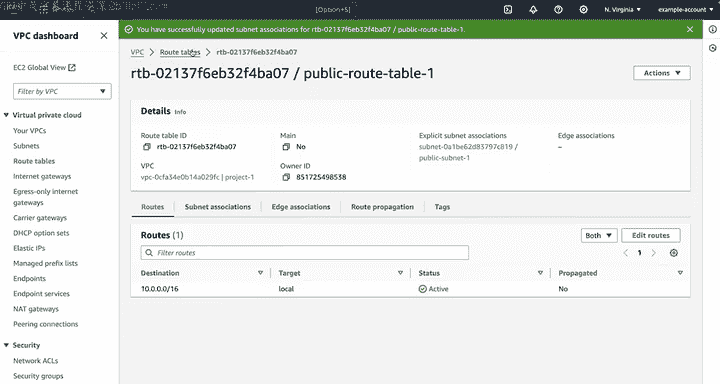

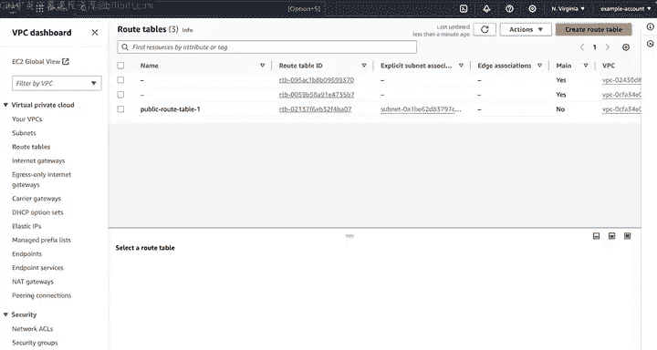

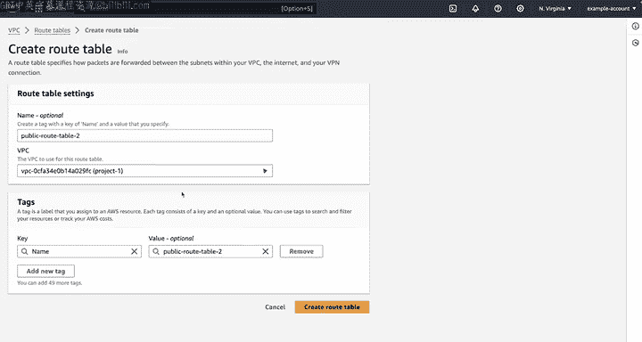

### 第一步：创建并关联路由表

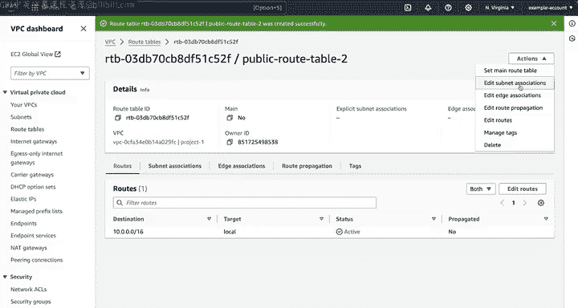

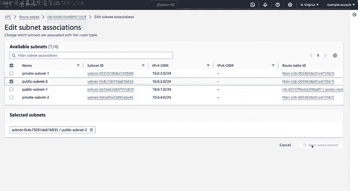

首先，我们需要为每个子网创建一个路由表，并将其与对应的子网关联。

1.  从VPC控制台，在导航面板选择“路由表”，然后点击“创建路由表”。
2.  我们将为VPC中的每个子网创建一个路由表。
    *   第一个路由表，命名为 `public-route-table-1`，选择 `Project1-VPC`，然后点击创建。
    *   创建后，通过选择“操作” -> “编辑子网关联”，将其与第一个公有子网（`public-subnet-1`）关联。
3.  重复此过程，为其他三个子网创建路由表：
    *   `public-route-table-2`，关联到 `public-subnet-2`。
    *   `private-route-table-1`，关联到 `private-subnet-1`。
    *   `private-route-table-2`，关联到 `private-subnet-2`。

### 第二步：创建路由规则

创建好路由表并关联子网后，接下来需要添加具体的路由规则。我们将为公有子网创建指向互联网网关的路由，为私有子网创建指向NAT网关的路由。

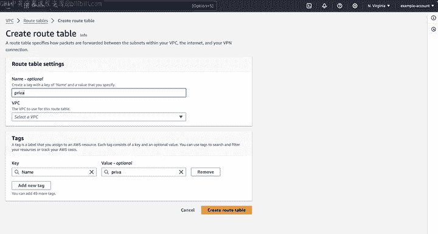

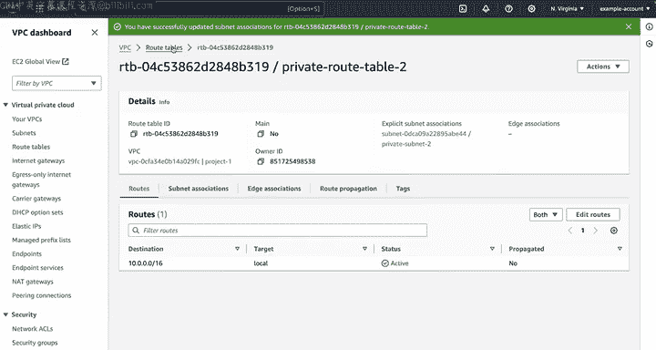

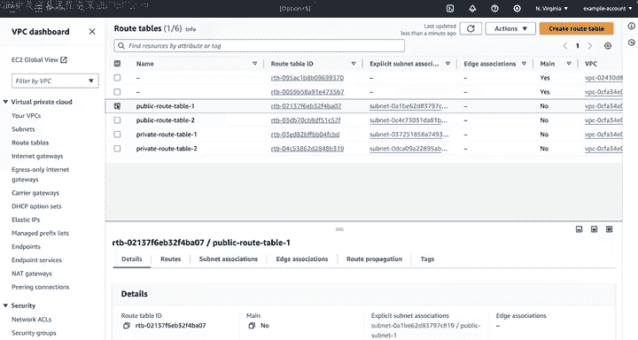

以下是配置公有子网路由的步骤：
1.  在路由表仪表板，选择 `public-route-table-1`，然后选择“编辑路由”。
2.  表中已存在一条默认路由，用于VPC内部通信。要添加允许互联网流量的路由，点击“添加路由”。
3.  在“目标”字段中，输入 `0.0.0.0/0`。在CIDR表示法中，`/0` 前缀意味着它可以匹配任何IP地址，即代表整个互联网。
4.  在“目标”下拉菜单中，选择我们上一课中创建并附加到此VPC的**互联网网关**。
5.  点击“保存更改”。此路由将允许公有子网中的实例通过互联网网关向互联网发送和接收流量。

现在，让我们来配置私有子网的路由表。

以下是配置私有子网路由的步骤：
1.  选择与我们的一个私有子网关联的路由表（例如 `private-route-table-1`），然后“编辑路由”。
2.  同样，添加一条新路由，“目标”设置为 `0.0.0.0/0`。
3.  这次，在“目标”中选择部署在对应可用区公有子网中的 **NAT网关**。
4.  保存更改。此配置确保从私有子网实例发出的、目的地为互联网的流量都会被路由到NAT网关。这使得这些实例可以访问互联网（例如获取更新），同时保持与互联网直接入站流量的隔离。
5.  对另一个公有和私有子网的路由表重复上述步骤。

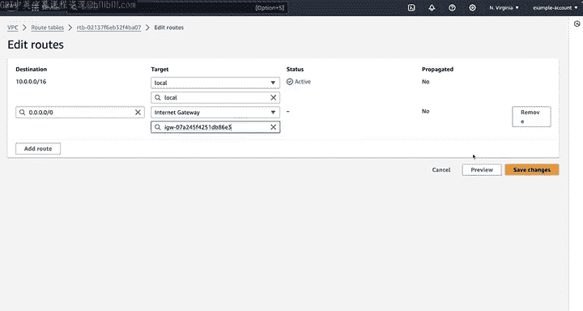

## 配置总结

完成以上步骤后，我们的路由表已按需配置完毕，可以处理内部和外部流量。

*   **公有子网**：拥有将互联网流量指向**互联网网关**的路由，使这些子网内的实例能够与互联网通信。
*   **私有子网**：拥有将互联网流量指向**NAT网关**的路由，允许这些子网内的实例建立到互联网的出站连接，同时阻止直接的入站连接。

## 总结

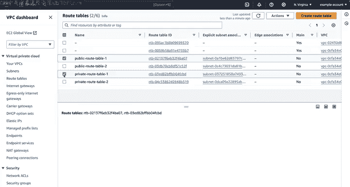

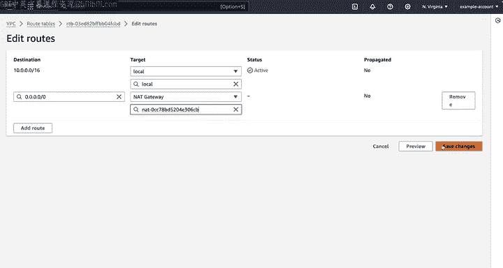

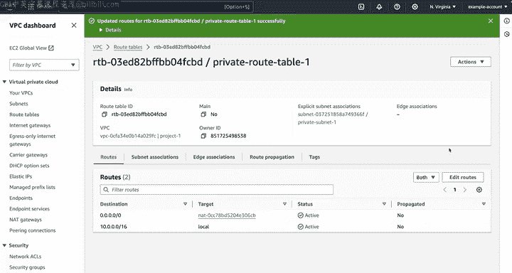

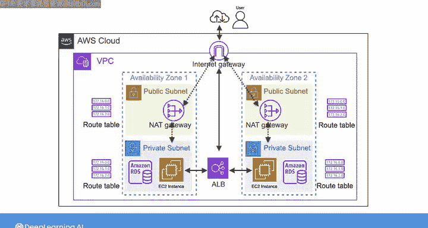

本节课中我们一起学习了AWS路由表的核心概念和配置方法。我们了解到路由表是VPC网络的“交通指挥中心”，通过定义目标（如 `0.0.0.0/0`）和下一跳目标（如互联网网关或NAT网关），精确控制了子网内资源的网络访问路径。配置公有和私有子网的不同路由，是实现安全、灵活网络架构的关键一步。

在下一视频中，我们将介绍其他网络配置，例如安全组和网络ACL。这些配置将通过定义实例和子网的入站和出站流量规则，进一步加固我们的VPC安全。