#  096：网络ACL和安全组 🛡️

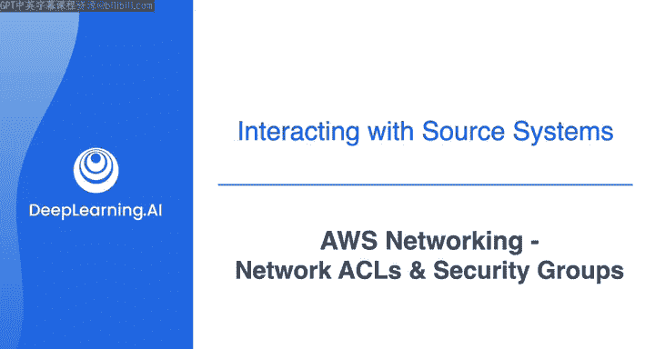

## 概述

在本节课中，我们将学习AWS网络中的两个核心安全组件：安全组和网络访问控制列表。我们将了解它们如何协同工作，为虚拟私有云中的资源提供多层安全防护，并掌握配置它们的基本方法。

---

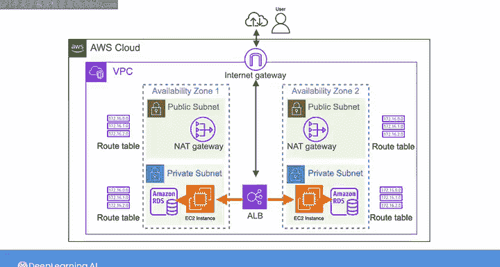

## 回顾：路由表配置

上一节我们介绍了如何为子网配置路由表，以引导VPC内的流量。本节中，我们来看看在典型应用场景下，还需要了解的其他网络配置。

在我们的场景中，应用负载均衡器将互联网流量发送给EC2实例，EC2实例随后会与RDS数据库实例建立连接以执行查询。你可以配置网络规则，只允许你想要的网络流量到达这些实例。默认情况下，即使路由表已就位，也没有任何流量被允许到达这些实例。要改变这一点，你首先需要理解安全组和网络访问控制列表。

---

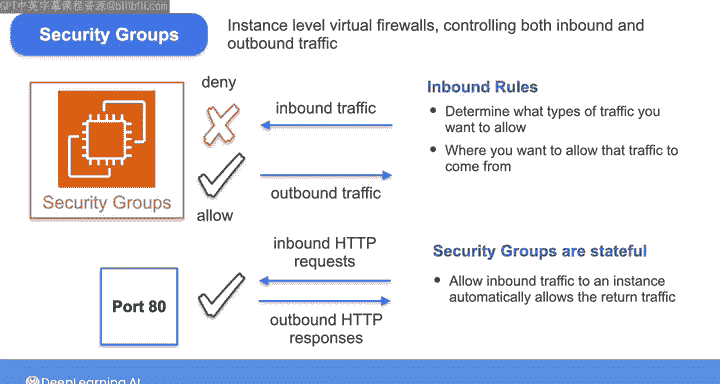

## 安全组：实例级虚拟防火墙

让我们从安全组开始。你可以将安全组视为实例级的虚拟防火墙，控制入站和出站流量。默认情况下，安全组拒绝所有入站流量，但允许所有出站流量。因此，你需要定义入站规则，以确定你希望允许哪些类型的流量，以及允许这些流量从何处来。

安全组是有状态的。这意味着如果你允许入站流量到达一个实例，那么返回流量会自动被允许，即使没有明确的出站规则来允许它。例如，如果你允许端口80上的HTTP入站流量，那么对这些HTTP请求的响应将被允许流出，而无需明确的出站规则。这种有状态的特性简化了安全组的管理，因为你无需为每个入站规则创建匹配的出站规则。

放置在VPC中的资源使用安全组。例如，EC2实例、负载均衡器和RDS数据库实例都可以使用具有不同规则的安全组。安全组的规则可以引用其他安全组。

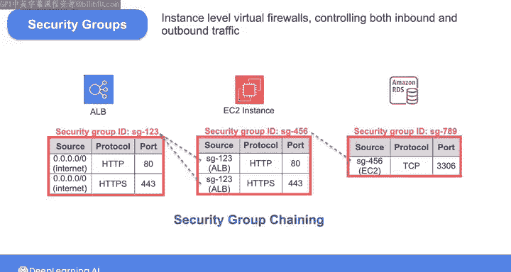

在我们的示例中：
*   一个应用负载均衡器需要从互联网接受端口80的HTTP和端口443的HTTPS流量。
*   一个托管Web服务器的EC2实例需要允许来自应用负载均衡器的HTTP和HTTPS流量，因此可以引用负载均衡器使用的安全组。
*   RDS数据库实例需要允许来自EC2实例使用的安全组的、端口3306上的TCP流量（这是MySQL等数据库常用的端口）。

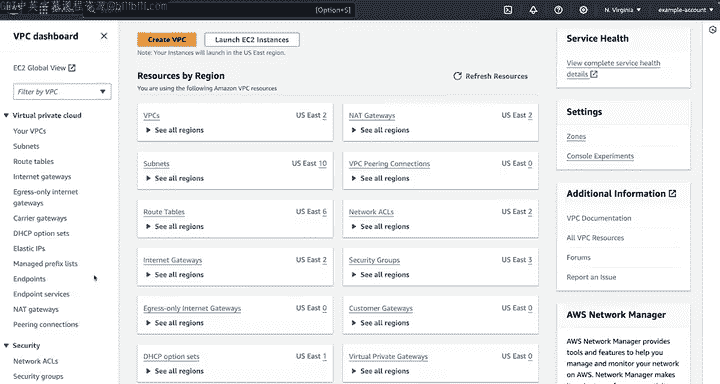

这被称为安全组链。

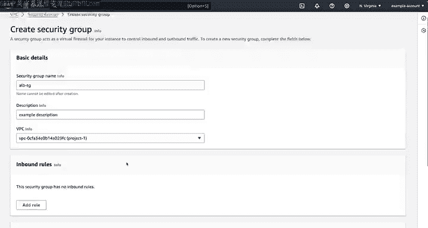

---

## 创建安全组示例

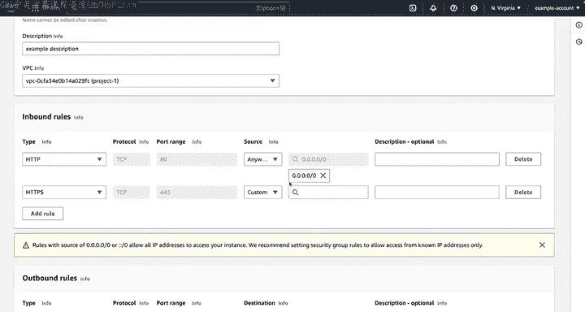

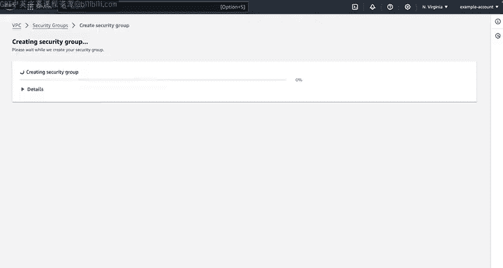

现在，让我们通过一个示例来创建一个可供应用负载均衡器使用的安全组。

以下是创建安全组的步骤：

1.  导航到VPC控制台，然后选择“安全组”。
2.  选择“创建安全组”。
3.  首先，为其命名，例如 `ALBSG`。
4.  选择此安全组所属的VPC，因为安全组与一个VPC相关联。我们将选择 `Project1 VPC`。
5.  接下来，我们需要定义入站规则。选择“添加规则”。
6.  对于流量类型，选择 `HTTP`，这将自动将端口范围填充为 `80`。
7.  为源选择 `0.0.0.0/0`，这将允许来自互联网的端口80流量。
8.  添加另一条针对 `HTTPS` 的规则，它使用端口 `443`，并允许来自互联网的流量。
9.  选择“创建安全组”。

创建完成后，此安全组就可以与负载均衡器关联。

---

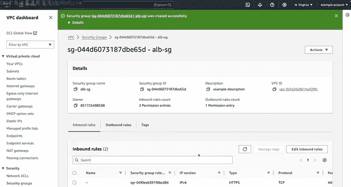

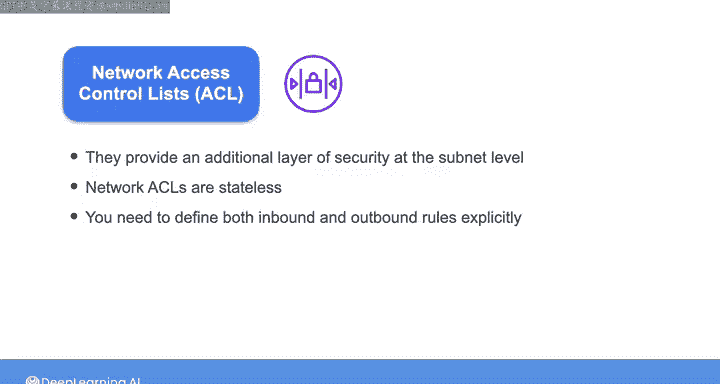

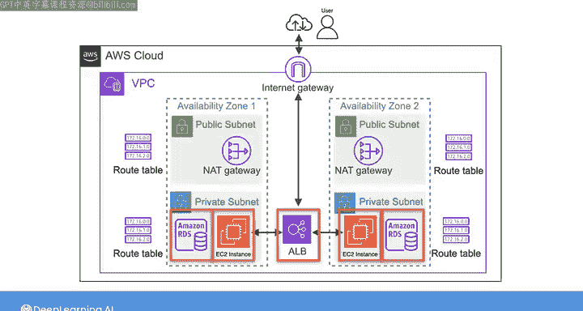

## 网络ACL：子网级安全层

现在，让我们继续学习网络ACL，它在子网级别提供了额外的安全层。

与有状态的安全组不同，网络ACL是无状态的。这意味着你需要明确地定义入站和出站规则。它们提供了对流量更精细的控制，对于在子网级别实施安全策略特别有用。

默认情况下，网络ACL允许所有入站和出站流量，但你可以修改这些规则以满足特定的安全要求。对于我们这个简单的用例，不需要改变此行为，但了解这一点仍然很重要，因为它是控制AWS上网络流量的主要方式之一。如果你在排查网络问题时，可能需要调整这些规则。

---

## 网络故障排查思路总结

在接下来的实验中，你需要排查数据库的连接问题，这是数据工程师经常会遇到的常见场景。因此，我现在想总结一下你在过去几个视频中学到的关于AWS网络的所有知识，以便你知道在尝试排查AWS上的网络连接问题时需要查看哪些地方。

以下是排查网络连通性问题时应遵循的步骤：

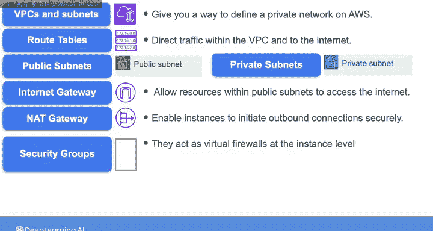

1.  **检查VPC和子网**：确认VPC是否正确配置了互联网网关，并且已正确附加。
2.  **检查路由表**：确认路由表具有适当的规则来正确引导流量，并且路由表与子网的关联配置正确。
3.  **检查安全组**：确保安全组已配置所需的规则。
4.  **检查网络ACL**：确认网络ACL允许必要的流量。
5.  **检查实例配置**：再次检查实例配置，确保它们与正确的安全组和子网相关联。

在下一个实验中，你将通过排查数据库连接问题来实践这些概念，运用你所学到的知识来识别和解决网络问题。

---

## 总结

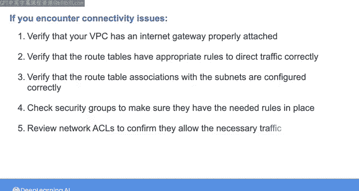

本节课中，我们一起学习了AWS网络中的两个关键安全组件。我们了解了**安全组**作为有状态的、实例级防火墙的工作原理，以及如何创建和配置它们。我们还探讨了**网络ACL**作为无状态的、子网级安全层的作用。最后，我们总结了当遇到网络连通性问题时，从VPC、路由表、安全组到网络ACL的系统性排查思路。掌握这些知识对于在AWS上构建和维护安全、可靠的网络架构至关重要。